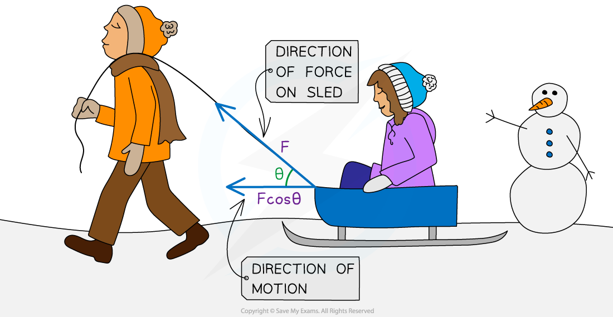

# Work

## Work

> **Spec point** — `spcpt_6xhKMyzgkpZp3ZPG`

## Work

- Work is defined as

**The amount of energy transferred when an external force causes an object to move over a certain distance**

- If the force is **parallel** to the direction of the object's displacement, the work done can be calculated using the equation:

$\DeltaW=F\Deltas$

- Where:

  - Δ*W* = change in work done (J)
  - *F* = average force applied in the **direction of the motion** (N)
  - *s* = displacement (m)
- Force in the **direction of the motion** means that when a force is applied at an angle, the **component **in the direction of motion is used in the calculation

- In the diagram below, the man’s pushing force on the block is doing work as it is transferring energy to the block 

***Work is done when a force is used to move an object over a distance***

- When pushing a block, **work is done against friction** to give the box kinetic energy to move

  - The kinetic energy is transferred to other forms of energy, such as heat and sound
- Usually, if a force acts **in **the direction that an object is moving, then the object will **gain energy**
- If the force acts in the **opposite **direction to the movement, then the object will **lose energy**

#### Calculating with Force at an Angle

- Sometimes the direction of motion of an object is not parallel to the direction of the force
- If the force is at an angle θ to the object's displacement, the work done is calculated by:

***W***** = *****Fs***** cos *****θ***

or

***W = Fs sin θ***

- Where

  - *θ* = the angle, in degrees, between the direction of the force and the motion
- When the angle is between the force and the horizontal, use cosine
- When the angle is between the force and the vertical, use sine

  - The component needed is the one that is **parallel to the displacement**

***When the force is at an angle, only the component of the force in the direction of motion is considered for the work done***

> **Worked Example**
> The diagram shows a barrel of weight 2.5 × 103 N on a frictionless slope inclined at 40° to the horizontal.
> 
> 
> 
> A force is applied to the barrel to move it up the slope at a constant speed. The force is parallel to the slope.
> 
> What is the work done in moving the barrel a distance of 6.0 m up the slope?
> 
> **Answer:**
> 
> **Step 1: Write the known values from the question**
> 
> - Force acting downwards, *F* =  2.5 × 103 N
> - Angle of the slope, *θ* = 40°
> - Displacement, *s* = 6.0 m
> 
> **Step 2: Find the force in the direction of motion by resolving the forces **
> 
> - Draw a diagram, showing the weight acting downwards
> - Resolve the weight into two components
> - The first component is parallel to the slope - the same as the direction of the motion; this is **W sin *****θ***
> - The second is at right angles to the slope, showing the normal reaction force (this component, **W cos *****θ*** is not used in this answer)
> 
> 
> 
> Force acting along the slope, $F=W\mathrm{sin}40^{\circ}$
> 
> $F=2.5\times10^{3}\times\mathrm{sin}40^{\circ}=1607N$
> 
> **Step 3: Write the equation for work done and substitute in the values**
> 
> $\DeltaW=F\Deltas$
> 
> $\DeltaW=1607\times6.0=9642J$
> 
> **Step 4: Give the answer to the correct number of significant figures**
> 
> $\DeltaW=9600J$ or $9.6\times10^{3}J$

> **Exam Hint**
> A common exam mistake is choosing the incorrect force which is not parallel to the direction of movement of an object.
> 
> You may have to resolve the force vector first in order to find the correct, parallel component.
> 
> The applied force does **not** have to be in the same direction as the movement, as shown in the worked example. In fact, in most cases, we apply a force at an angle to move something, because it saves us having to lean down to the height of whatever we are pulling or pushing!
