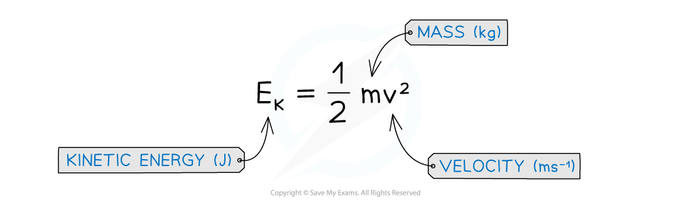
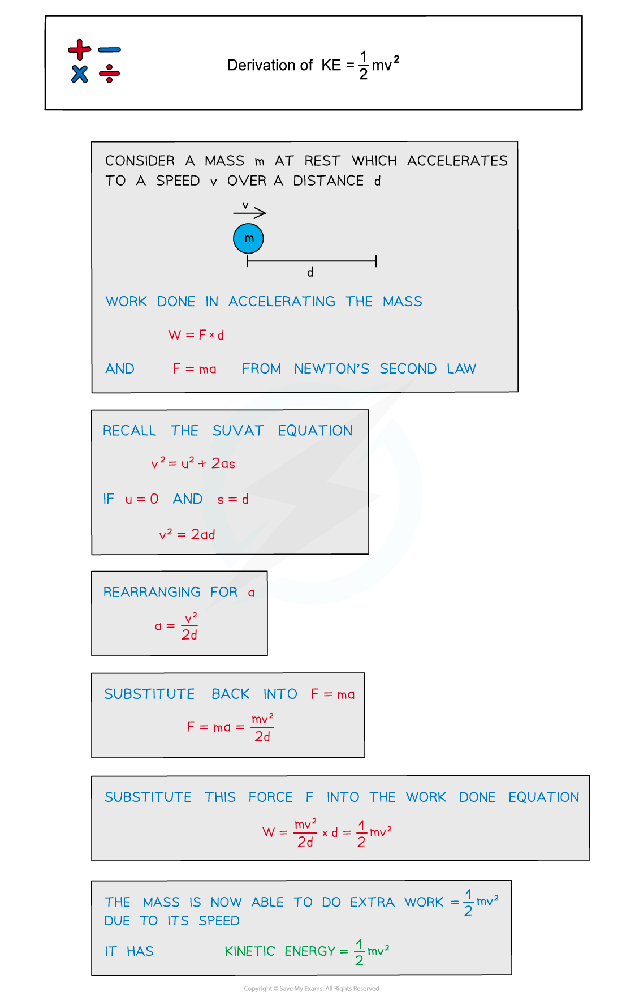

# Kinetic Energy

## Kinetic Energy

> **Spec point** — `spcpt_vmjbDywkKvqzk7NB`

## Kinetic Energy

- Kinetic energy (usually written *E**k *and sometimes KE) is the energy an object has due to its **motion** (or velocity)

  - The faster an object moves, the greater its kinetic energy

- When an object is falling, it is **gaining** kinetic energy since it is gaining speed

  - This energy transferred from the gravitational potential energy it is losing
  - An object will maintain this kinetic energy unless its speed changes

- Kinetic energy can be calculated using the following equation:

***Kinetic energy (KE): The energy an object has when it is moving***

#### Derivation of Kinetic Energy Equation

- A force can make an object accelerate; work is done by the force and energy is transferred to the object
- Using this concept of work done and an equation of motion, the extra work done due to an object's speed can be derived
- The derivation for this equation is shown below:

> **Worked Example**
> A body travelling with a speed of 12 m s–1 has kinetic energy 1650 J.
> 
> If the speed of the body is increased to 45 m s–1, estimate its new kinetic energy.
> 
> **Answer:**
> 
> 

> **Exam Hint**
> When using the kinetic energy equation, note that only the speed is squared, not the mass or the ½.
> 
> If a question asks about the ‘loss of kinetic energy’, remember **not** to include a negative sign since energy is a **scalar** quantity.
