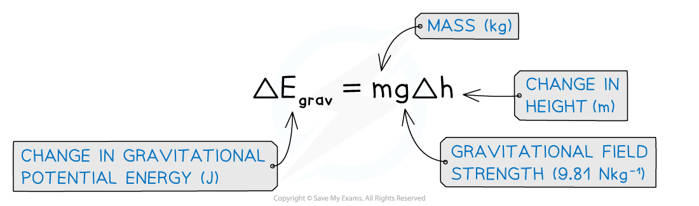
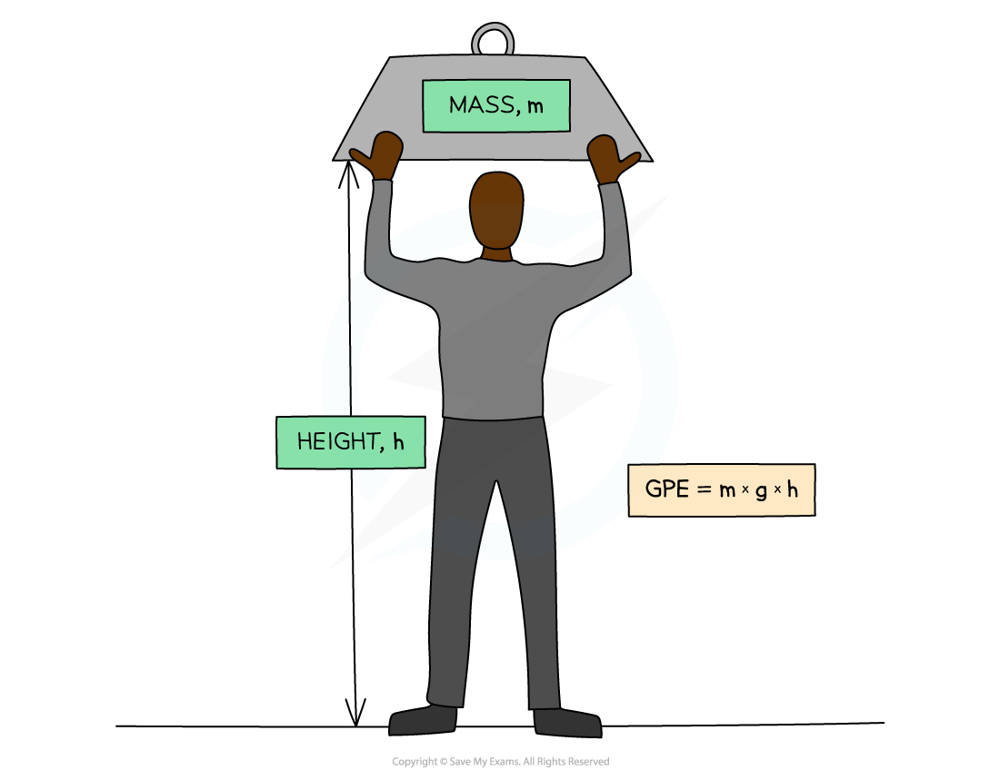
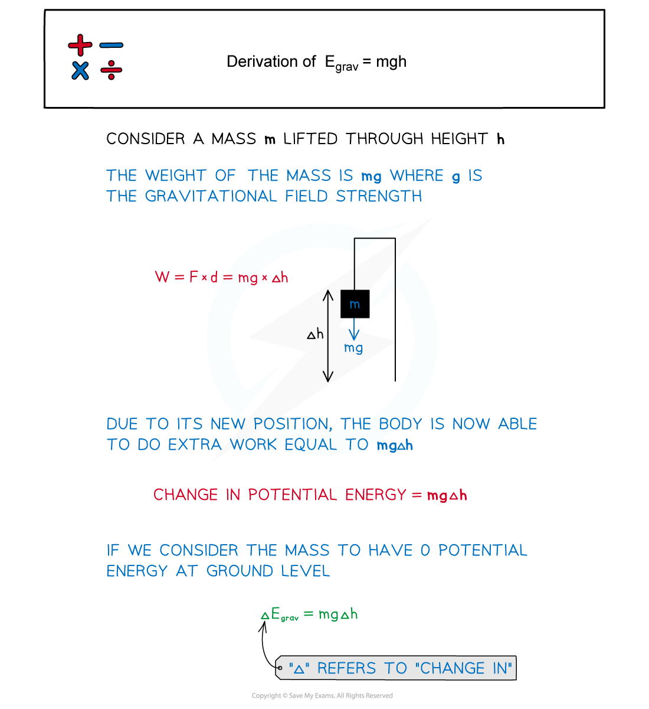

# Gravitational Potential Energy

## Gravitational Potential Energy

> **Spec point** — `spcpt_WrkJ3vG3KmX9dC7F`

## Gravitational Potential Energy

- Gravitational potential energy (usually written Ep, but sometimes GPE) is energy stored in a mass due to its position in a gravitational field

  - If a mass is **lifted** up, it will **gain **Ep (converted **from** other forms of energy)
  - If a mass **falls**, it will **lose **Ep (and be converted **to** other forms of energy)
- The equation for gravitational potential energy for energy changes in a **uniform gravitational field** is:

***Gravitational potential energy (GPE): The energy an object has when lifted up***

- The potential energy on the Earth’s surface at ground level is taken to be equal to 0
- This equation is only relevant for energy changes in a **uniform gravitational field** (such as near the Earth’s surface)

#### Derivation of GPE Equation

- When a heavy object is lifted, work is done since the object is provided with an upward force against the downward force of gravity

  - Therefore, **energy is transferred to the object**
- This equation can therefore be derived from the work done

> **Worked Example**
> To get to his apartment a man has to climb five flights of stairs.
> 
> The height of each flight is 3.7 m and the man has a mass of 74 kg.
> 
> What is the approximate gain in the man's gravitational potential energy during the climb?
> 
> **A.** 13 000 J              ** **
> 
> **B.** 2700 J
> 
> **C.** 1500 J
> 
> **D.** 12 500 J
> 
> 

> **Exam Hint**
> Gravitational potential energy questions often use falling objects, where you are expected to realise that, since energy is conserved, the gravitational potential energy **at the start** is equal to the kinetic energy **at the end**.
