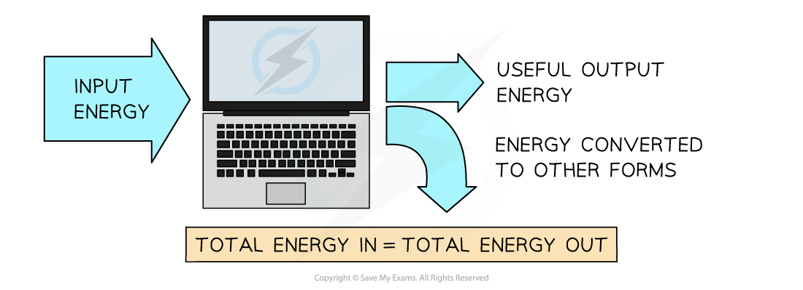

# The Principle of Conservation of Energy

## The Principle of Conservation of Energy

> **Spec point** — `spcpt_zpbXpStsNR38WXcy`

## The Principle of Conservation of Energy

- *The principle of conservation of energy* is a law of Physics which always applies to a *closed system*

- To apply conservation of energy, heat losses are usually ignored during the calculation stage
- In reality there are always some energy losses from the system

  - These should be mentioned when comparing calculated, ideal values to real-life situations

- Conservation of energy is often applied in questions about exchanges between **kinetic energy** and **gravitational energy**
- Common examples include:

  - A swinging pendulum
  - Objects in *free fall*
  - Sports such as skiing or skydiving where gravity is causing motion and few drag forces apply

- The gravitational potential energy stored initially is transferred to kinetic energy, or vice versa
- This allows either;

  - Final velocity to be found from the distance the object moved, or
  - Height of a drop from the final velocity

> **Worked Example**
> The diagram below shows a skier on a slope descending 750 m at an angle of 25° to the horizontal.
> 
> 
> 
> Calculate the final speed of the skier, assuming that he starts from rest and 15% of his initial gravitational potential energy is **not** transferred to kinetic energy.
> 
> **Answer:**
> 
> **Step 1: Write down the known quantities**
> 
> 
> 
> - Vertical height, *h* = 750 sin 25°
> - *E**k* = 0.85 *E**p*
> 
> **Step 2: Equate the equations for *****E******k***** and *****E******grav***
> 
> *E**k** *= 0.85 *E**grav*
> 
> ½ *mv**2* = 0.85 × *mgh*
> 
> **Step 3: Rearrange for final speed, *****v***
> 
> 
> 
> **Step 4: Calculate the final speed, *****v***
> 
> 

> **Exam Hint**
> **Gravitational energy:**
> 
> - This equation only works for objects close to the Earth’s surface where we can consider the gravitational field to be uniform.
> 
> **Kinetic energy:**
> 
> - When using the kinetic energy equation, note that only the speed is squared, not the mass or the ½.
> - If a question asks about the ‘loss of kinetic energy’, remember **not** to include a negative sign since energy is a scalar quantity.
