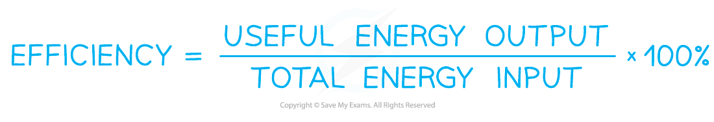
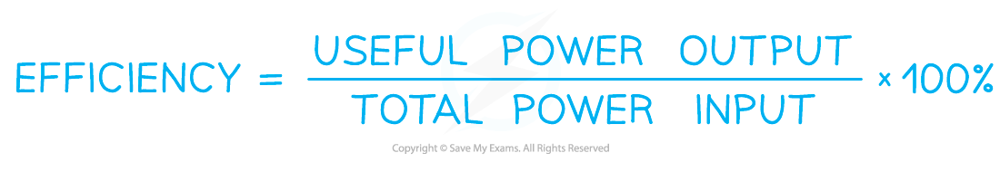

# Efficiency

## Efficiency

> **Spec point** — `spcpt_rDVr8PPRnbW78CVw`

## Efficiency

- The efficiency of a system is a measure of how well energy is transferred in a system
- Efficiency is defined as: **The ratio of the useful power or energy transfer output from a system to its total power or energy transfer input**
- If a system has **high** efficiency, this means most of the energy transferred is **useful**
- If a system has **low** efficiency, this means most of the energy transferred is **wasted**
- Determining which type of energy is useful or wasted depends on the system

  - When electrical energy is converted to light in a lightbulb, the light energy is **useful** and the heat energy produced is **wasted**
  - When electrical energy is converted to heat for a heater, the heat energy is **useful** and the sound energy produced is **wasted**
- Efficiency can be given as a ratio (between 0 and 1) or a percentage (between 0 and 100%)
- Since efficiency is a ratio, it has **no units**

- Calculate energy efficiency and power efficiency in the same way, using one of the following equations;

- The energy can be of any form e.g. gravitational potential energy, kinetic energy

- Where power is defined as the energy transferred per unit of time

> **Worked Example**
> An electric motor has an efficiency of 35 %. It lifts a 7.2 kg load through a height of 5 m in 3 s.
> 
> Calculate the power of the motor.
> 
> **Answer:**
> 
> **Step 1: Write down the efficiency equation **
> 
> 
> 
> **Step 2: Rearrange for the power input **
> 
> 
> 
> **Step 3: Calculate the power output**
> 
> - The power output is equal to energy ÷ time
> - The electric motor transferred electric energy into gravitational potential energy to lift the load
> 
> Gravitational potential energy = *mgh* = 7.2 × 9.81 × 5 = 353.16 J
> 
> Power = 353.16 ÷ 3 = 117.72 W
> 
> **Step 4: Substitute values into power input equation**
> 
> 

> **Worked Example**
> The diagram shows a pump called a hydraulic ram.
> 
> 
> 
> In one such pump, the long approach pipe holds 700 kg of water. A valve shuts when the speed of this water reaches 3.5 m s-1 and the kinetic energy of this water is used to lift a small quantity of water by height of 12m.
> 
> The efficiency of the pump is 20%.
> 
> Determine the mass of water which could be lifted 12 m
> 
> **Answer:**
> 
> **Step 1: Identify the energy conversions and write them in an equation**
> 
> - The kinetic energy of the moving water is converted to gravitational potential energy as it is lifted
> - The equation should be that;
> 
> $initialE_{k}=finalE_{grav}$ → $\frac{1}{2}mv^{2}=mgΔh$
> 
> **Step 2: Include the efficiency in the equation**
> 
> - Efficiency = 20% meaning 20% of the kinetic energy is converted;
> 
> $0.2\times\frac{1}{2}mv^{2}=mgΔh$
> 
> **Step 3: Substitute in the values and calculate**
> 
> $0.2\times\frac{1}{2}\times700\times(3.5^{2})=m\times9.81\times12$
> 
> $857.5=117.72m$
> 
> *m* = 7.284
> 
> **Step 4: Write the answer with the correct significant figures and units**
> 
> - Mass of water lifted, *m* = 7.3 kg (2 s.f.)

> **Exam Hint**
> In efficiency calculations decide **before starting** where the energy is lost from the system.
> 
> In the example above, the pump is what converts the water’s **kinetic energy** into **gravitational potential energy**, and it is the pump whose efficiency we are given. That means the losses are from the kinetic energy.
> 
> Don't just calculate then deduct the efficiency at the end - this can lead to lots of work for no marks. Which isn't very efficient!
