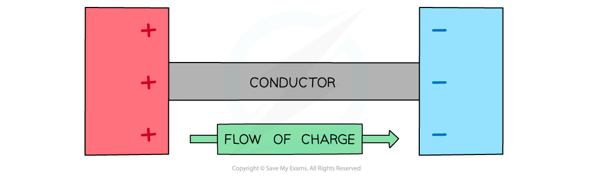
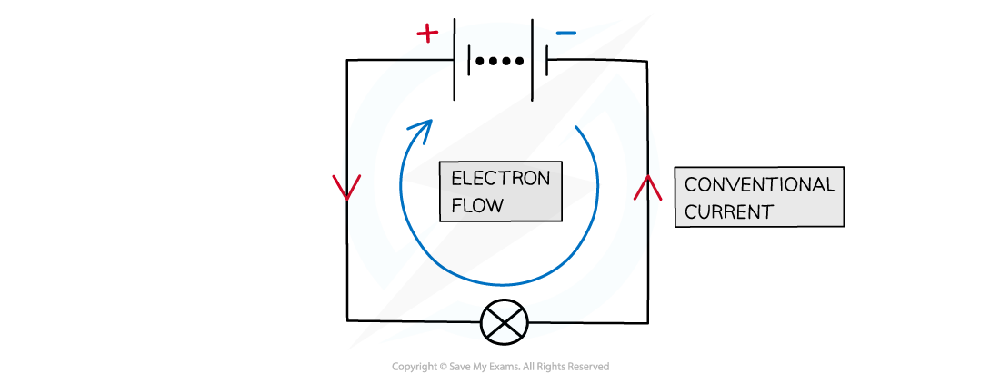

# Electric Current

## Electric Current

> **Spec point** — `spcpt_p7dHywzCQhcdWcQY`

## Electric Current

#### Electric Current

- Electric current is defined as: **The rate of flow of charge**
- It is measured in units of **amperes (*****A*****) **or **amps**
- The charge, current and time are related by the equation:

- There are several examples of electric currents, including in household wiring and electrical appliances

#### Electric Charge

- Electric charge is a property of some particles

  - For example, **protons** have a **positive** charge and **electrons** have a **negative** charge
- Charge has the unit Coulombs, C
- In electric circuits, **electrons** are usually the **charge carriers**

  - They have a charge of 1.6 × 10−19 C
- Charge, *Q*, can be calculated using the equation

***Q***** = *****ne***

- Where:

  - *Q* = charge (C)
  - *n* = number of electrons
  - *e* = electron charge (C)

- If 1 electron has a charge of 1.6 × 10−19 C

  - Then, 1 C of charge contains 6.25 × 1018 electrons

- Charge is sometimes written as Δ*Q *which means 'change in charge'

  - Similarly, time is written as Δ*t* means 'change in time'
- When two oppositely charged conductors are connected together (by a length of wire), charge will flow between the two conductors, causing a current
- Therefore, rearranging for current, *I* gives the equation:

***Charge can flow between two conductors. The direction of conventional current in a metal is from positive to negative***

#### Direction of Flow of Charge

- In electrical wires, the current is a flow of **electrons**
- Electrons are negatively charged; they flow away from the negative terminal of a cell towards the positive terminal
- Conventional current is defined as the flow of **positive** charge from the **positive terminal of a cell to the negative terminal**

  - This is the opposite to the direction of electron flow, as the conventional current was described before electric current was really understood

***By definition, conventional current always goes from positive to negative (even through electrons go the other way)***

#### Measuring Current

- Current is measured using an **ammeter**
- Ammeters should always be connected in **series** with the part of the circuit the current is to be measured through

  - This is because the current is the same in all components connected in series

***An ammeter can be used to measure the current around a circuit and always connected in series***

> **Worked Example**
> The current in a filament lamp is  8 mA.
> 
> Which answer below explains how this current can be obtained?
> 
> **A.** 1 J of energy is used by 1 C of charge
> 
> **B.** A charge of 4 C passes in 500 s
> 
> **C. **A charge of 8 C passes in 100 s
> 
> **D.** A charge of 1 C passes in 8 s
> 
> **Answer: B**
> 
> **Step 1: Write out the equation relating current, charge and time**
> 
> *Q* = *It*
> 
> **Step 2: Rule out any obviously incorrect options**
> 
> - Option **A** does not contain charge or time, so can be ruled out
> 
> **Step 3: Try the rest of the options to determine the correct answer**
> 
> - Consider option **B**:
> 
> *I* = 4 / 500 = 8 × 10–3 = 8 mA
> 
> - Consider option **C**:
> 
> *I* = 8 / 100 = 80 × 10–3 = 80 mA
> 
> - Consider option **D**:
> 
> *I* = 1 / 8 = 125 × 10–3 = 125 mA
> 
> - Therefore, the correct answer is **B**

> **Exam Hint**
> Although electric charge can be positive or negative, since the conventional direction of current is the flow of **positive **charge the current should always be a positive value for your exam answers.
> 
> An example of this is electrolysis where ions are used as charge carriers in the ionic solution and the ions travel through a liquid as an electric current
