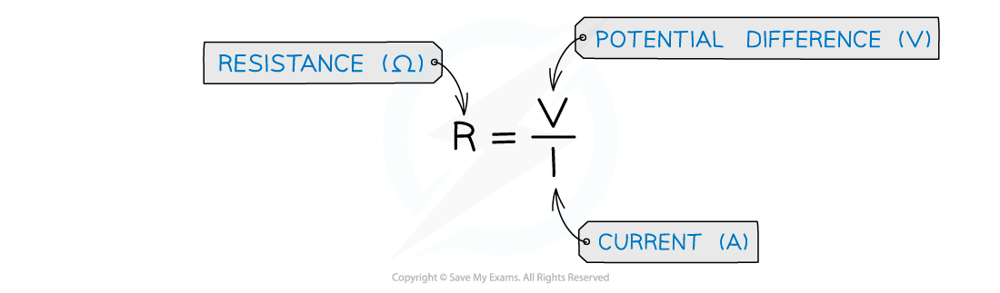
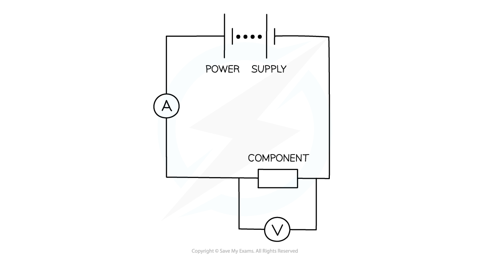
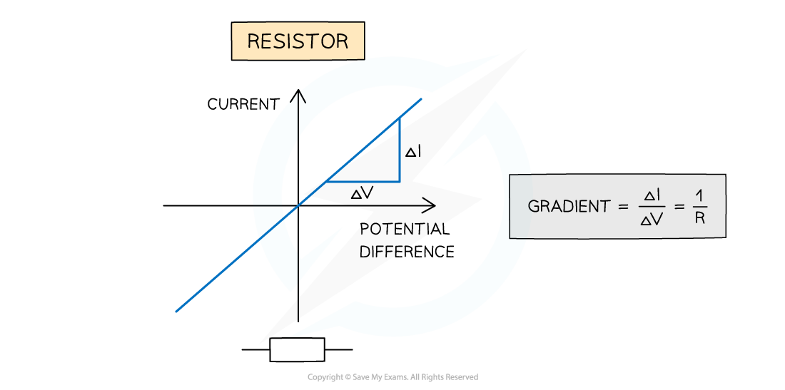

# Ohm's Law

## Defining Resistance

> **Spec point** — `spcpt_pBYY9FNGRkyP24Kj`

## Defining Resistance

#### Resistance

- Resistance is defined as the **opposition** to current
- It is further defined by Ohm's Law, which says that the resistance of a conductor is given by the ratio of potential difference across it to the current flowing in it

$R=\frac{V}{I}$

- For a given potential difference, then, **the higher the resistance the lower the current**

***Resistance of a component is the ratio of the potential difference and current***

*** ***

- Resistance is measured in** Ohms (Ω)**
- An Ohm is defined as **one volt per ampere**
- The resistance controls the size of the current in a circuit

  - A **higher** resistance means a **smaller** current
  - A **lower** resistance means a **larger** current
- All electrical components, including wires, have some value of resistance

#### Measuring Resistance

- To find the resistance of a component, a simple circuit can be used, containing:

  - A power supply
  - A component (such as a lamp or resistor)
  - An ammeter in series with the component
  - A voltmeter in parallel with the component

***A circuit to determine the resistance of a component***

- The power supply should be set to a low voltage to avoid heating the component, typically 1-2 V
- Measurements of the potential difference and current should then be taken from the voltmeter and ammeter respectively
- Finally, these readings should be substituted into the resistance equation

> **Worked Example**
> A charge of 5.0 C passes through a resistor of resistance R Ω at a constant rate in 30 s.
> 
> If the potential difference across the resistor is 2.0 V, calculate the value of R.
> 
> **Answer:**
> 
> 

## Ohm's Law

> **Spec point** — `spcpt_zFm7ybxgwcbZTF6X`

## Ohm's Law

- Ohm’s law is defined as: T**he current through a component is directly proportional to the potential difference across it, providing the temperature is constant**
- Constant temperature implies constant resistance
- This is shown the equation below:

***Ohm’s law***

- By adjusting the resistance on the variable resistor, the current and potential difference will vary in the circuit.
- The variation of current with potential difference through the fixed resistor can be plotted on a pair of axes

  - This will produce a straight-line graph

***Circuit for plotting graphs of current against voltage***

- Since the gradient is constant, the resistance *R* of the resistor can be calculated by using **1 ÷ gradient** of the graph
- An electrical component obeys Ohm’s law if its graph of current against potential difference is a **straight line** through the origin

  - A resistor **does** obey Ohm’s law
  - A filament lamp does **not** obey Ohm’s law
- Any metal wires will follow Ohm's Law, provided that the current isn’t large enough to increase their temperature

> **Worked Example**
> The current flowing through a component varies with the potential difference *V* across it as shown
> 
> 
> 
> Which graph best represents how the resistance *R* varies with *V*?
> 
> 
> 
> 

> **Exam Hint**
> Resistance is used to control current. Increasing the resistance in a circuit will reduce the current. Don't get the cause and effect mixed up here. Reducing current does not increase resistance - it's the other way round!
> 
> Using graphs;
> 
> - In maths, the gradient is the **slope** of the graph
> - The graphs below show a summary of how the slope of the graph represents the gradient
> 
> 
> 
> ***Graphs showing varying gradients***
