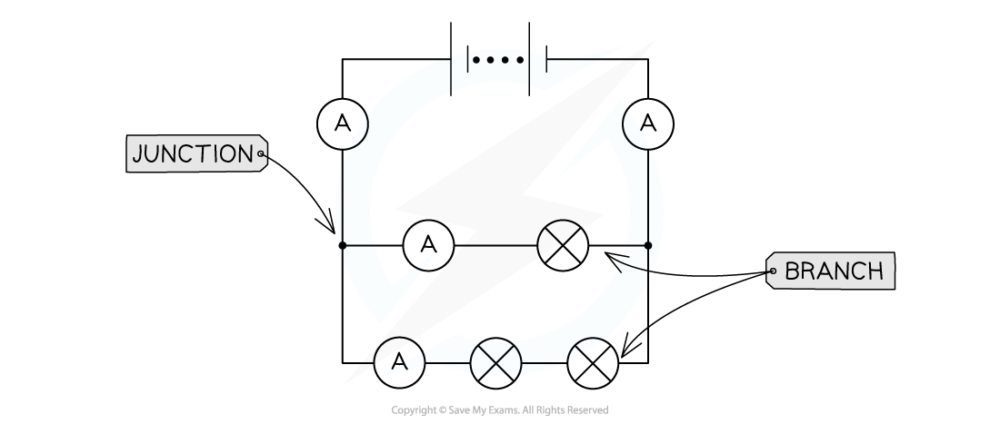
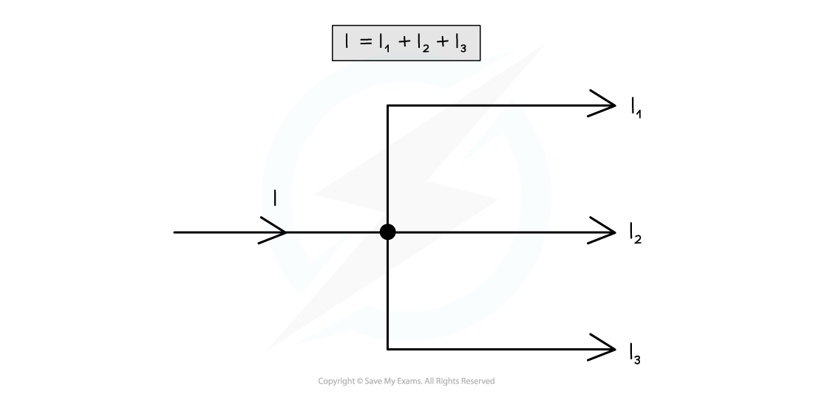
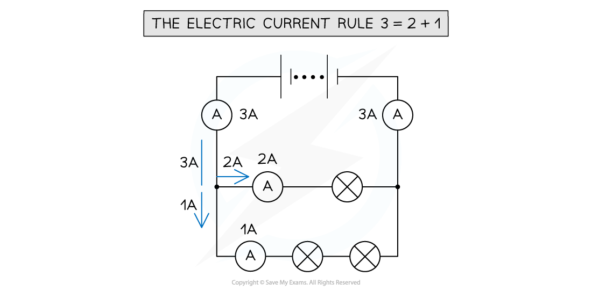

# Charge Conservation in Circuits

## Charge Conservation in Circuits

> **Spec point** — `spcpt_7Tr9PGjcqCqCDPrN`

## Charge Conservation in Circuits

#### The Electric Current Rule (Kirchhoff's First Law)

- The electric current rule is defined as: **The algebraic sum of the currents entering and leaving a junction is equal to zero**
- This is a consequence of conservation of **charge - **current shouldn’t decrease or increase in a circuit when it splits

#### Series and Parallel

- In a circuit:

  - A **junction** is a point where at least three circuit paths meet
  - A **branch** is a path connecting two junctions

- If a circuit splits into two **branches**, then the current before the circuit splits should be equal to the current after it has split
- A typical circuit might have a setup where  I = I1 + I2+ I3 where:

  - I represent the current in the circuit before it branches
  - I1, I2 and I3 represent the current in the respective three branches

***The current I into the junction is equal to the sum of the currents out of the junction***

- The charge is conserved on both sides of the junction
- In a **series** circuit, the current is the same at any point

***The current is the same at all points in a series circuit***

- In a **parallel** circuit, the current divides at the junctions and each branch has a different value.
- The electric current rule applies at each junction

  - The sum of the currents before the junction will equal the sum of the currents after the junction

***The current divides at each junction in a parallel circuit***

> **Exam Hint**
> Junctions only appear in parallel circuits as circuits become more complex. It can be confusing to work out which currents are going into the junction and which are coming out. Drawing arrows on the diagram for the current flow (making sure it’s from positive to negative) at each junction, such as in the worked example, will help with this.
> 
> The electric current rule is also known as Kirchhoff's First Law, and you may come across this phrase.
