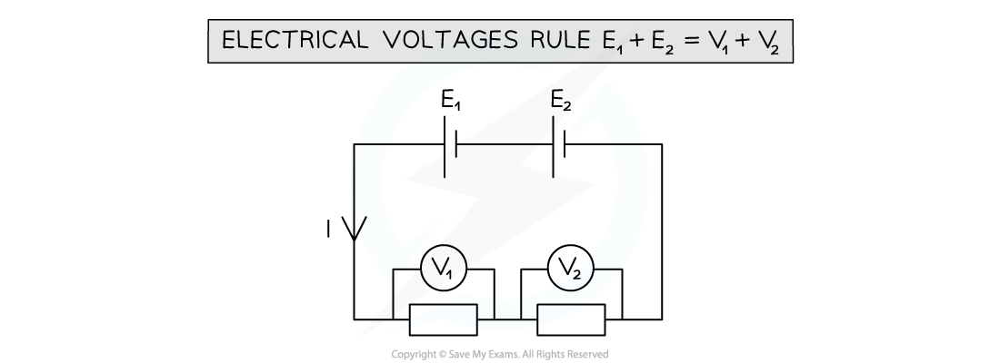
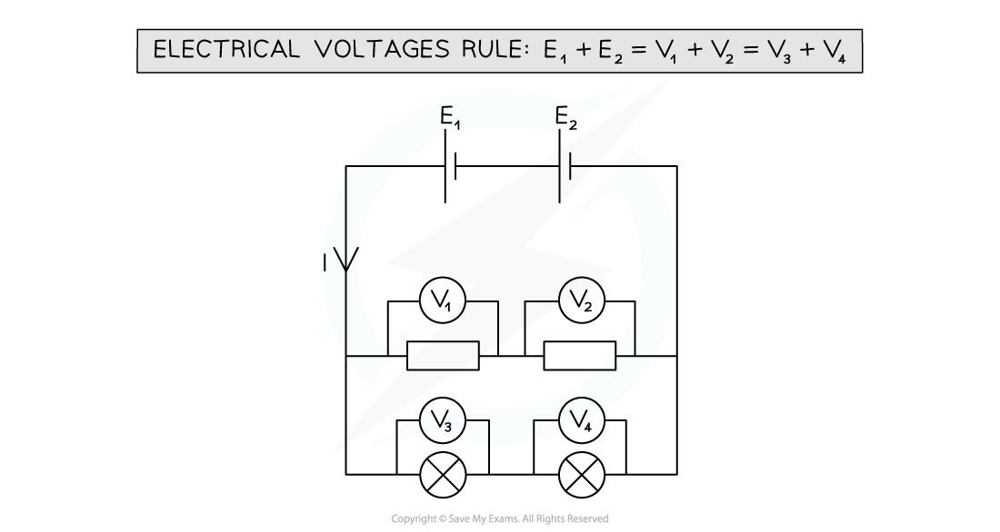
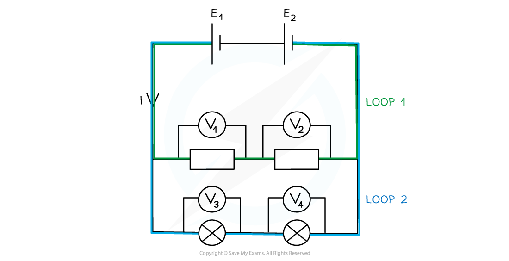

# Energy Conservation in Circuits

## Energy Conservation in Circuits

> **Spec point** — `spcpt_pk6tT42xskN6xTdJ`

## Energy Conservation in Circuits

#### The Electrical Voltages Rule (Kirchhoff's Second Law)

- Energy is never used up or lost in a circuit, since everything follows the Law of Conservation of Energy
- The electrical voltages rule is defined as: **The sum of the e.m.f.s in a closed circuit loop is equal to the sum of the potential differences around that loop**
- Each closed circuit loop can be treated like a series circuit
- A typical circuit might have a setup where  E1 + E2 = V1 + V2 where:

  - E1 and E2 represent the e.m.f.s in the closed loop
  - V1  and V2 represent the potential differences in the closed loop

***The sum of the voltages is equal to the total e.m.f from the batteries***

- In a **series** circuit, the voltage is split across all components depending on their resistance

  - The sum of the voltages is equal to the total e.m.f of the power supply
- In a **parallel** circuit, the voltage is the same across each closed loop

  - The sum of the voltages **in each closed circuit loop** is equal to the total e.m.f of the power supply:

***The sum of the p.ds in each closed loop is equal to the total e.m.f of the power supply***

- A closed-circuit loop acts as its own independent series circuit
- Each loop separates at a junction
- A parallel circuit is made up of two or more of these loops

***Each circuit loops acts as a separate, independent series circuit***

- This makes parallel circuits incredibly useful for home wiring systems

  - A single power source supplies all lights and appliances with the same voltage
  - If one light breaks, voltage and current can still flow through for the rest of the lights and appliances

> **Exam Hint**
> The Electrical Voltages Rules is sometimes known as Kirchhoff's Second Law.
> 
> Drawing the loops in different colours, as in the example above, can be a helpful way of identifying the different loops.
