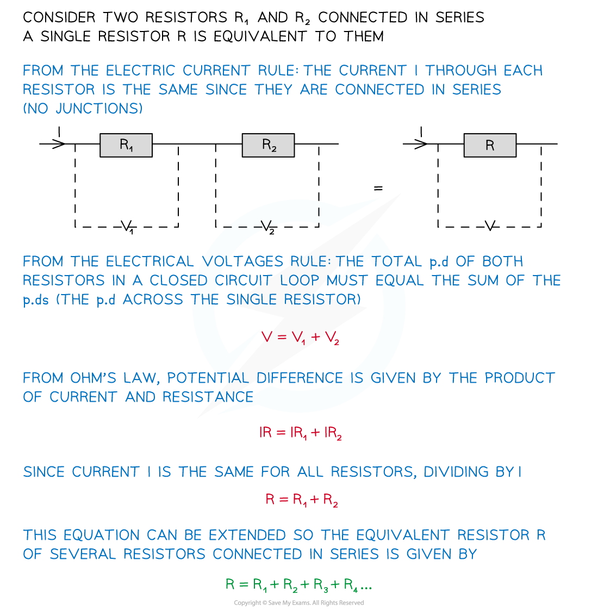
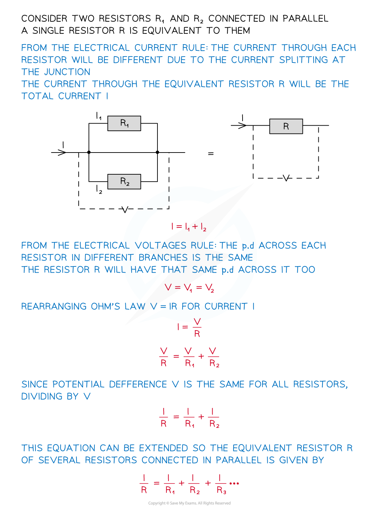

# Resistance in Series & Parallel

## Deriving Equations for Resistance in Series & Parallel

> **Spec point** — `spcpt_R6sPcKxZ2bFHtqRj`

## Deriving Equations for Resistance in Series & Parallel

#### Resistors In Series

- When two or more components are connected in series:

  - **The combined resistance of the components is equal to the sum of individual resistances**

***Resistors connected in series***

- The equation for combined **resistors in series **is derived using the electric current rule and the electrical voltages rule
- These rules describe that for a series circuit:

  - The current is the same through all resistors
  - The potential difference is  split between all the resistors

- The equation for the combined resistance of resistors in series is therefore:

#### Resistors In Parallel

- In a parallel circuit, the combined resistance of the components requires the use of **reciprocals**

  - **The reciprocal of the combined resistance of two or more resistors is the sum of the reciprocals of the individual resistances**

***Resistors connected in parallel***

- The equation for combined **resistors in parallel **is derived using the electric current rule and the electrical voltages rule
- These rules describe that for a parallel circuit:

  - The current is the split at the junction (and therefore between resistors)
  - The potential difference is the same across all resistors

- The equation for the combined resistance of resistors in parallel is therefore:

- This means the combined resistance decreases

  - The combined resistance is  less than the resistance of any of the individual components
  - For example, If two resistors of equal resistance are connected in parallel, then the combined resistance will halve

## Using Equations for Resistance in Series & Parallel

> **Spec point** — `spcpt_K3ZQTFxVrR8S3ph2`

## Using Equations for Resistance in Series & Parallel

#### Series Circuits

> **Worked Example**
> The combined resistance *R* in the following series circuit is 60 Ω.
> 
> 
> 
> Wich of the following is the value of R2?
> 
> **A.** 100 Ω
> 
> **B.** 30 Ω
> 
> **C.** 20 Ω
> 
> **D. **40 Ω
> 
> 

#### Parallel Circuits

> **Worked Example**
> 
> 
> 

> **Exam Hint**
> The most common mistake is to forget to find the correct value for RT in parallel. Remember to do $\frac{1}{\mathrm{answer}}$ to get the correct value.
> 
> Reciprocals can be considered in the following way:
> 
> - The reciprocal of a value is $\frac{1}{\mathrm{value}}$
> 
>   - For example, the reciprocal of a whole number such as 2 equals $\frac{1}{2}$
>   - The reciprocal of $\frac{1}{2}$ is 2
> - If the number is already a fraction, the numerator and denominator are ‘flipped’ round
> 
> 
> 
> ***The reciprocal of a number is 1 ÷ number***
> 
> - In the case of the resistance R, this becomes $\frac{1}{R}$
> 
>   - To get the value of R from $\frac{1}{R}$, you must do $\frac{1}{\mathrm{answer}}$
> - You can also use the reciprocal button on your calculator (labelled either x-1 or $\frac{1}{x}$, depending on your calculator)
