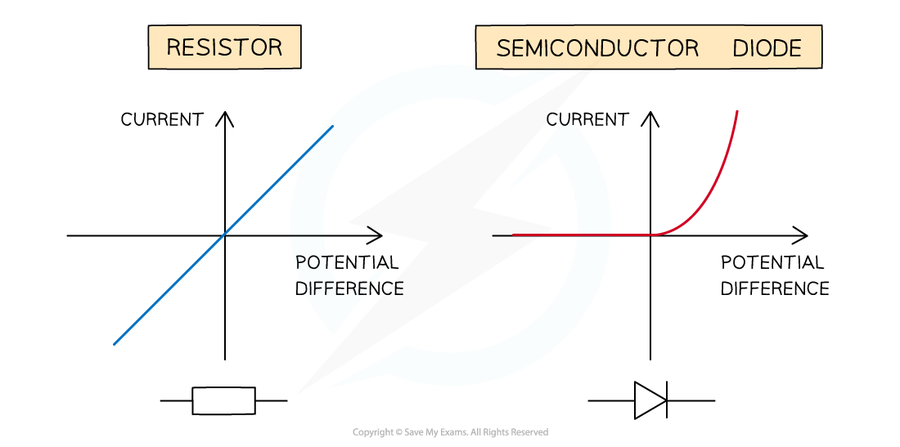
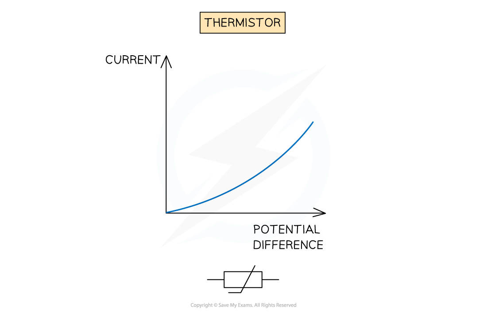

# Current-Potential Difference Graphs

## Current-Potential Difference Graphs

> **Spec point** — `spcpt_Srz6qCnYvKdVf95j`

## Current-Potential Difference Graphs

- As the potential difference (voltage) across a component is increased, the current also increases (by *Ohm’s law*)
- The precise relationship between voltage and current is different for different components and can be shown on a current-potential difference or *I-V* graph

  - For an ohmic conductor, the *I*–*V* graph is a straight line through the origin
  - For a semiconductor diode, the *I*–*V* graph is a horizontal line that goes sharply upwards
  - For a filament lamp, the *I*–*V* graph has an 'S' shaped curve

***I–V characteristics for an ohmic conductor (e.g. resistor), semiconductor diode and filament lamp***

#### Ohmic Conductor

- The *I–V* graph for an ohmic conductor at constant temperature e.g. a resistor is very simple:

  - The current is **directly proportional** to the potential difference
  - This is demonstrated by the **straight-line** graph through the origin

#### Diode

- The *I–V* graph for a diode is slightly different.
- A diode is used in a circuit to allow current to flow only in a specific direction:

  - When the current is in the direction of the arrowhead symbol, this is **forward bias. **This is shown by the sharp increase in potential difference and current on the right side of the graph
  - When the diode is switched around, it does not conduct and is called **reverse bias. **This is shown by a zero reading of current or potential difference on the left side of the graph
  - The threshold voltage at which a diode starts to conduct is typically around 0.6V

#### Filament Lamp

- The *I–V* graph for a filament lamp shows the current increasing at a proportionally slower rate than the potential difference
- This is because:

  - As the current increases, the **temperature** of the filament in the lamp **increases**
  - Since the filament is a metal, the higher temperature causes an **increase** in **resistance**
  - Resistance opposes the current, causing the **current** to **increase** at a **slower rate**
- Where the graph is a straight line, the resistance is constant
- The resistance increases as the graph curves
- The filament lamp obeys Ohm's Law for small voltages

#### Thermistor

- The *I–V* graph for a thermistor is a shallow curve upwards

- The increase in the potential difference results in an increase in current which causes the **temperature** of the thermistor to rise
- As its temperature rises, its resistance **decreases**

  - This means even more current is able to flow through
- Since the current is not directly proportional to the potential difference (the graph is still curved), the thermistor does **not** obey Ohm's law

- The *I–V* graph for a thermistor shows the current increasing at a proportionally **faster **rate than the potential difference (the curve becomes steeper)
- This is because:

  - As the current increases, the **temperature** of the thermistor **increases**
  - A higher temperature causes **resistance **to **decrease**
  - The lower resistance allows **more current** to flow for each increase in p.d., so the graph is curved (non-ohmic)

> **Worked Example**
> The *I–V* graph of two electrical components **X** and **Y** are shown
> 
> 
> 
> Which statement is correct?
> 
> **A**. The resistance of **X** increases as the current increases
> 
> **B**. At 2 V, the resistance of **X** is half the resistance of **Y**
> 
> **C**. **Y** is a semiconductor diode and **X** is a resistor
> 
> **D**. **X** is a resistor and **Y** is a filament lamp
> 
> **Answer: C**
> 
> **Step 1: Consider the characteristics of graph X**
> 
> - The *I–V* graph **X** is **linear**
> 
>   - This means the graph has a constant gradient. *I*/*V* and the resistance is therefore also constant (since gradient = 1/*R*)
>   - This is the *I–V* graph for a conductor at constant temperature e.g. a resistor
> 
> **Step 2: Consider the characteristics of graph Y**
> 
> - The *I–V* graph **Y** starts with zero gradient and then the gradient increases rapidly
> 
>   - This means it has infinite resistance at the start which then decreases rapidly
>   - This is characteristic of a device that only has current in one direction e.g a semiconductor diode
> 
> **Step 3: Compare this information with the statements A-D**
> 
> - **A.** Resistance is constant
> 
>   - therefore this statement is** incorrect**
> - **B.** At 2V the current of X is 0.5 A and the current of Y is 0 A.
> 
>   - therefore this statement is** incorrect**
> - **D.** X is an ohmic component such as a resistor, however Y is the graph for a diode not a filament bulb.
> 
>   - therefore this statement is** incorrect**
> 
> **Step 4: State the correct answer**
> 
> - The correct answer is **C**

**      **

> **Exam Hint**
> Make sure you're confident in drawing the *I*–*V* graphs for different components, as you may be asked to sketch these from memory in exam questions
> 
> You may get a question asking you to explain why resistance in a metal increase with temperature. This is usually two marks given for:
> 
> - The vibrations of metal atoms are faster and of greater displacement from equilibrium
> - Therefore there are more collisions between the conduction electrons and the atoms
