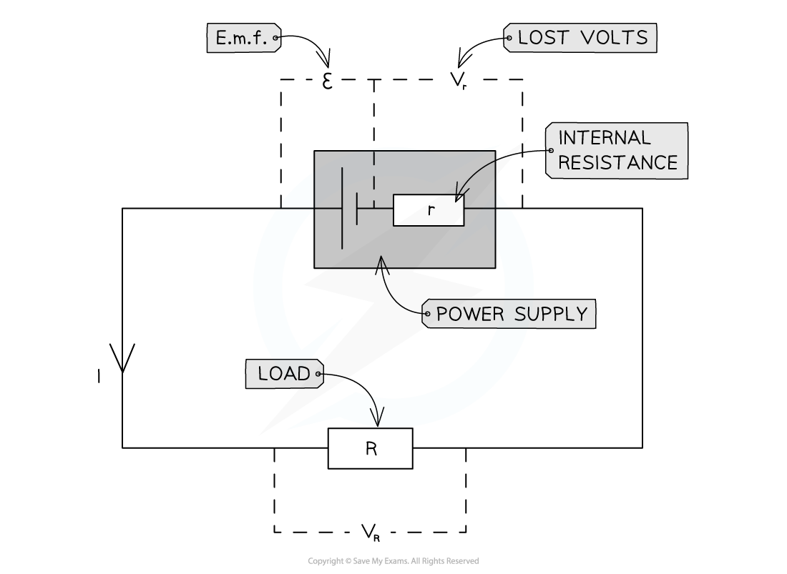

# Internal Resistance

## Internal Resistance

> **Spec point** — `spcpt_tHsyWHbG2ZJ6qsS7`

## Internal Resistance

- All power supplies have some resistance between their terminals

  - This is called **internal resistance** (*r*)
- Internal resistance causes some electrical energy to be transformed to heat energy in the power supply itself

  - This is why the cell becomes warm after a period of time
- Therefore, the internal resistance causes energy loss in a power supply
- A cell can be thought of as a source of e.m.f. with an internal resistance connected in series
- The amount of voltage lost is known as the 'lost volts'

  - A higher internal resistance will result in a higher value for lost volts

***Circuit showing the e.m.f and internal resistance of a power supply***

- Where:

  - *R* = resistance of the circuit (the ‘load resistor’)
  - *r* = internal resistance
  - *ε* = e.m.f.
  - *V**r* = 'lost volts'
  - *V**R* = voltage across the load (sometimes also called *V**T*, the terminal voltage)

> **Exam Hint**
> The internal resistance concept catches many students out. Make sure you fully understand the circuit diagram;
> 
> - Internal resistance of the cell can be treated as though it were a separate resistor - although it isn't!
> - The load  resistance is treated as another resistor in series
> - Potential difference is measured across the load resistor
> - The lost volts are calculated as though they were the potential difference across the 'internal resistor'
