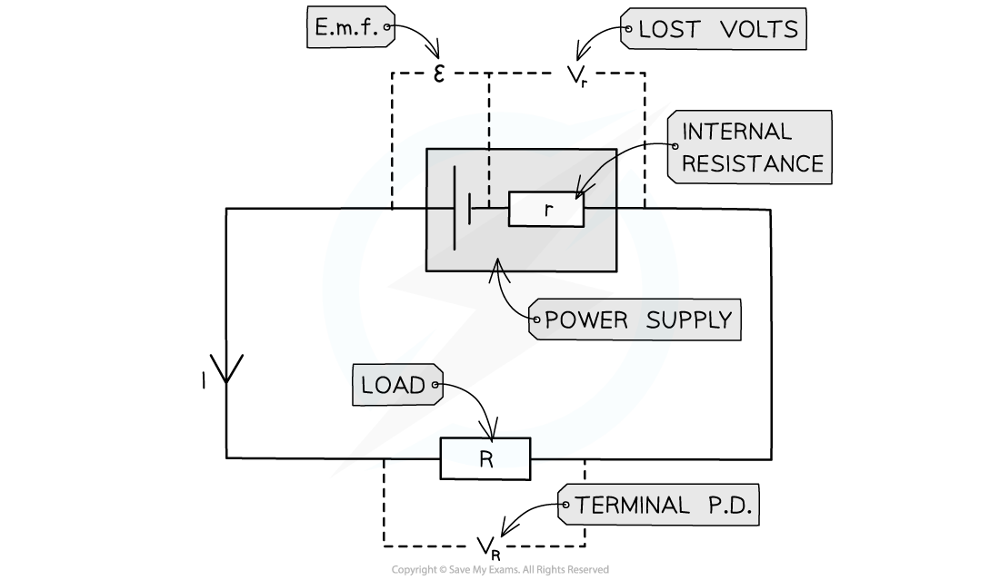
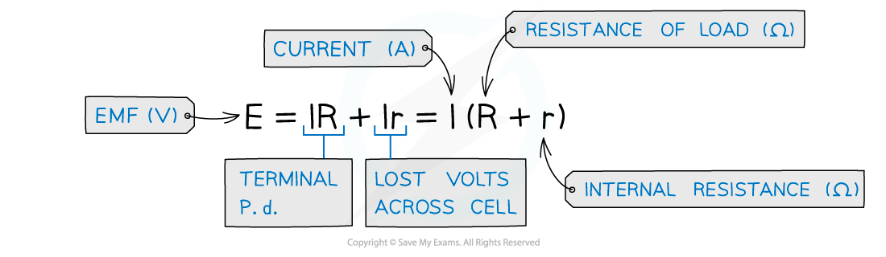

# E.M.F. vs. Terminal Potential Difference

## E.M.F. vs. Terminal Potential Difference

> **Spec point** — `spcpt_Rr7KBb2CcbMFWY6m`

## E.M.F. vs. Terminal Potential Difference

#### Terminal Potential Difference

- **The terminal potential difference (p.d.) is the potential difference across the terminals of a cell**

  - If there was no internal resistance, the terminal p.d. would be equal to the e.m.f.
  - If a cell has internal resistance, the terminal p.d. is always **lower** than the e.m.f.
  - If you have a load resistor *R* across the cell's terminals, then the terminal p.d. is **also** the potential difference across the load resistor

***Circuit showing the e.m.f. and internal resistance of a power supply***

- Where:

  - Resistor *R* is the ‘load resistor’
  - *r* is the internal resistance
  - ε is the e.m.f.
  - Vr is the lost volts
  - VR is the p.d across the load resistor, which is the same as the terminal p.d.

- Terminal potential difference is the voltage available to the rest of the circuit

**V****R ****= *****I***** × *****R***** ** ( from Ohm’s law)

- Where:

  - R = load resistance (Ω)
  - I = current in the circuit (A)
  - VR = Terminal p.d. (V)

- When a load resistor is connected, current flows through the cell and a potential difference develops across the internal resistance.

  - This voltage is not available to the rest of the circuit so is called the ‘lost volts’

- *V**r* is the **lost volts**

  - This is the voltage lost in the cell due to internal resistance

**V****r**** = *****I***** × *****r ***(from Ohm’s law)

- Where:

  - r = internal resistance (Ω)
  - I = current in the circuit (A)
  - Vr = Lost volts (V)

- The e.m.f. is the sum of the terminal p.d. and the lost volts:

#### The Difference Between Potential Difference and E.M.F

- The difference between **potential difference** and **e.m.f **is the type of energy transfer per unit charge

- When charge passes through a resistor, for example, its electrical energy is converted to heat in the resistor

  - The resistor, therefore, has a **potential difference** across it
- Potential difference describes the loss of energy from charges

  - Ie. when** electrical energy **is **transferred** to other forms of energy in a component
- E.m.f. describes the **transfer of energy **from the **power supply** to **electrical charges **within the circuit

> **Worked Example**
> A battery of e.m.f. 7.3 V and internal resistance r of 0.3 Ω is connected in series with a resistor of resistance 9.5 Ω.
> 
> 
> 
> Determine:
> 
> a) The current in the circuit
> 
> b) Lost volts from the battery
> 
> **Answer:**
> 
> 

> **Exam Hint**
> If the exam question states 'a battery of negligible internal resistance', this assumes that e.m.f. of the battery is equal to its voltage. Internal resistance calculations will not be needed here. If the battery in the circuit diagram includes internal resistance, then the e.m.f. equations must be used.
