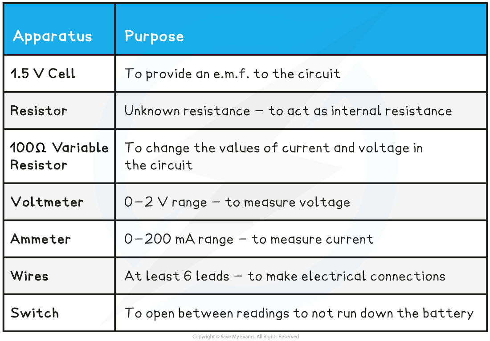
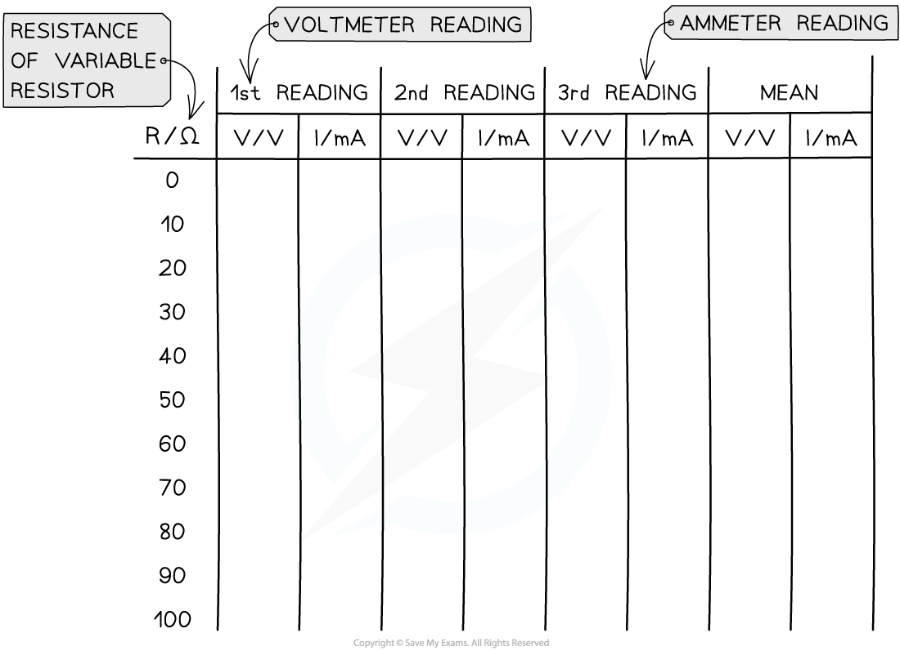

# Core Practical 8: Investigating E.M.F. & Internal Resistance

## Core Practical 8: Investigating E.M.F. & Internal Resistance

> **Spec point** — `spcpt_Pc34TqDb7G7ycy8X`

## Core Practical 8: Investigating E.M.F. & Internal Resistance

#### Aims of the Experiment

The overall aim of the experiment is to investigate the relationship between e.m.f and internal resistance by measuring the variation of current and voltage using a variable resistor

- *Independent variable* = resistance, *R* (Ω)
- *Dependent variable* = voltage, *V* (V) & current, *I* (A)
- Control variables:

  - E.m.f of the cell
  - Internal resistance of the cell

#### Equipment List

- Resolution of measuring equipment:

  - Voltmeter = 1 mV
  - Ammeter = 0.1 mA

#### Method

1. The cell and the resistor, labelled *r*, should be connected in series and considered to be a single cell
2. With the switch open, record the reading *V* on the voltmeter
3. Set the variable resistor to its maximum value, close the switch and record *V* and the reading *I* on the ammeter

  - Make sure to open the switch between readings
4. Vary the resistance of the variable resistor up to a minimum of 8-10 readings and

  - Record values for *V* and *I* for each resistance.
  - Ensure to take readings for the whole range of the variable resistor

- An example of a suitable table might look like this:

#### Analysing the Results

- The relationship between e.m.f. and internal resistance is given by

***E***** = *****I***** (*****R***** + *****r*****)**

- Where:

  - *E* = electromotive force (V)
  - *I* = current (A)
  - *R* = resistance of the load in the circuit (Ω)
  - *r* = internal resistance of the cell (Ω)

- This can be simplified into the form:

***E***** = *****IR***** + *****Ir***** = *****V***** + *****Ir***

- Rearranging this equation for *V*:

***V***** = –*****rI***** + *****E***

- Comparing this to the equation of a straight line: y = mx + c

  - y = *V* (V)
  - x = *I* (A)
  - Gradient = –*r* (Ω)
  - Y-intercept = *E* (V)

1. Plot a graph of V against I and draw a line of best fit
2. Measure the gradient of the graph and compare it with the manufacturer’s value of the resistor
3. The y-intercept will be the e.m.f and the gradient will be the negative internal resistance:

#### Evaluating the Experiment

*Systematic Errors:*

- Only close the switch for as long as it takes to take each pair of readings

  - This will prevent the internal resistance of the battery or cell from changing during the experiment

*Random Errors:*

- Only use fairly new cells otherwise the e.m.f. and internal resistance of run-down batteries can vary during the experiment
- Wait for the reading on the voltmeter and ammeter to stabilise (stop fluctuating) before recording the values
- Take multiple repeat readings (at least 3) for each voltage and current and calculate a mean to reduce random errors

#### Safety Considerations

- Electrical components can get hot when used for a long period
- Switch off the power supply right away if there is a burning smell
- Make sure there are no liquids close to the equipment

> **Worked Example**
> In an experiment, a student uses a variable resistor as an external load. The current flowing through the circuit is measured with a suitable milliammeter and the potential difference across the variable resistor is measured with a voltmeter for a range of resistance values.
> 
> The data collected were as follows:
> 
> 
> 
> Plot a graph of these results and determine the e.m.f. and the internal resistance directly from the graph.
> 
> **Answer:**
> 
> **Step 1: Plot the data on a graph of *****V***** against *****I *****and draw a line of best fit**
> 
> 
> 
> **Step 2: Draw the largest triangle possible in order to calculate the gradient**
> 
> 
> 
> 
> 
> **Step 3: Determine the e.m.f. and the internal resistance from the graph**
> 
> *V* = –*rI* + *E*
> 
> - From this equation:
> 
>   - Gradient = –*r* (Ω)
>   - Y-intercept = *E* (V)
> - Therefore:
> 
>   - Internal resistance, *r* = 22.7 Ω
>   - E.m.f. *E* = 1.60 V
