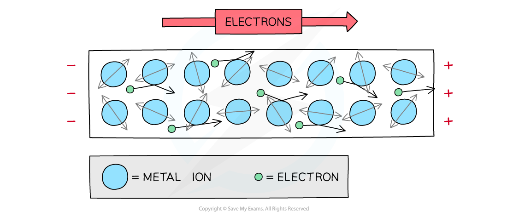
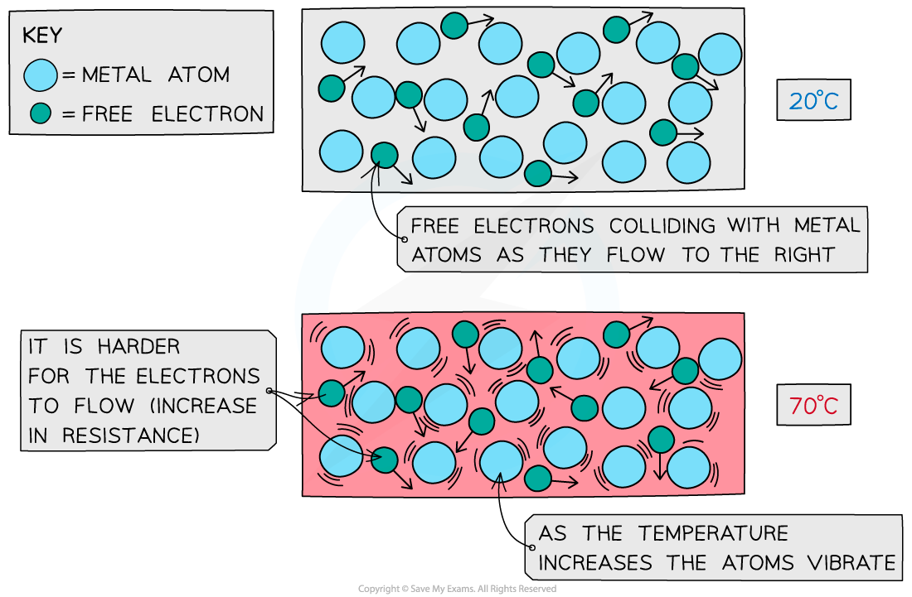
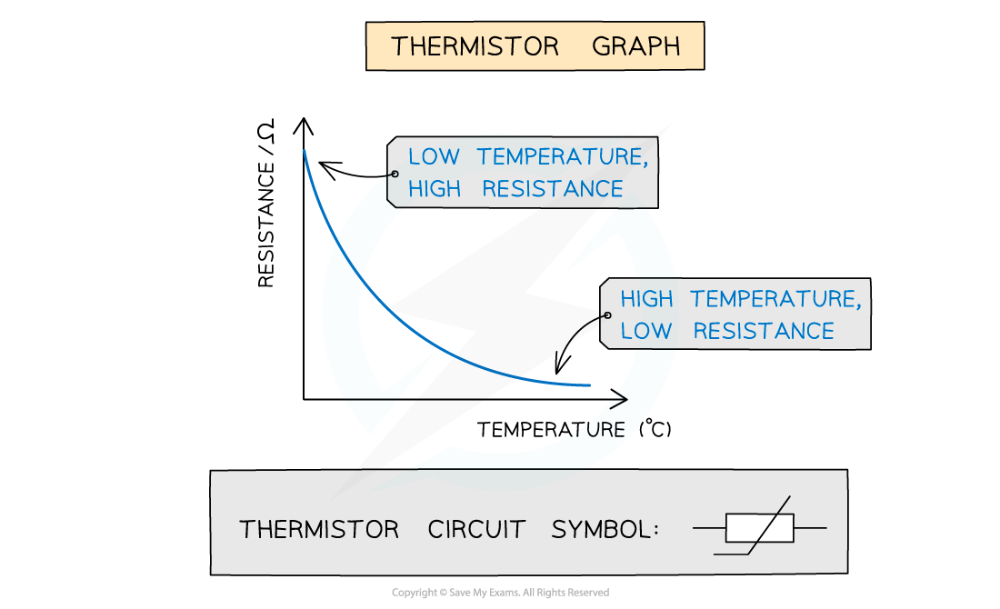
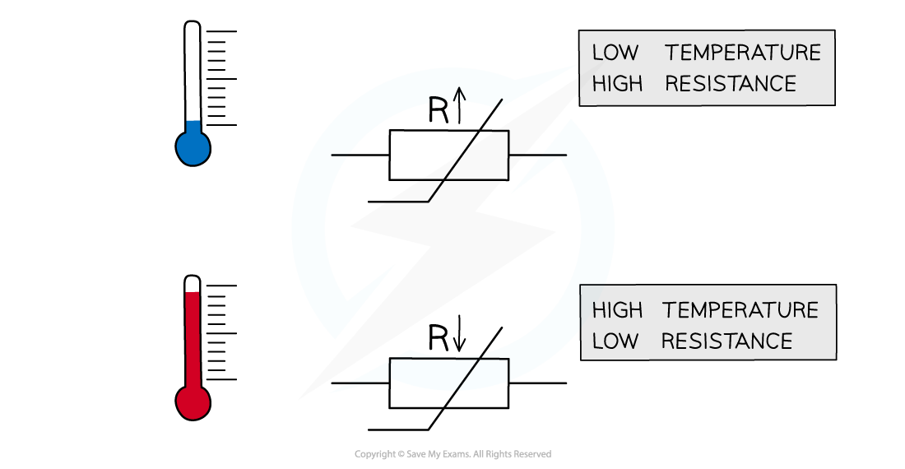

# Resistance & Temperature

## Modelling the Variation of Resistance with Temperature

> **Spec point** — `spcpt_5MDy7HRXq8tDxBT6`

## Modelling the Variation of Resistance with Temperature

- All materials have some **resistance** to the flow of charge
- As **free** **electrons** **move** through a metal wire, they collide with ions which get in their way
- As a result, they **transfer** some, or all, of their **kinetic** **energy** on **collision**, which causes electrical **heating**

***Free electrons collide with ions which resist their flow***

- As temperature increases, the vibrations of the ions in the lattice also increase

  - This increases the chance of collisions between the conduction electrons and the ions
- Since **current** is the **flow** of **charge**, the ions resisting the flow of electrons cause **resistance**
- Therefore as temperature increases so does resistance

  - At small increases of temperature this increase is linear
- A higher current will cause temperature to rise

  - This is due to more collisions between free electrons and ions
  - The collisions cause the ions to vibrate more

## Resistance & Temperature for Metallic Conductors

> **Spec point** — `spcpt_7kjv9B43T2KkH5v6`

## Resistance & Temperature for Metallic Conductors

- All solids are made up of vibrating atoms

  - This includes metal solids
- As the temperature in a metal rises, the ions vibrate with a greater frequency and amplitude

  - The electrons collide with the vibrating atoms which impede their flow, hence the current **decreases**
  - electric current is the flow of free electrons in a material

***Metal atoms and free electrons at low and high temperatures***

- Current decreases because the resistance has increased (from *V* = *IR*)

  - This is because resistivity has increased
  - This is from ρ ∝ *R *(if the area *A* and length *L* is constant)

- For a metallic conductor:

  - an **increase** in temperature leads to an **increase** in resistance and resistivity
  - a **decrease** in temperature leads to a **decrease** in resistance and resistivity

- The *I-V* graph for a filament lamp shows this effect

***I-V characteristics for a filament lamp***

- As the current increases, the number of collisions between free electrons and the lattice of ions increases

  - This increases the temperature of the filament in the lamp
- An increase in temperature leads to** increased vibrations** in the lattice of ions

  - As a result, the frequency of **collisions **between free electrons and the ions increases, which leads to an **increase **in resistance
- Resistance **opposes **the current, causing the current to increase at a slower rate

  - This is seen on the* I*-*V* graph as a curve with a **decreasing gradient**

> **Worked Example**
> The temperature of a non-ohmic resistor increases as the current through it increases.
> 
> Explain this is terms of the structure of a metal.
> 
> **Answer:**
> 
> **Step 1: Consider the effect on rate of electron flow:**
> 
> - Rate of flow of electrons increases
> 
> **Step 2: Consider the effect on number of collisions of conduction electrons with the lattice**
> 
> - This increases the number of collisions of conduction electrons with the ions in the lattice
> 
> **Step 3: Describe what happens to the vibrations of the lattice**
> 
> - Therefore vibrations of the lattice ions increase

## Resistance & Temperature for Thermistors

> **Spec point** — `spcpt_qQnZ3t8Nz5kS6x89`

## Resistance & Temperature for Thermistors

- The resistivity of a thermistor behaves in the **opposite** way to metals

  - This is because it is a type of semiconductor
  - Semiconductors behave in a different way to metals
- The number density of charge carriers (such as electrons) **increases** with **increasing** temperature
- Therefore, for a thermistor:

  - An **increase** in temperature causes a **decrease** in resistance and resistivity
  - A **decrease** in temperature causes an **increase** in resistance and resistivity

- Thermistors are often used in temperature sensing circuits such as thermometers and thermostats
- A thermistor is a non-ohmic conductor and sensory resistor whose resistance varies with temperature

  - Most thermistors are negative temperature coefficient ntc) components.
  - This means that if the temperature **increases,** the resistance of the thermistor **decreases **(and vice versa)
- The temperature-resistance graph for a thermistor is shown below

- Thermistors are temperature sensors and are used in circuits in ovens, fire alarms and digital thermometers

  - As the thermistor gets **hotter**, its resistance **decreases**
  - As the thermistor gets **cooler**, its resistance **increases**

***The resistance through a thermistor is dependent on the temperature of it***

> **Worked Example**
> A thermistor is connected in series with a resistor *R* and a battery.
> 
> 
> 
> The resistance of the thermistor is equal to the resistance of *R* at room temperature.
> 
> Which statement describes the effect when the temperature of the thermistor decreases?
> 
> **A.** The p.d across the thermistor increases
> 
> **B. **The current in *R* increases
> 
> **C. **The current through the thermistor decreases
> 
> **D.** The p.d across *R* increases
> 
> **Answer: A**
> 
> **Step 1: Outline the nature of a thermistor**
> 
> - The resistance of the thermistor increases as the temperature decreases
> 
> **Step 2: Consider the properties of current in a series circuit**
> 
> - Since the thermistor and resistor *R* are connected in series, the current *I* in both of them is the same
> 
> **Step 3: Consider a relevant equation**
> 
> - Ohm’s law states that ***V***** = *****IR***
> - Since the resistance of the thermistor increases, and *I* is the same, the potential difference *V *across it increases
> 
> **Step 4: State the conclusion**
> 
> - Therefore, statement **A** is correct
