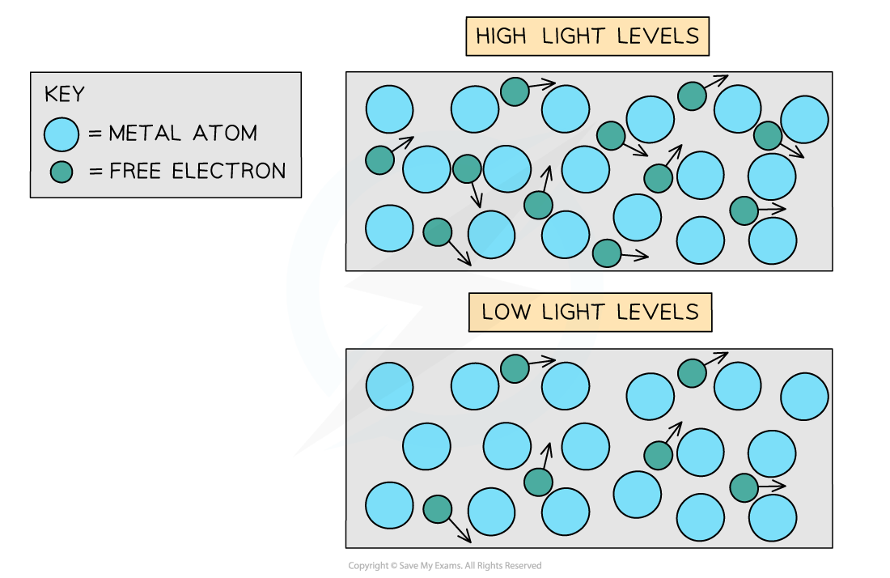
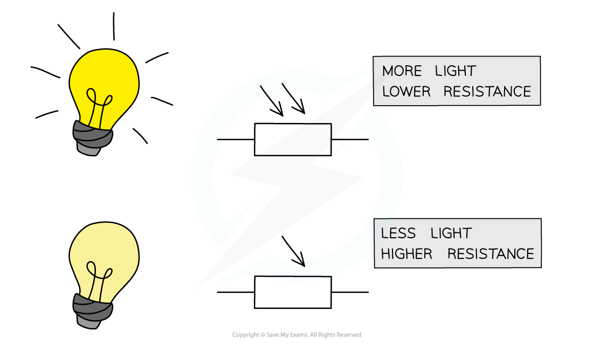
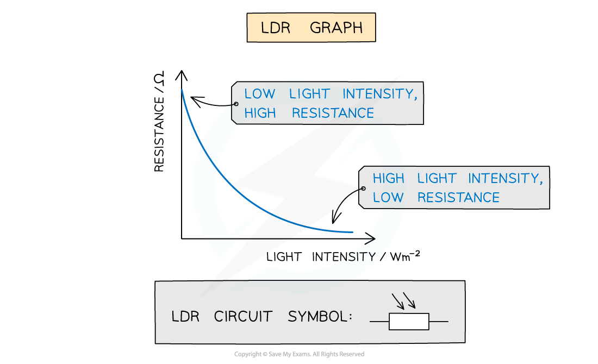
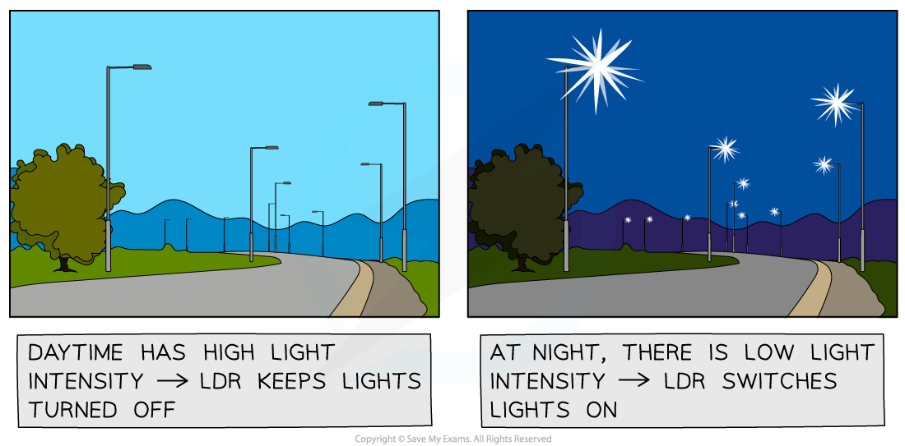

# Resistance & Illumination

## Modelling the Variation of Resistance with Illumination 

> **Spec point** — `spcpt_ZzjXSw25Sj8VxTJs`

## Modelling the Variation of Resistance with Illumination

- Light can cause a change in conductivity of some semi-conductors
- When light is absorbed by the material it causes more electrons to be available for conduction

- An increase in the number of conduction electrons reduces the resistance

## Resistance & Illumination for LDRs

> **Spec point** — `spcpt_bm9n7JHh2HNpVn27`

## Resistance & Illumination for LDRs

- A light-dependent resistor (LDR) is a non-ohmic conductor and sensory resistor
- Its resistance automatically changes depending on the light energy falling onto it (illumination)
- As the** light intensity increases**, the **resistance** of an LDR **decreases**

***Resistance of an LDR depends on the light intensity falling on it***

- This is shown by the following graph:

***Graph of light intensity and resistance for an LDR***

- LDRs can be used as light sensors, so, they are useful in circuits which automatically switch on lights when it gets dark, for example, street lighting and garden lights

  - In the dark, its resistance is very large (millions of ohms)
  - In bright light, its resistance is small (tens of ohms)

***LDRs are used for automatic street lights***

> **Worked Example**
> The graphs show various possible relationships between current and voltage through a component.
> 
> 
> 
> Which graph best represents the relationship between the current and voltage of an LDR?
> 
> 
> 
> **Step 1: Consider the relationship between light intensity and resistance**
> 
> - As light intensity increases, resistance decreases in an LDR
> - If the resistance decreases then the potential difference will increase
> 
> **Step 2: Consider a relevant equation**
> 
> - Ohm’s law states that ***V *****= *****IR***
> - The resistance is equal to V/I or 1/R = I/V = gradient of the graph
> 
>   - Since *R* decreases, the value of 1/R increases, so the gradient must increase
> 
> **Step 3: State the conclusion**
> 
> - Therefore, *I* increases with changing *V* with an increasing gradient
> - This is seen in graph **A**
