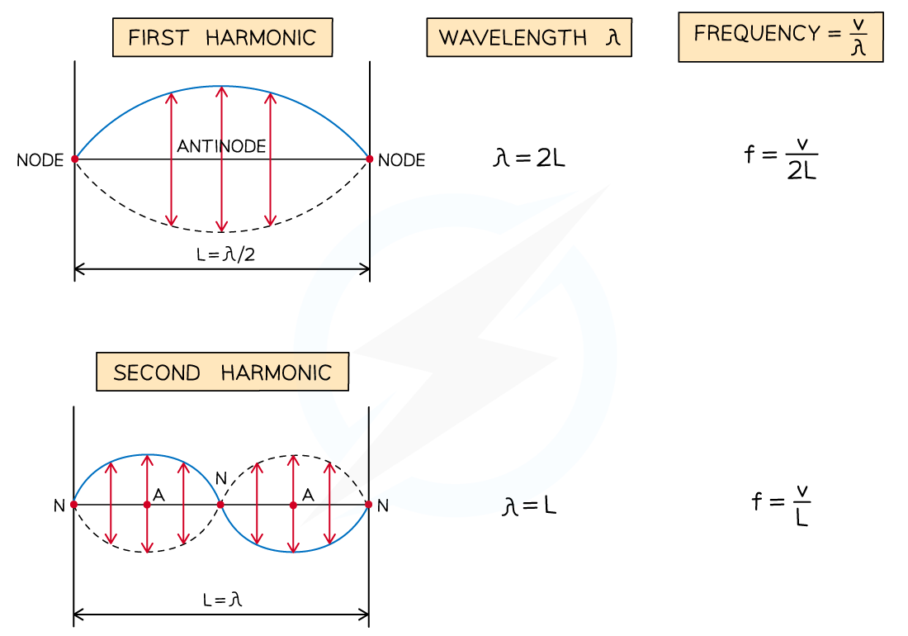

# Wave Speed on a Stretched String

## Wave Speed on a Stretched String

> **Spec point** — `spcpt_rt4PQwsj5vPKMNPh`

## Wave Speed on a Stretched String

- The speed of a wave travelling along a string with two fixed ends is given by:

- Where:

  - *T* = tension in the string (N)
  - μ = mass per unit length of the string (kg m–1)

- At the fundamental frequency, *f**0* of a stationary wave of length *L*, the wavelength, *λ* = *2L*
- Therefore, according to the wave equation, the speed of the stationary wave is:

***v***** = *****fλ***** = f × 2*****L***

- Combining these two equations leads to the equation for the **fundamental frequency** (sometimes referred to as the first harmonic):

- Where:

  - *f* = frequency (Hz)
  - *L *= the length of the string (m)
  - *T *= the tension in the string (N)
  - *µ *= mass per unit length (kg m-1)
- Mass per unit length, *µ *can be calculated by dividing the mass of the string by the length of the string

***Diagram showing the first three modes of vibration of a stretched string with corresponding frequencies***

> **Worked Example**
> A guitar string of mass 3.2 g and length 90 cm is fixed onto a guitar.
> 
> The string is tightened to a tension of 65 N between two bridges at a distance of 75 cm.
> 
> 
> 
> Calculate the
> 
> a) speed of the waves on the string
> 
> b) fundamental frequency of the string
> 
> **Answer:**
> 
> **Part (a)**
> 
> **Step 1: Write the known quantities in S.I. units**
> 
> - Tension, *T *= 65 N
> - Mass, *m* = 3.2 g = 3.2 × 10−3 kg
> - Length of string, *L* = 90 cm = 0.90 m
> 
>   - Mass per unit length, *μ *= $\frac{m}{L}=\frac{3.2\times10^{-3}}{0.9}$ = 3.56 × 10−3 kg m−1
> 
> **Step 2: Write the equation for speed on a string and calculate**
> 
> - *v* = *fλ* = f × 2*L**** ***AND** *****f *****= **$\frac{1}{2L}\sqrt{\frac{T}{μ}}$
> - So, *v* = $\frac{1}{2L}\sqrt{\frac{T}{μ}}\times2L=\sqrt{\frac{T}{μ}}$
> 
> $v=\sqrt{\frac{T}{μ}}=\sqrt{\frac{65}{3.56\times10^{-3}}}$ = 135
> 
> **Step 3: Write the answer to the correct significant figures and include units**
> 
> - The speed of the wave on the string, *v* = 140 m s−1
> 
> **Part (b)**
> 
> **Step 1: Write the known quantities in S.I. units**
> 
> - Tension, *T *= 65 N
> - Length of string under tension,* L* = 75 cm = 0.75 m
> - Mass per unit length, *μ =* 3.56 × 10−3 kg m−1 (from part (a))
> 
> **Step 2: Identify the length of one wavelength at the fundamental frequency, *****f******0***
> 
> 
> 
> **Step 3: Write the equation for fundamental frequency and calculate**
> 
> $f_{0}=\frac{1}{2L}\sqrt{\frac{T}{μ}}=\frac{v}{2L}=\frac{135}{(2\times0.75)}$** **= 90.1
> 
> **Step 3: Write the answer to the correct significant figures and include units**
> 
> - The fundamental frequency, f0 = 90 Hz

> **Exam Hint**
> Go through solutions step by step, showing all your working. Questions like this one will be very similar so you can rely on using your tried and tested method to get the answer.
