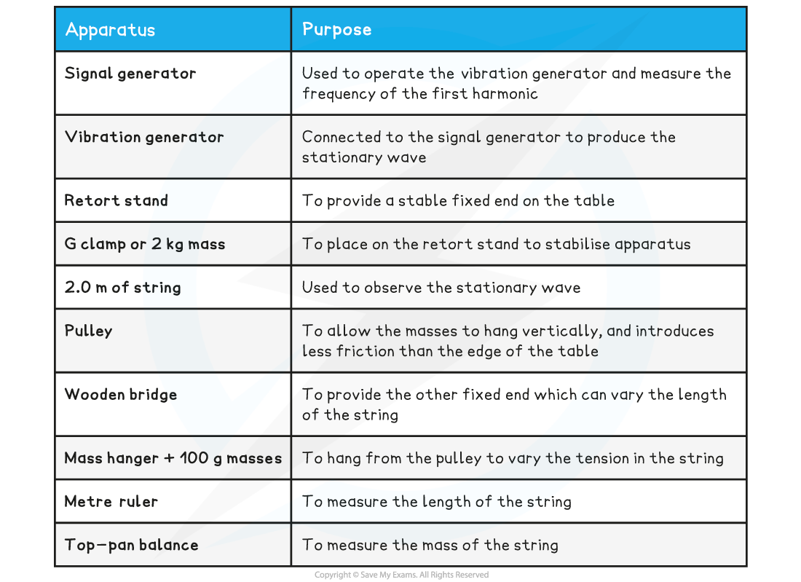
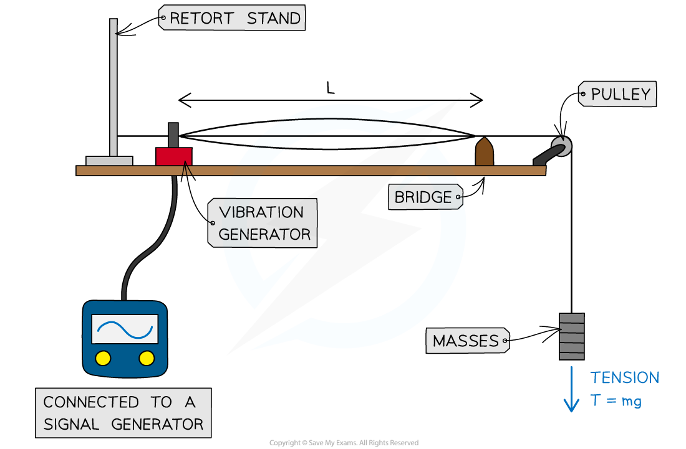
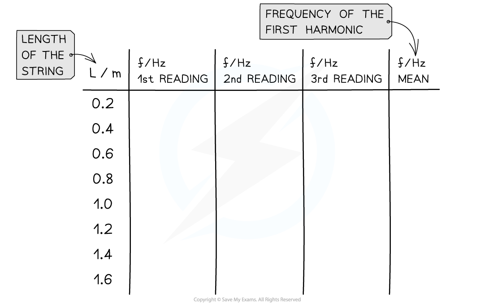

# Core Practical 5: Investigating Stationary Waves

## Core Practical 5: Investigating Stationary Waves

> **Spec point** — `spcpt_PcNMWHzk9t5P3dqG`

## Core Practical 5: Investigating Stationary Waves

#### Aims of the Experiment

- The overall aim of the experiment is to measure how the frequency of the first harmonic is affected by changing one of the following variables:

  - The length of the string
  - The tension in the string
  - Strings with different values of mass per unit length

#### Variables

- *Independent variable* = either length, tension, or mass per unit length
- *Dependent variable* = frequency of the first harmonic
- Control variables

  - If length is varied = same masses attached (tension), same string (mass per unit length)
  - If tension is varied = same length of the string, same string (mass per unit length)
  - If mass per unit length is varied = same masses attached (tension), same length of the string

#### Equipment List

- *Resolution* of measuring equipment:

  - Metre ruler = 1 mm
  - Signal generator ~ 10 nHz
  - Top-pan balance = 0.005 g

#### Method

***The setup of apparatus required to measure the frequency of the first harmonic at different values of length, tension, or mass per unit length***

This method is an example of the procedure for varying the length of the string with the frequency – this is just one possible relationship that can be tested

1. Set up the apparatus by attaching one end of the string to the **vibration generator** and pass the other end over the bench pulley and secure to the mass hanger
2. Adjust the position of the bridge so that the length *L* is measured from the vibration generator to the bridge using a metre ruler
3. Turn on the **signal generator** to set the string **oscillating**
4. Increase the **frequency** of the vibration generator until the **first harmonic** (**nodes** at both ends and an **antinode** in the middle) is observed and read the frequency that this occurs at
5. **Repeat** the procedure with different lengths of *L*
6. Repeat the frequency readings at least two more times and take the **average** of these measurements
7. Measure the **tension** in the string using *T* = *mg*

  - Where *m* is the  mass attached to the string and *g* is the gravitational field strength on Earth (9.81 N kg–1)
8. Measure the **mass per unit length** of the string, *μ* = mass of string ÷ length of string

  - Simply take a known length of the string (1 m is ideal) and measure its mass on a balance

- An example of a table with some possible string lengths might look like this:

***Before conducting an experiment, a table must be set up to detail of what measurements are to be made***

#### Analysing the Results

- For the **first harmonic**, wavelength, *λ* = 2*L*
- So, the **speed** of the stationary wave is:

***v***** = *****f*****λ = *****f***** × 2*****L***

- Rearranging for **frequency**, *f*:

- Comparing this to the equation of a straight line: y = mx

  - y = *f* (Hz)
  - x = 1/*L* (m–1)
  - Gradient = *v*/2 (m s–1)

1. **Plot** a graph of the mean values of *f* against 1/*L*
2. Draw a **line of best fit** and calculate the gradient
3. Work out the **wave speed**, which will be 2 × gradient

***If the frequency is plotted again the inverse of the length, the velocity is twice the gradient of the graph***

- Verify the **wave speed** of the travelling waves using the equation:

- Where:

  - *T* = tension (N)
  - *μ* = mass per unit length (kg m−1)

- Assess the **uncertainties** in the measurements of length and frequency, and carry out calculations to determine the uncertainty in the wave speed

#### Evaluating the Experiment

***Systematic errors:***

- An **oscilloscope** can be used to verify the signal generator’s readings
- The signal generator should be left for about 20 minutes to stabilise
- The measurements would have a **greater resolution** if the length used is as large as possible, or as many half-wavelengths as possible

  - This means measurements should span a **suitable range**, for example, 20 cm intervals over at least 1.0 m

***Random errors:***

- The **sharpness** of resonance leads to the biggest problem in deciding when the first harmonic is achieved

  - This can be **resolved** by adjusting the frequency while looking closely at a node. This is a technique to gain the largest response
  - Looking at the amplitude is likely to be less reliable since the wave will be moving very fast
- When taking repeat measurements of the frequency, the best procedure is as follows:

  - Determine the **frequency** of the **first harmonic** when the largest vibration is observed and note down the frequency at this point
  - **Increase the frequency** and then gradually reduce it until the first harmonic is observed again and note down this frequency
  - If taking three repeat readings, repeat this procedure again
  - Average the three readings and move on to the next measurement

#### Safety Considerations

- Use a** rubber string** instead of a metal wire, in case it snaps under tension
- If using a metal wire, **wear goggles** to protect the eyes
- **Stand well away** from the masses in case they fall onto the floor
- Place a **crash mat** or a soft surface under the masses to break their fall

> **Worked Example**
> A student investigates the relationship between the frequency of the stationary waves on a wire and the tension in the wire. The tension is varied by adding masses to a hanger which is attached to a pulley over one end of a table.The student records the following data:
> 
> - Mass of the wire = 0.16 g
> - Length of the wire weighed = 1.0 m
> - Distance between the fixed ends = 0.4 m
> 
> 
> 
> Calculate the frequency using the relation between frequency, length, tension and mass per unit length. Evaluate the percentage uncertainty in these values.
> 
> **Answer:**
> 
> 
> 
> 
> 
> 
> 
> 
> 
> 
