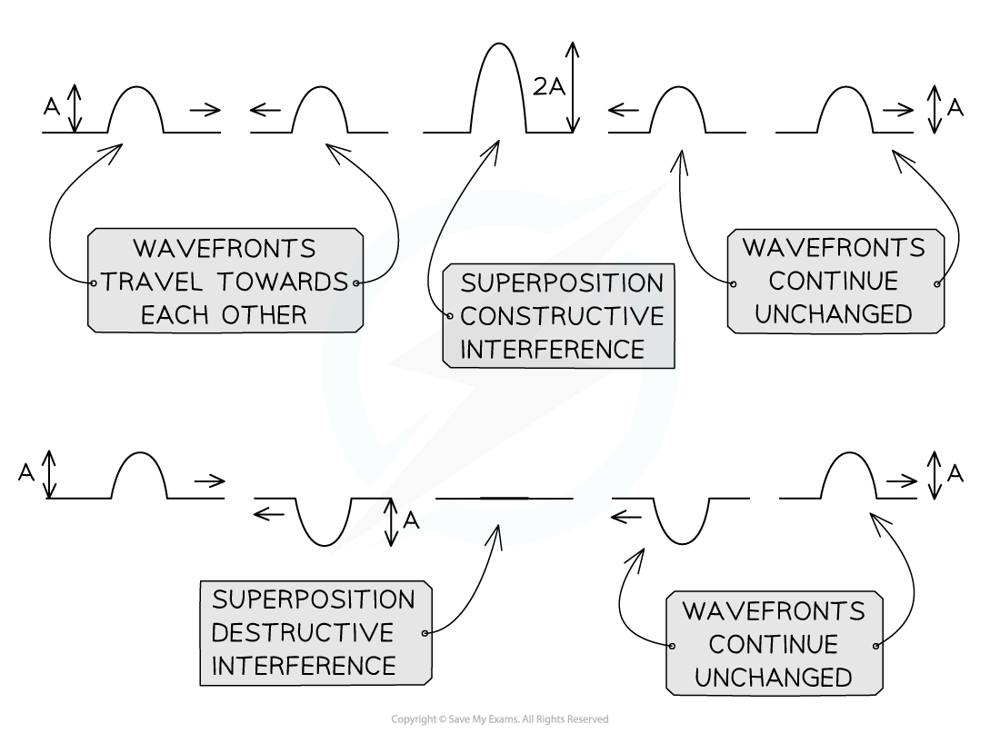
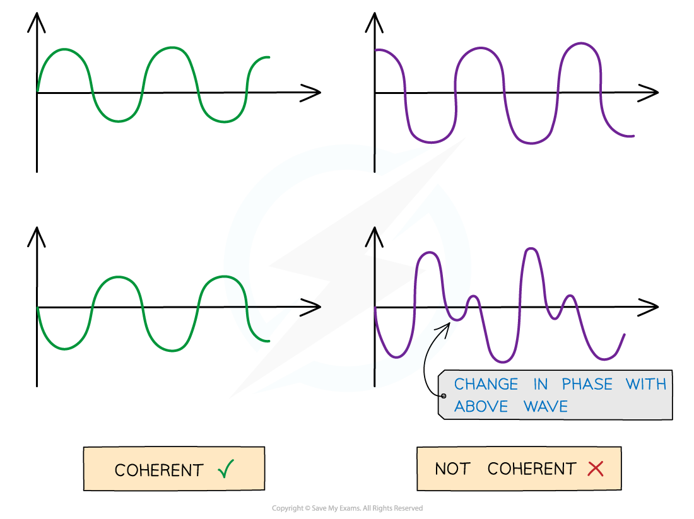

# Interference & Superposition of Waves

## Interference & Superposition of Waves

> **Spec point** — `spcpt_gKf5fPxvqWbsCkmd`

## Interference & Superposition of Waves

- **Interference** occurs whenever two or more waves combine to produce a resultant wave with a new *amplitude*
- **Superposition **literally means to be **positioned over **something

  - When waves interfere and combine, they do so according to the ***principle of superposition***

- If two *wavefronts* are travelling towards each other they will combine by superposition and then pass through
- The wavefronts will emerge unchanged on the other side

- Interference due to superposition can be constructive or destructive

  - **Constructive interference** happens when the resultant wave has a larger amplitude than any of the individual waves
  - **Destructive interference** happens when the resultant wave has a smaller amplitude than the individual waves

#### Coherence

- Interference is only observable if produced by a **coherent** source
- Waves are said to be coherent if they have:

  - A **constant *****phase difference***
  - The **same *****frequency***

***Coherent waves (on the left) and non-coherent waves (on the right). The abrupt change in phase creates an inconsistent phase difference***

- For example, in light, a coherent beam of light contains light waves that are **monochromatic** and have a constant phase difference

  - Monochromatic light consists of light waves of a **single frequency**
  - Laser light is an example of a coherent light source
  - Filament lamps produce incoherent light waves

> **Exam Hint**
> It can sometimes be tricky to identify whether constructive or destructive interference is taking place. If two waves meet at the same point on each wave e.g. two crests then the interference will be constructive, if not it will be destructive.
