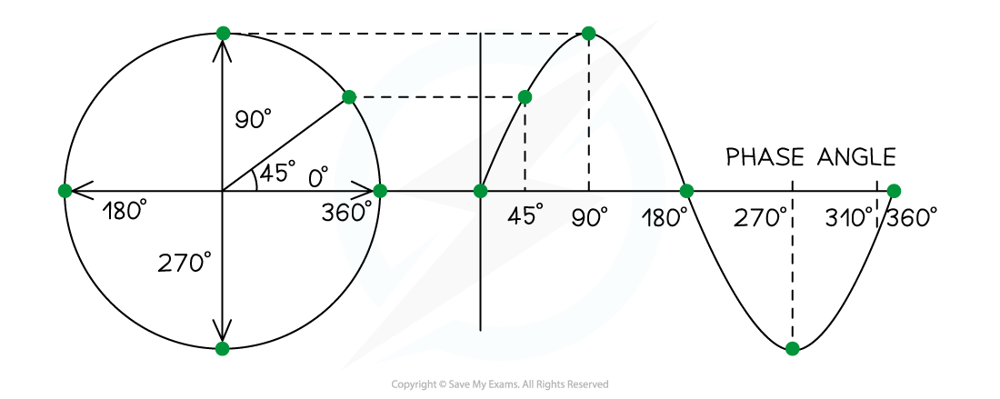
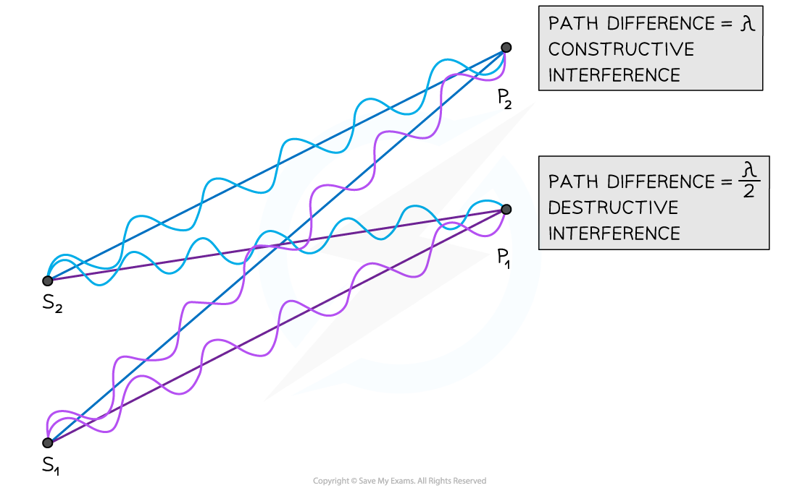
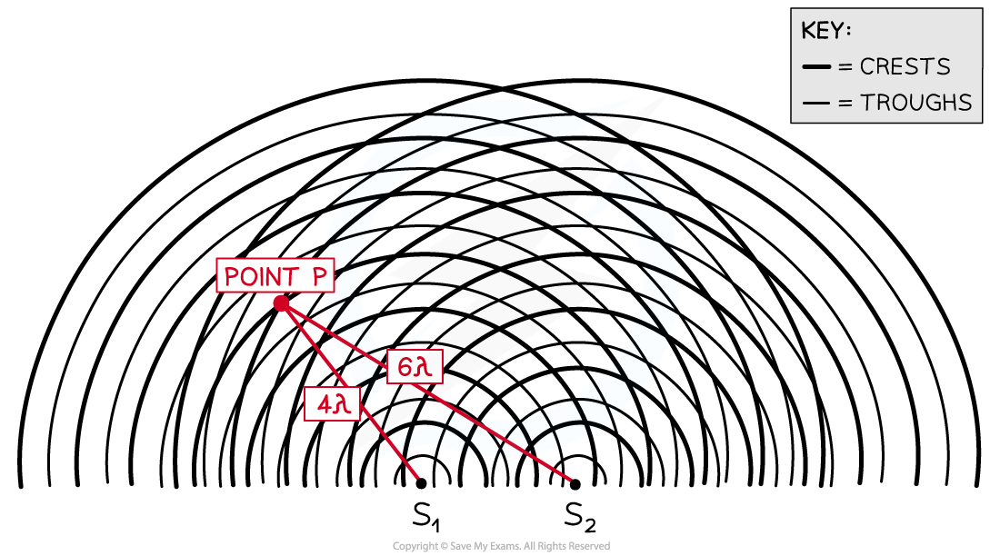

# Phase & Path Difference

## Phase & Path Difference

> **Spec point** — `spcpt_x2PTTBsKyQ8jTtrt`

## Phase & Path Difference

- Waves are said to be **coherent** if they have:

  - The same **frequency**
  - A **constant phase difference**

#### Phase Difference

- Two points on a wave, or on different waves, are in phase when they are the same point in their wave cycle
- The angle between their wave cycles is the phase difference

#### Path Difference

- The type of interference occurring at a given point (i.e. constructive or destructive) depends on the **path difference** of the overlapping waves
- Path difference is defined as: **The difference in distance travelled by two waves from their sources to the point where they meet**
- Path difference is generally expressed in multiples of *wavelength*

***At point P******2****** the waves have a path difference of a whole number of wavelengths resulting in constructive interference. At point P******1****** the waves have a path difference of an odd number of half wavelengths resulting in destructive interference***

- In the diagram above, the number of wavelengths between:

  - S1 ➜ P1 = 6λ
  - S2 ➜ P1 = 6.5λ
  - S1 ➜ P2 = 7λ
  - S2 ➜ P2 = 6λ
- The path difference at point P1 is 6.5λ – 6λ = **λ / 2**
- The path difference at point P2 is 7λ – 6λ = **λ**
- In general:

  - The condition for constructive interference is a path difference of **nλ**
  - The condition for destructive interference is a path difference of **(n + ½)λ**
  - In this case, n is an integer i.e. 0, 1, 2, 3...

- Hence:

  - **Destructive interference **occurs **at** point **P****1**
  - **Constructive interference **occurs **at** point** P****2**

***At point P the waves have a path difference of a whole number of wavelengths resulting in constructive interference***

- Another way to represent waves spreading out from two sources is shown in the diagram above
- At point **P**, the number of **crests** from:

  - Source S1 = 4λ
  - Source S2 = 6λ
- The path difference at **P** is 6λ – 4λ = **2λ**
- This is a whole number of wavelengths, hence **constructive interference** occurs at point **P**

> **Worked Example**
> The diagram shows the interferences of coherent waves from two point sources.
> 
> 
> 
> Which row in the table correctly identifies the type of interference at points **X**, **Y** and **Z**.
> 
> 
> 
> **Answer: B**
> 
> - At point **X**:
> 
>   - Both peaks of the waves are overlapping
>   - Path difference = 5.5λ – 4.5λ = λ
>   - This is **constructive** interference and rules out options **C** and **D**
> - At point **Y**:
> 
>   - Both troughs are overlapping
>   - Path difference = 3.5λ – 3.5λ = 0
>   - Therefore **constructive** interference occurs
> - At point **Z**:
> 
>   - A peak of one of the waves meets the trough of the other
>   - Path difference = 4λ – 3.5λ = λ / 2
>   - This is **destructive** interference

**      **

> **Exam Hint**
> Phase difference and path difference are easy to confuse because the names sound similar. However they are very different concepts.
> 
> Phase difference tells us how far apart the waves are when **comparing their phases** (you can think of this as their peaks and troughs).
> 
> Path difference is how much further along one wave is than another. Think of it as how much **further along the path** it has travelled.
