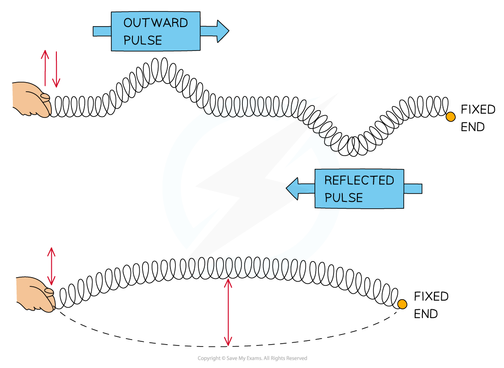
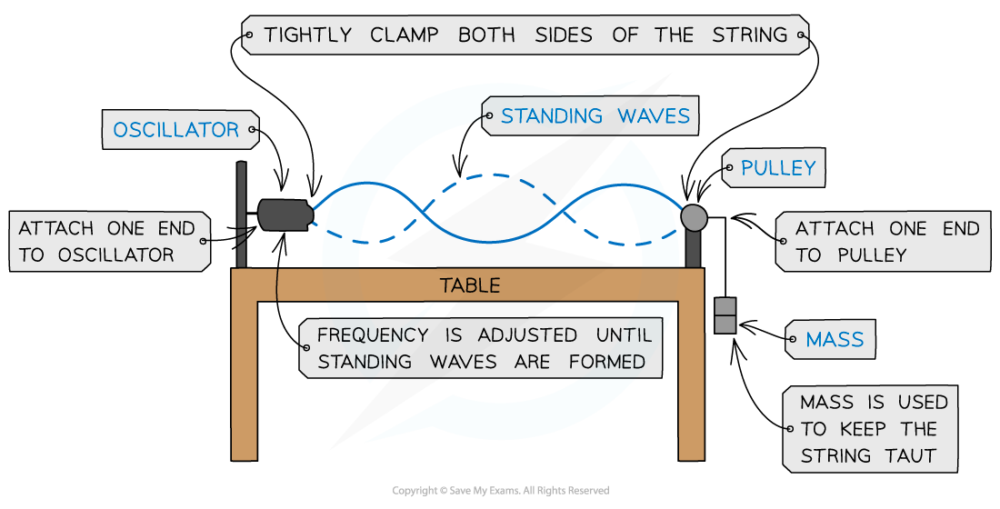
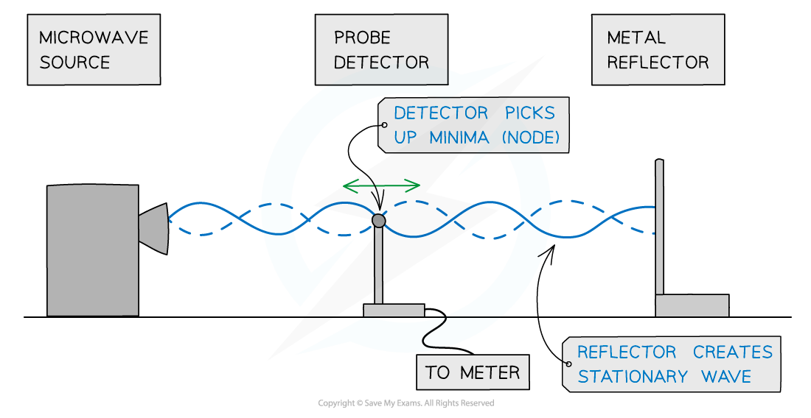
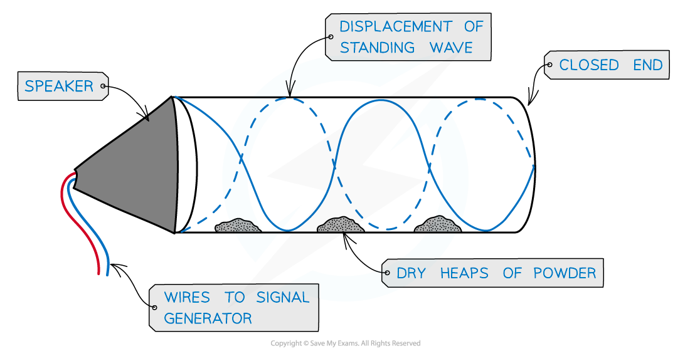
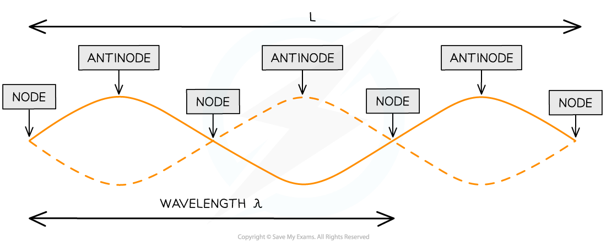

# Stationary Waves

## Stationary Waves

> **Spec point** — `spcpt_2WxQKHfmWGBRssCZ`

## Stationary Waves

- **Stationary waves**, or standing waves, are produced by the **superposition** of two waves of the **same frequency** and **amplitude** travelling in **opposite directions**
- This is usually achieved by a travelling wave and its **reflection**. The superposition produces a wave pattern where the **peaks** and **troughs** **do not move**

***Formation of a stationary wave on a stretched spring fixed at one end***

- In this section, we will look at a few experiments that demonstrate stationary waves in everyday life

*** ***

#### Stretched Strings

- Vibrations caused by stationary waves on a stretched string produce sound

  - This is how stringed instruments, such as guitars or violins, work
- This can be demonstrated by an oscillator vibrating a length of string under tension fixed at one end:

***Stationary wave on a stretched string***

*** ***

- As the frequency of the oscillator changes, standing waves with different numbers of **minima** (**nodes**) and **maxima** (**antinodes**) form

#### Microwaves

- A microwave source is placed in line with a **reflecting plate** and a small **detector** between the two
- The reflector can be moved to and from the source to vary the stationary wave pattern formed
- By moving the **detector**, it can pick up the minima (nodes) and maxima (antinodes) of the stationary wave pattern

***Using microwaves to demonstrate stationary waves***

#### Air Columns

- The formation of stationary waves inside an air column can be produced by sound waves

  - This is how musical instruments, such as clarinets and organs, work
- This can be demonstrated by placing a fine powder inside the air column and a loudspeaker at the open end
- At certain frequencies, the powder forms evenly spaced heaps along the tube, showing where there is **zero disturbance** as a result of the nodes of the stationary wave

***Stationary wave in an air column***

- In order to produce a stationary wave, there must be a minima (node) at one end and a maxima (antinode) at the end with the loudspeaker

#### Nodes and Antinodes

- A stationary wave is made up **nodes** and **antinodes**

  - **Nodes** are where there is no vibration
  - **Antinodes** are where the vibrations are at their maximum amplitude
- The nodes and antinodes **do not** move along the string. Nodes are fixed and antinodes only move in the vertical direction

  - Between nodes, all points along the stationary wave are in phase
  - The image below shows the nodes and antinodes on a snapshot of a stationary wave at a point in time

*** ***

- *L* is the length of the string
- 1 wavelength *λ *is only a portion of the length of the string

> **Worked Example**
> A stretched string is used to demonstrate a stationary wave, as shown in the diagram.
> 
> 
> 
> Which row in the table correctly describes the length of L and the name of **X** and **Y**?
> 
> 
> 
> **Answer: C**
> 
> 

> **Exam Hint**
> Always refer back to the experiment or scenario in an exam question e.g. the wave produced by a **loudspeaker** reflects at the end of a **tube**. This reflected wave, with the same frequency, overlaps the initial wave to create a stationary wave.
> 
> Can't remember which is the node and which is the anti-node? **Nod**es occur at areas of **NO D**isturbance!
