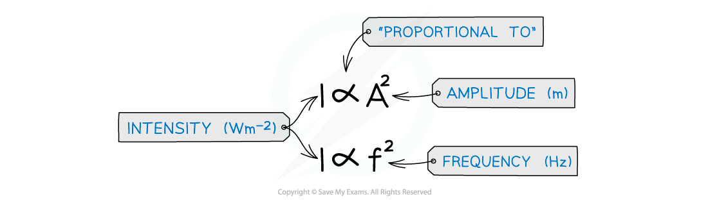
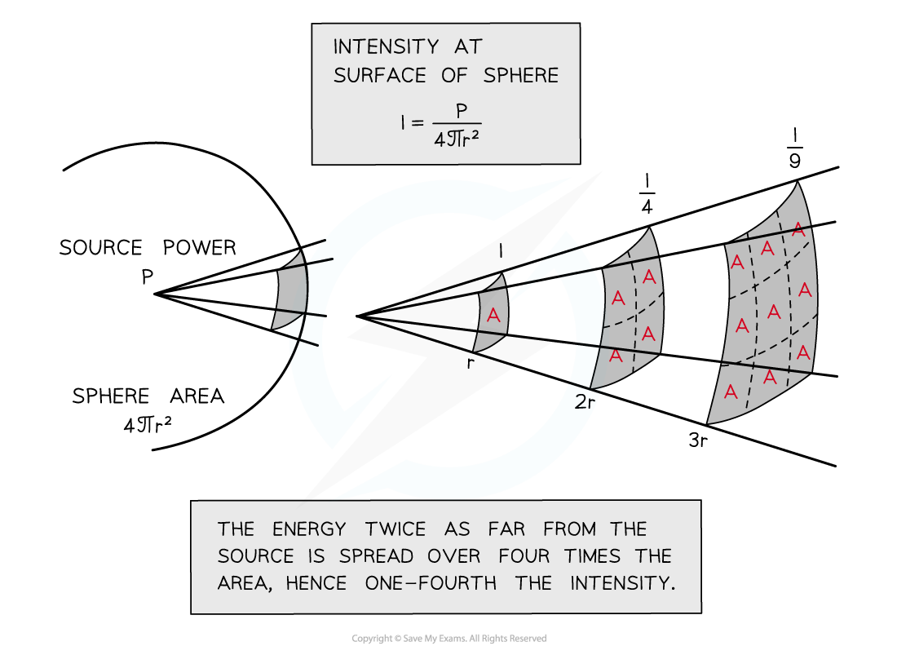

# Equation for the Intensity of Radiation

## Equation for the Intensity of Radiation

> **Spec point** — `spcpt_Yd3KTTv4mrWCrqMp`

## Equation for the Intensity of Radiation

- Progressive waves transfer **energy**
- The amount of energy passing through a unit area per unit time is the **intensity** of the wave
- Therefore, the **intensity** is defined as **power per unit area**

***Intensity is equal to the power per unit area***

- The **area** the wave passes through is **perpendicular** to the direction of its **velocity**
- The** intensity** of a progressive wave is also **proportional** to its **amplitude squared** and **frequency squared**

***Intensity is proportional to the amplitude******2****** and frequency******2***

- This means, if the frequency or the amplitude is doubled, the intensity increases by a factor of 4 (22)

#### Spherical Waves

- A **spherical wave** is a wave from a point source that **spreads out equally** in all directions
- The area the wave passes through is the **surface area** of a sphere:** 4πr****2**
- As the wave travels further from the source, the energy it carries passes through increasingly larger areas as shown in the diagram below:

***Intensity is proportional to the amplitude squared***

*** ***

- Assuming there’s no absorption of the wave energy, the **intensity** *I* **decreases** with **increasing distance** from the source
- Note the intensity is proportional to 1/r2

  - This means when the source is twice as far away, the intensity is 4 times less
- The 1/r2 relationship is known in physics as the **inverse square law**

> **Worked Example**
> The intensity of a progressive wave is proportional to the square of the amplitude of the wave. It is also proportional to the square of the frequency. The variation with time t of displacement x of particles when two progressive waves Q and P pass separately through a medium are shown on the graphs
> 
> 
> 
> The intensity of wave Q is *I**0*. What is the intensity of wave P?
> 
> **Answer:**
> 
> 
> 
> 

> **Exam Hint**
> The key concept with intensity is that it has an inverse square relationship with distance (not a linear one). This means the energy of a wave decreases very rapidly with increasing distance
