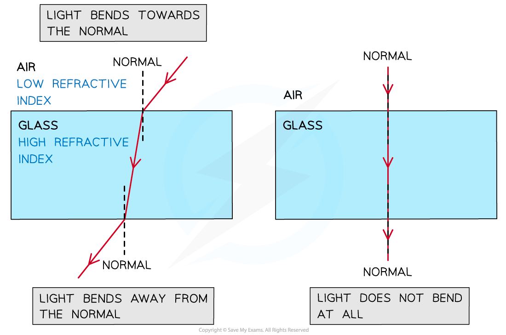
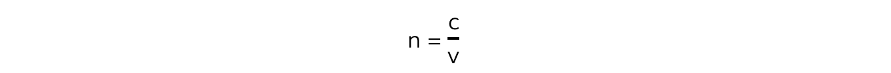
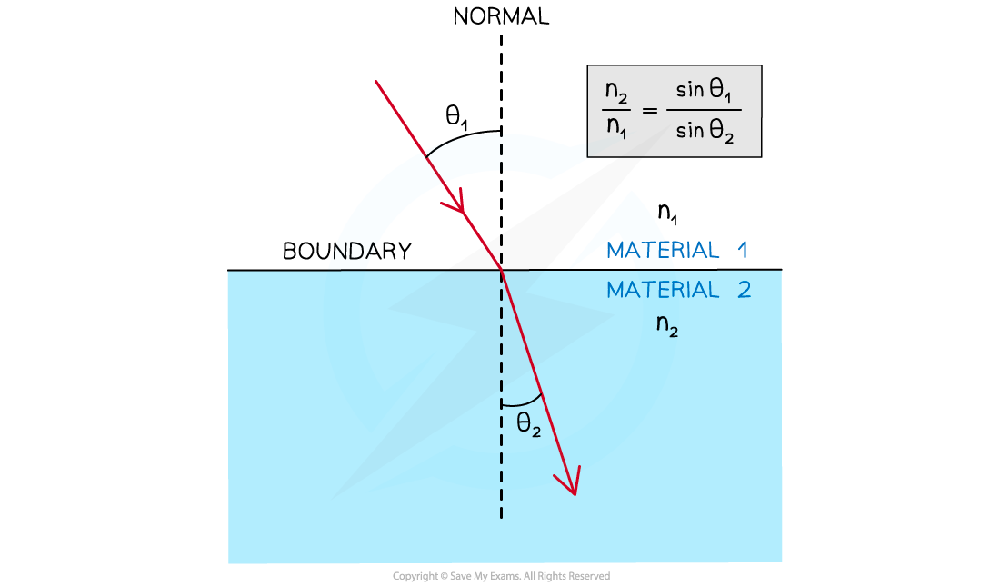

# Refraction & Refractive Index

## Refraction & Refractive Index

> **Spec point** — `spcpt_kVM7GTyj4VVChjt5`

## Refraction & Refractive Index

- Refraction occurs when light passes a boundary between two different transparent media
- At the boundary, the rays of light undergo a **change in direction** and** a change in speed**
- The change in direction is caused by the change in speed

  - Entering a **more dense** medium **slows **the light down and it bends **towards** the normal
  
    - In the denser medium there are more particles closer together providing more friction to the passing of the light through the material
  - Entering a **less** dense medium **speeds **the light up and it bends **away **from the normal
  - When passing **along the normal** (perpendicular) the light does **not **change direction
  - Its speed does still change, as it is passing through a medium with a different refractive index

***Refraction of light through a glass block***

#### Calculating Refractive Index

- The refractive index, *n*, is a property of a material which measures how much light slows down when passing through it

- Where:

  - *c* = *the speed of light* in a vacuum (m s–1)
  - *v* = the speed of light in a substance (m s–1)

- Light travels at different speeds within different substances depending on their refractive index

  - A material with a high refractive index is called **optically dense**, such material causes light to travel **slower**
- Since the speed of light in a substance will always be less than the speed of light in a vacuum, the value of the *n* is **always greater than 1**
- In calculations, the refractive index of air can be taken to be approximately **1**

  - This is because light does not slow down significantly when travelling through air (as opposed to travelling through a vacuum)

#### Snell's Law

- Snell’s law relates the **angle of incidence** to the **angle of refraction**, it is given by:

***n******1***** sin *****θ******1***** = *****n******2***** sin *****θ******2***

- Where:

  - *n**1* = the refractive index of material 1
  - *n**2* = the refractive index of material 2
  - *θ**1* = the angle of incidence of the ray in material 1 (°)
  - *θ**2* = the angle of refraction of the ray in material 2 (°)

***Snell's Law is used to find the refractive indices or the angles to the normal at a boundary***

- *θ**1* and *θ**2 *are always taken from the **normal**
- Material 1 is always the material in which the ray goes through **first**
- Material 2 is always the material in which the ray goes through **second**

> **Worked Example**
> A light ray is directed at a vertical face of a glass cube. The angle of incidence at the vertical face is 39° and the angle of refraction is 25° as shown in the diagram.
> 
> 
> 
> Show that the refractive index of the glass is about 1.5.
> 
> **Answer:**
> 
> 
> 
> 

> **Exam Hint**
> Always double-check if your calculations for the refractive index are greater than 1. Otherwise, something has definitely gone wrong in your calculation!
> 
> The refractive index of air will not be given in the question. Always assume that nair = 1.
> 
> Always check that the angle of incidence and refraction are the angles between the normal and the light ray. Remember the normal line is not really there - it has been drawn in to give you a place to measure from.
