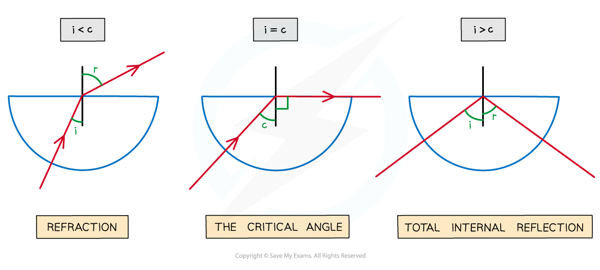
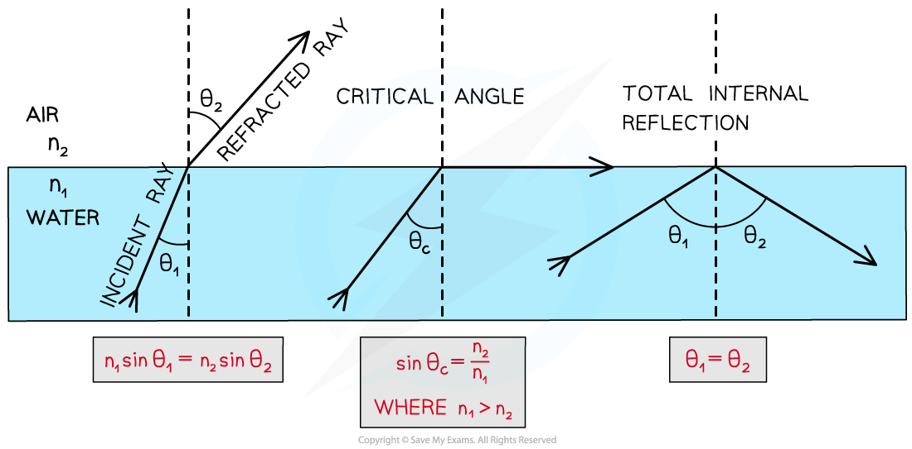

# Total Internal Reflection

## Total Internal Reflection

> **Spec point** — `spcpt_tMF48p6GJK5PBYNz`

## Total Internal Reflection

- Total internal reflection (TIR) occurs when: **The angle of incidence is greater than the critical angle and the incident refractive index***** n******1***** is greater than the refractive index of the material at the boundary *****n******2***
- Therefore, the **two** conditions for total internal reflection are:

  - The angle of incidence, *θ**1* > the critical angle, *C*
  - Refractive index *n**1* > refractive index *n**2* (air)

***Diagram showing refraction, the critical angle and total internal reflection***

- Two conditions are necessary for total internal reflection to occur:

  - The light must be going from a** more dense medium** into a **less dense** one
  - The** angle of incidence** must be **greater** than the **critical angle**

> **Exam Hint**
> If asked to name the phenomena make sure you **give the whole name** - Total Internal Reflection. Remember: Total Internal Reflection occurs when going from a **more dense to **a** less dense** material and **ALL** of the light is reflected. If asked to explain what is meant by the **critical angle**, you can draw the diagram above (showing the three semi-circular blocks).
