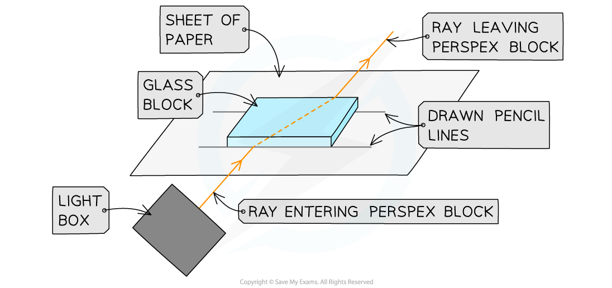
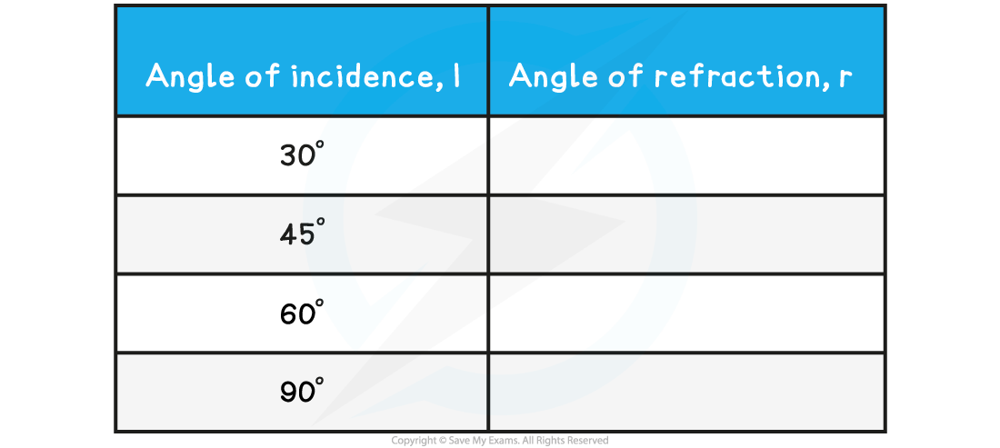

# Measuring Refractive Index

## Measuring Refractive Index

> **Spec point** — `spcpt_WFVSrWs2cx8Vjn7m`

## Measuring Refractive Index

#### Aim of the Experiment

- To investigate the **refraction** of light through a **perspex block**

#### Equipment

- Ray Box - to provide a narrow beam of light to refract through the perspex box
- Protractor - to measure the light beam angles
- Sheet of paper - to mark with lines for angle measurement
- Pencil - to make perpendicular line and angle lines on paper
- Ruler - to draw straight lines on the paper
- Perspex block - to refract the light beam

**Variables**

- *Dependent variable* = angle of refraction , *r*
- Control variables:

  - Use of the same perspex block
  - Width of the light beam
  - Same frequency / wavelength of the light

#### Method

***Apparatus to investigate refraction***

1. Place the **perspex block** on a **sheet of paper**, and draw around it using a pencil
2. Switch on the **ray box** and direct a beam of light at the **side face** of the block
3. **Mark** on the paper with a small 'x':

  - A point on the ray close to the ray box
  - The point where the ray enters the block
  - The point where the ray exits the block
  - A point on the exit light ray which is a distance of about 5 cm away from the block
4. **Draw** a dashed line **normal **(at right angles) to the outline of the block
5. Remove the block and **join the points** marked 'x' with three straight lines
6. Replace the block within its outline and **repeat** the above process for a ray striking the block at **different angles** of incidence

- An example of the data collection table is shown below:

#### Analysis of Results

- *i* and *r *are always measured from the **normal**
- For light rays **entering** perspex block, the light ray refracts **towards** the central line:

**i > r**

- For light rays **exiting** the perspex block, the light ray refracts **away** from the central line:

**i < r**

- When the angle of incidence is 90° to the perspex block, the light ray does **not** refract, it passes straight through the block:

**i = r**

- If the experiment was carried out correctly, the angles should follow the pattern, as shown below:

***How to measure the angle of incidence and angle of refraction***

#### Safety Considerations

- The ray box light gets **hot** and could **burn** if touched

  - Run burns under cold running water for at least five minutes
- Looking directly into the light may **damage** the **eyes**

  - Avoid looking directly at the light
  - Stand behind the ray box during the experiment
- Keep all **liquids away** from the electrical equipment and paper
- Take care using the perspex

  - Damage to the perspex block can affect the outcome of the experiment

> **Exam Hint**
> In your examination you could be asked about the method for this experiment or given a set of results and asked how accurate they are or how they can be improved.
