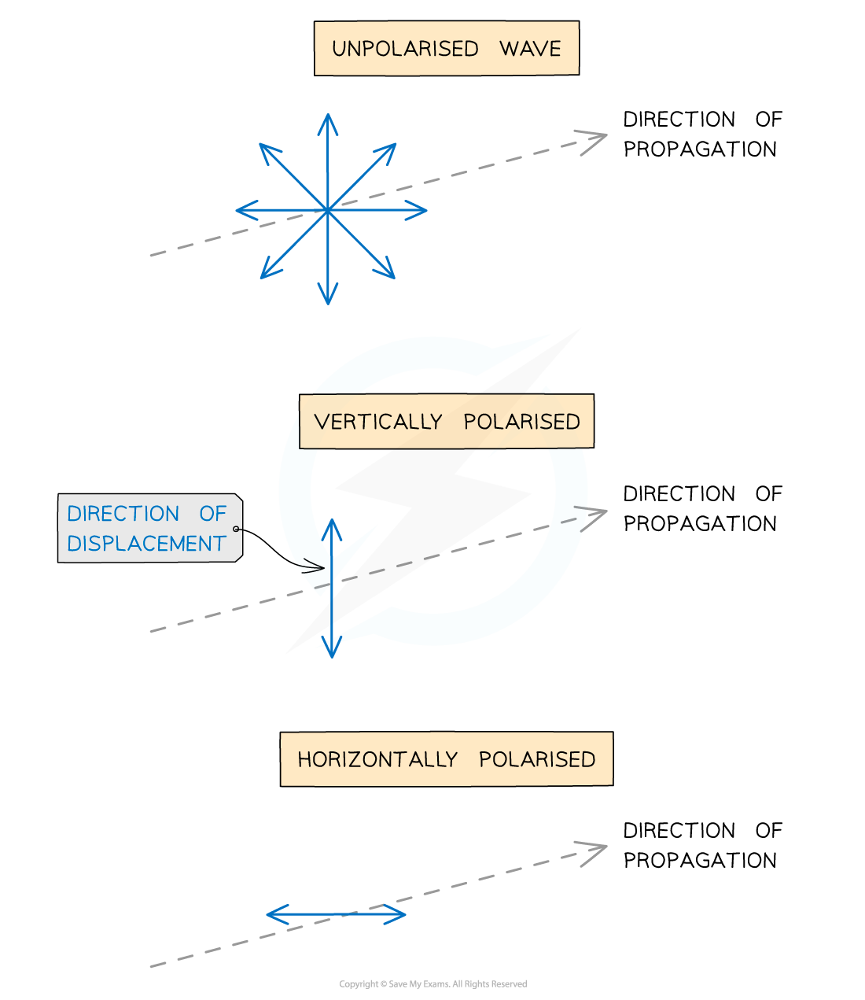
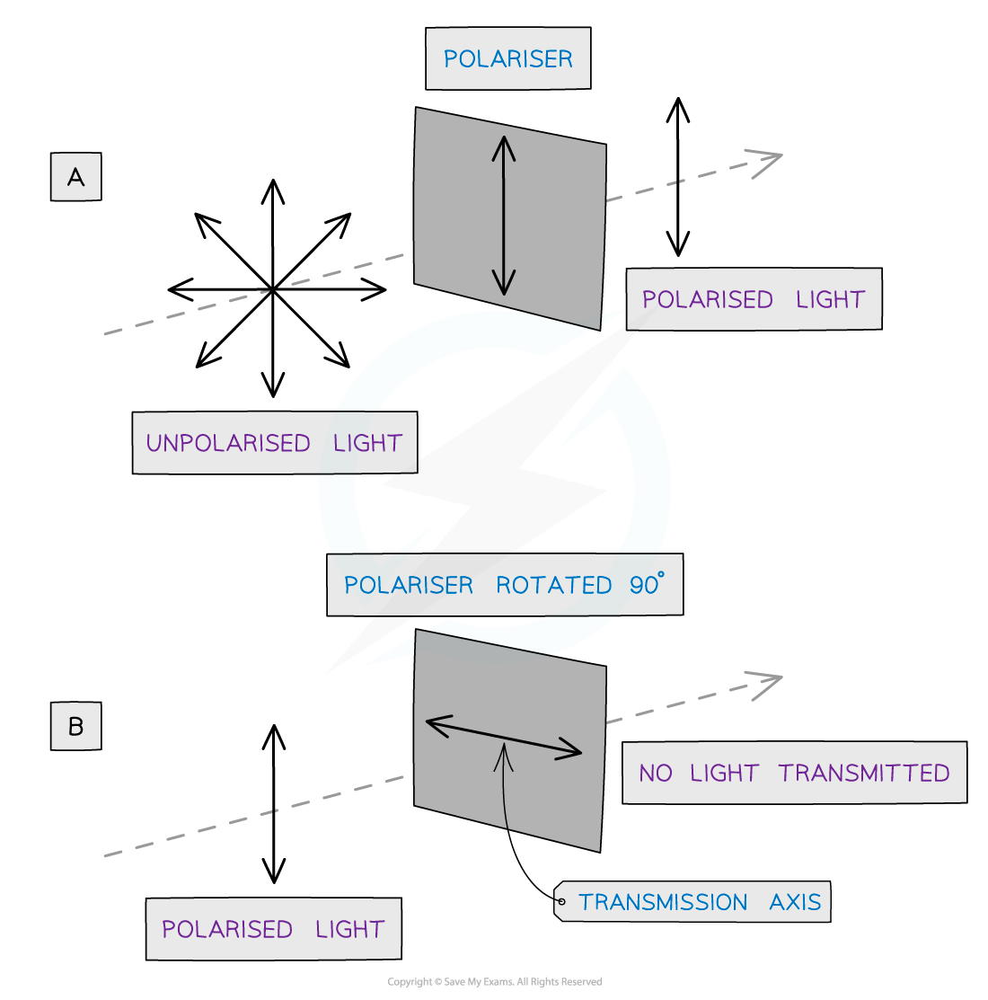
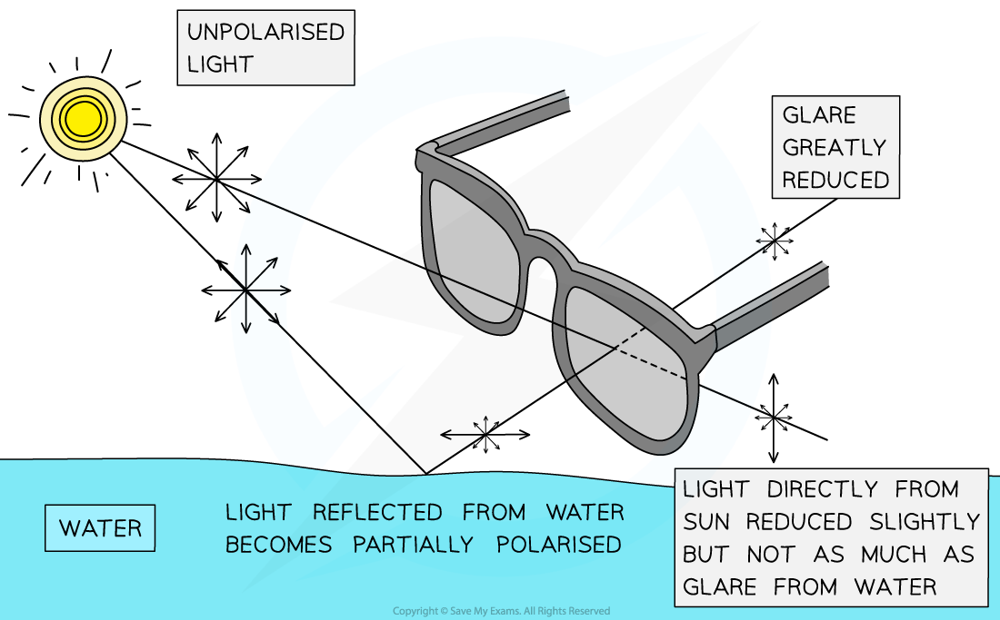
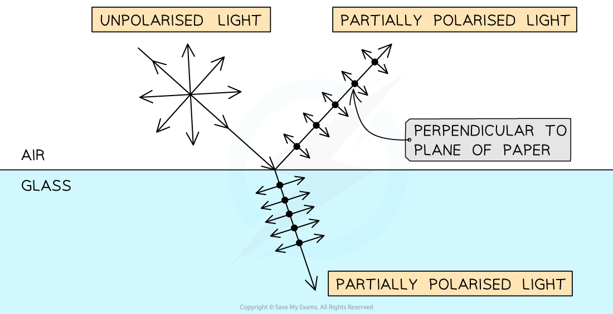

# Plane Polarisation

## Plane Polarisation

> **Spec point** — `spcpt_khfsndP4PJ7qbJbR`

## Plane Polarisation

- Transverse waves can oscillate in **any **plane perpendicular to the direction of motion (and energy transfer) of the wave

  - Such waves are said to be **unpolarised**
- When a wave is plane polarised:

**Particle oscillations occur in a single plane perpendicular to the direction of wave propagation**

- Polarisation can only occur in transverse waves

  - This is because transverse waves oscillate in **any plane **perpendicular to the propagation direction

***Diagram showing the displacement of unpolarised and polarised transverse waves***

- Since longitudinal waves oscillate in the same direction as the direction of motion of the wave, **polarisation of longitudinal waves cannot occur **

- Methods of polarisation include

  - polarising filters
  - reflection (from a non-metallic plane surface)
  - refraction

### Polarising filters

- Light waves can be polarised by making them pass through a **polarising filter **(also known as a **polariser**)
- The filter imposes its plane of polarisation on the incident light wave
- A polariser with a vertical **transmission axis** only allows vertical oscillations to be transmitted through the filter (**A**)
- If vertically polarised light is incident on a filter with a horizontal transmission axis, no transmission occurs (**B**), and the wave is blocked completely

***Diagram showing an unpolarised and polarised wave travelling through polarisers***

### Polarisation by reflection

- When light is reflected from a non-metallic surface e.g. the surface of water or a wet road, it undergoes **partial plane polarisation**
- Reflected light is polarised in a plane **parallel **to the reflecting surface

  - This means if the surface is horizontal, a proportion of the reflected light will oscillate more in the horizontal plane than in the vertical plane
- Sunglasses with vertically aligned Polaroid lenses can block this horizontally polarised light
- As a result, they can reduce glare, which means

  - objects under the surface of water can be viewed more clearly
  - drivers can see the road more clearly

***When sunlight reflects off a horizontal reflective surface, such as water, the light becomes horizontally polarised. This is where Polaroid sunglasses come in useful with their vertically aligned polarising filters***

### Polarisation by refraction

- Light can also become partially polarised by refraction when transmitted from one medium into another, such as from air into glass or water
- Refracted light is polarised in a plane **perpendicular **to the transmitting surface

  - This means if the surface is horizontal, a proportion of the transmitted (refracted) light will oscillate more in the vertical plane than in the horizontal plane
- When unpolarised light is incident on a horizontal surface into which it can refract:

  - some of the light is **reflected**, partially polarising it in the **horizontal **plane
  - some of the beam is **transmitted **and **refracted**, also partially polarising it, but in the **vertical **plane

***Unpolarised light can be partially polarised by both reflection and refraction at the boundary between two media, such as air and glass***

#### Using polarisation for stress analysis

- Polarising filters can be used to observe stress concentrations in materials due to changes in refractive index
- A sample of transparent material (such as plastic) is positioned between two polarising filters with their planes at 90° to one another

  - When the material is unstressed, no light passes through
  - When the material is stressed, the plane of polarisation of the light passing through the material is rotated
- Different areas under different degrees of stress cause light to pass through at different speeds
- The result is an interference pattern with different colours revealing areas of varying stress in the material

  - The **brighter **regions represent areas under **more **stress
  - The **darker **regions represent areas under **less **stress

#### Using polarisation for chemical analysis

- Polarising filters can also be used to analyse the strength of chemical samples, such as sugar solutions
- In a similar way to materials under stress, chemical solutions can also rotate the plane of polarisation of the light passing through
- The degree of polarisation depends on the concentration of the solution

  - The **higher **the concentration of the sample, the **greater **the angle at which the light emerges
  - The **lower **the concentration of the sample, the **smaller **the angle at which the light emerges
