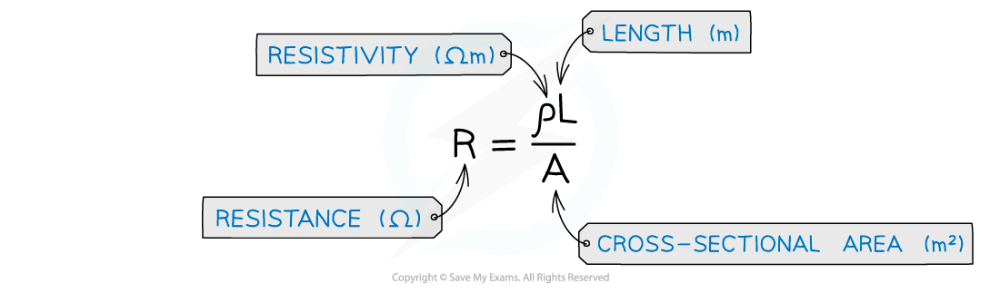
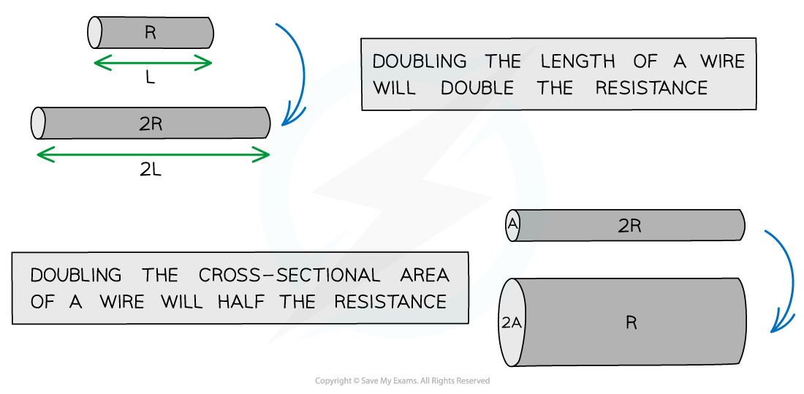
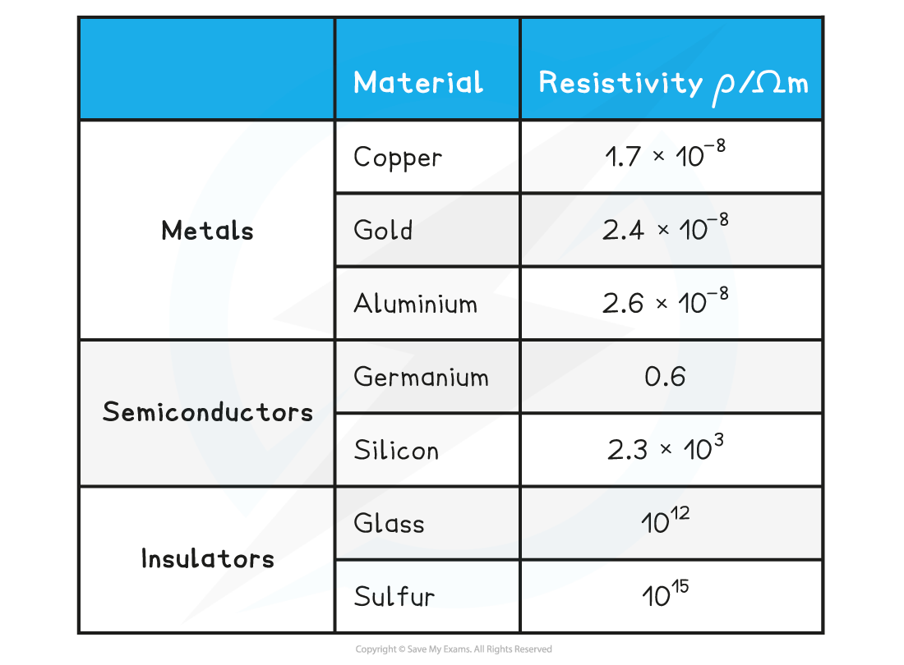

# Electrical Resistivity

## Electrical Resistivity

> **Spec point** — `spcpt_g9gDHFtKGvZHqQxr`

## Electrical Resistivity

- All materials have some **resistance** to the flow of charge
- As **free** **electrons** **move** through a metal wire, they collide with ions which get in their way
- As a result, they **transfer** some, or all, of their **kinetic** **energy** on **collision**, which causes electrical **heating**

***Free electrons collide with ions which resist their flow***

- Since **current** is the **flow** of **charge**, the ions resisting their flow cause **resistance**
- Resistance depends on the **length** of the wire, the **cross-sectional area **through which the current is passing and the **resistivity** of the material

***Electrical resistance equation***

- The resistivity equation shows that:

  - The **longer** the wire, the **greater** its resistance
  - The **thicker** the wire, the **smaller** its resistance

***The length and width of the wire affect its resistance***

*** ***

- Resistivity is a property that describes the extent to which a material opposes the flow of electric current through it
- It is a property of the material, and is dependent on temperature
- Resistivity is measured in **Ω m**

***Resistivity of some materials at room temperature***

- The higher the resistivity of a material, the higher its resistance

  - Copper has a relatively low resistivity at room temperature, and so is used for electrical wires
  - This is because current flows through it very easily
- Insulators have such a high resistivity that virtually no current will flow through them

> **Worked Example**
> Two electrically-conducting cylinders made from copper and aluminium respectively.
> 
> Their dimensions are shown below.
> 
> 
> 
> Copper resistivity = 1.7 × 10-8 Ω m
> 
> Aluminium resistivity = 2.6 × 10-8 Ω m
> 
> Which cylinder is the better conductor?
> 
> **Answer:**
> 
> 

> **Exam Hint**
> You don’t need to memorise the value of the resistivity of any material; these will be given in the exam question.
> 
> Remember if the cross-sectional area is a circle e.g. in a wire, then area is proportional to the radius or diameter squared. This means if the diameter doubles, the area will quadruple. This causes the resistance to drop by a quarter. Considering how changing one property affects the value of the others is a common exam question.
