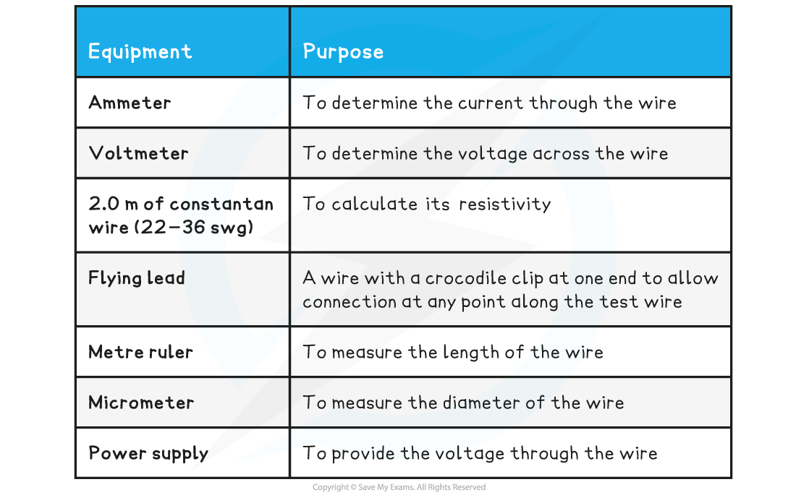
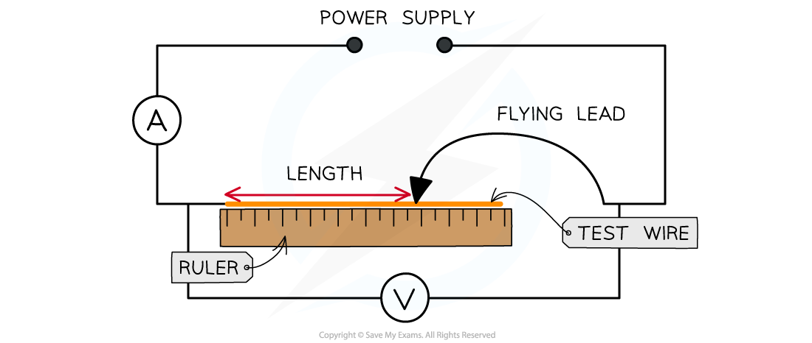

# Core Practical 7: Investigating Resistivity

## Core Practical 7: Investigating Resistivity

> **Spec point** — `spcpt_rJsJFbZJRH6pVKkG`

## Core Practical 7: Investigating Resistivity

#### Aims of the Experiment

- The aim of the experiment is to determine the resistivity of a length of wire

**Variables:**

- *Independent variable* = Length, *L*, of the wire (m)
- *Dependent variable* = The current, *I*, through the wire (A)
- Control variables:

  - Voltage across the wire
  - The material the wire is made from

#### Equipment List

- Resolution of measuring equipment:

  - Metre ruler = 1 mm
  - Micrometer screw gauge = 0.01 mm
  - Voltmeter = 0.1 V
  - Ammeter = 0.01 A

#### Method

1. Measure the diameter of the wire using a micrometer.

  - The measurement should be taken between 5-10 times randomly along the wire.
  - Calculate the mean diameter from these values
2. Set up the equipment so the wire is taped or clamped to the ruler with one end of the circuit attached to the wire where the ruler reads 0.

  - The ammeter is connected in series and the voltmeter in parallel with the wire
3. Attach the flying lead to the test wire at 0.25 m and set the power supply at a voltage of 6.0 V.

  - Check that this is the voltage across the wire on the voltmeter
4. Read and record the current from the ammeter, then switch off the current immediately after the reading

  - This is to prevent the wire from heating up and changing the resistivity
5. Vary the distance between the fixed end of the wire and the flying lead in 0.25 m intervals (0.25 m, 0.50 m, 0.75 etc.) until the full length

  - In this example, a 2.0 m wire is used.
  - The original length and the intervals can be changed (e.g. start at 0.1 m and increase in 0.1 m intervals), as long as there are 8-10 readings
6. Record the current for each length at least 3 times and calculate an average current, *I*
7. For each length, calculate the average resistance of the length of the wire using the equation

- Where:

  - *R *= average resistance of the length of the wire (Ω)
  - *V* = potential difference across the circuit (V)
  - *I *= the average current through the wire for the chosen length (A)

- An example of a table of results might look like this:

#### Analysis of Results

- The resistivity, *ρ*, of the wire is equal to

- Where:

  - *ρ* = resistivity (Ω m)
  - *R = *resistance (Ω)
  - *A* = cross-sectional area of the wire (m2)
  - *L* = length of wire (m)
- Rearranging for the resistance, *R,* gives:

- Comparing this to the equation of a straight line: y = mx

  - y = *R*
  - x = *L*
  - Gradient, m = *ρ / A*

- Therefore, to find resistivity:

  - Plot a graph of the length of the wire, *L*, against the average resistance of the wire
  - Draw a line of best fit
  - Calculate the gradient
  - Multiply the gradient by cross-sectional area, A

**ρ = gradient × A**

- To calculate the cross-sectional area, *A*, of the wire 

#### Evaluating the Experiment

*Systematic Errors:*

- The end of the wire that is attached to the circuit (not the flying lead) must start at 0 on the ruler

  - Otherwise, this could cause a zero error in your measurements of the length

*Random Errors:*

- Only allow small currents to flow through the wire

  - The resistivity of a material depends on its temperature
  - The current flowing through the wire will cause its temperature to increase
  - Therefore the temperature is kept constant by small currents
- The current should be switched off between readings

  - So that there isn't a temperature rise
- Calculate an average diameter

  - This will reduce random errors in the reading
  - Make at least 5-10 measurements of the diameter of the wire with the micrometer

#### Safety Considerations

- When there is a high current, and a thin wire, the wire will become very hot.

  - Make sure never to touch the wire directly when the circuit is switched on
- Switch off the power supply right away if you smell burning
- Make sure there are no liquids close to the equipment,

  - This could damage the electrical equipment
  - Or cause a short circuit which will affect the results

> **Worked Example**
> A student conducts an experiment to find the resistivity of a constantan wire.
> 
> They attach one end of the wire to a circuit that contains a 6.0 V battery. The other end of the wire is attached by a flying lead to the wire at different lengths.
> 
> They obtain the following table of results:
> 
> 
> 
> The following additional data for the wire is:
> 
> 
> 
> Calculate the resistivity of the wire.
> 
> **Answer:**
> 
> **Step 1: Complete the average current and resistance columns in the table**
> 
> - The resistance is calculated using the equation
> 
> 
> 
> 
> 
> **Step 2: Calculate the cross-sectional area of the wire from the diameter**
> 
> - The average diameter is 0.191 mm = 0.191 × 10–3 m
> - The cross-sectional area is equal to
> 
> 
> 
> **Step 3: Plot a graph of the length L against the resistance R**
> 
> 
> 
> **Step 4: Calculate the gradient of the graph **
> 
> 
> 
> $\frac{ΔR}{ΔL}=\frac{ρ}{A}=\frac{27.00-5.00}{1.7-0.3}=15.71$
> 
> **Step 5: Calculate the resistivity of the wire**
> 
> `rho space equals space g r a d i e n t cross times A space equals space 15.71 cross times open parentheses 2.87 cross times 10 to the power of negative 8 end exponent close parentheses space equals space 4.51 cross times 10 to the power of negative 7 end exponent space straight capital omega straight m`
