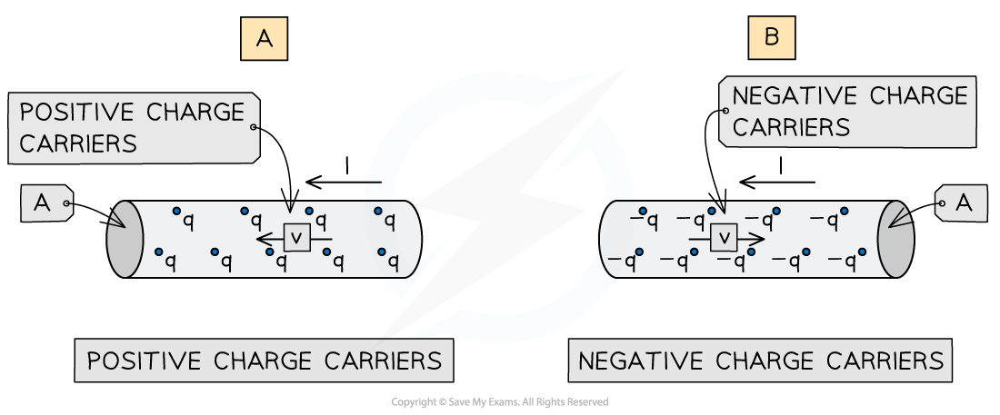

# Calculating Current & Drift Velocity

## Calculating Current & Drift Velocity

> **Spec point** — `spcpt_k3FSKxYrXMXk2pf4`

## Calculating Current & Drift Velocity

#### Drift Velocity

- In a conductor, the current is due to the movement of charge carriers

  - The charge carriers can be negative or positive
  - However current is always taken to be in the **same** direction

- **Drift velocity** is the **average **velocity of the charge carriers travelling through the conductor
- In conductors, the charge carrier is usually free electrons

  - Free electrons only travel small distances before colliding with a metal ion
  - Therefore they have a relatively slow drift velocity of ∼ 10−3 m s−1

- In the diagram below, the current in each conductor is from right to left

  - In diagram **A** (positive charge carriers), the drift velocity is in the **same** direction as the current
  - In diagram **B** (negative charge carriers), the drift velocity is in the **opposite** direction to the current

***Conduction in a current-carrying conductor***

- The density *n* represents the number of free charge carriers (electrons) **per unit volume**

  - **Conductors**, such as metals, have a **high **value of *n*
  - **Insulators**, such as plastics, have a **low **value of *n*
- Since the density of charge carriers is so large in conductors, the flow of current flow appears to happen instantaneously

#### The Transport Equation

- The current can be expressed in the transport equation:

$I=nqvA$

- Where:

  - *I* = current (A)
  - *n* = number density (m−3)
  - *q* = the charge of the charge carrier (C)
  - *v* = drift velocity (m s−1)
  - *A* = cross sectional area of the wire (m2), calculated using **A = πr****2**

- The **same equation** is used whether the charge carriers are positive or negative

  - A negative value for* v* will indicate current in the opposite direction to the charge carriers
- The transport equation shows that *v* is** inversely proportiona**l to *n*

  - Since the more charge carriers available per unit volume the more the density will slow down their speed through the conductor
- The transport equation also shows that *I* is **directly proportional** to *n *

  - Greater *n* means a greater charge is flowing and therefore a larger current *I*
- When the value of *n* is lower, the charge carriers must **travel faster** to carry the same current

> **Worked Example**
> The number density of conduction electrons in a copper wire is 9.2 × 1028 m−3.  The wire carries a current of 3.5 A and it has a cross-sectional area of 1.5 mm2.
> 
> Determine the average drift velocity of the electrons.
> 
> **Answer:**
> 
> **Step 1: Consider the situation**
> 
> - A copper wire is a conductor, and the free electrons are charge carriers
> - Use the transport equation *I *= *nqvA *
> 
> **Step 2: Rearrange the equation for drift speed *****v***
> 
> $v=\frac{I}{nqA}$
> 
> **Step 3: Substitute in values**
> 
> - Current, *I *= 3.5 A
> - Cross-sectional area,* A* = 1.5 mm2 = 1.5 ÷ 10002 = 1.5 × 10−6 m2
> - Number density of conduction electrons,* n *= 9.2 × 1028 m−3 
> - Charge on an electron, *q *= 1.60 × 10−19 C (From the data sheet)
> 
> `v space equals space fraction numerator 3.5 over denominator open parentheses 9.2 space cross times space 10 to the power of 28 close parentheses space cross times space open parentheses 1.60 space cross times space 10 to the power of negative 19 end exponent close parentheses space cross times space open parentheses 1.5 space cross times space 10 to the power of negative 6 end exponent close parentheses end fraction space equals space 0.16 space cross times space 10 to the power of negative 3 end exponent` m s−1
> 
> $v=0.16$ mm s−1 (2 s.f.)

## The Large Range of Material Resistivities 

> **Spec point** — `spcpt_qmbY8WT6T8TR6fzK`

## The Large Range of Material Resistivities

#### Resistivity

- The transport equation tells us that current,* I* ∝ number of charge carriers, *n*

  - Therefore, the **larger **the number of charge carriers, the **greater **the current will be for the same applied voltage
  - This is because resistivity has decreased with more charge carriers available
- Different materials have different numbers of charge carriers

- Insulators have **few** charge carriers:

  - They have such a high resistivity that virtually no current will flow through them
  - A perfect insulator would have no charge carriers, *n* = 0
  - A perfect insulator would have a current of zero regardless of the voltage applied

- Conductors have a **large number** of charge carriers

  - Metals are good conductors because they have** free electrons**
  - Free electrons are the atoms from the outer shell of each atom
  - Therefore there are lots of charge carriers per unit volume
  - This means resistivity is low

- Semiconductors have a **small number** of free electrons

  - There are **fewer** delocalised electrons in a semiconductor than in a metal
  - There are a greater number of free electrons at a higher temperature
  - Resistivity changes in a semiconductor, due to the variation with temperature in free electrons which are available as charge carriers
  - Silicon is an example of a semiconductor

**The resistivity of some materials at room temperature**

> **Exam Hint**
> Remember that the cross-sectional area is in m2, the drift velocity is in m s-1 and the number density is in m-3.
> 
> Therefore, sometimes unit conversions from cm or mm may be required, so make sure you're comfortable with these.
