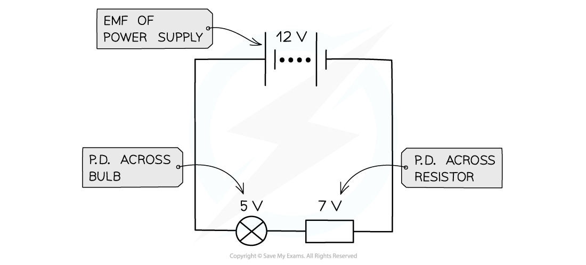

# Potential Difference & Conductor Length

## Potential Difference & Conductor Length

> **Spec point** — `spcpt_y5n8RpRD27rSF9sV`

## Potential Difference & Conductor Length

#### Potential difference

- A cell makes one end of the circuit positive and the other negative. This sets up a **potential difference** across the circuit
- The potential difference across a component in a circuit is defined as:

**The energy transferred per unit charge**

- The energy is transferred from electrical energy into other forms, depending on the component or device being used
- Potential difference is measured in **volts (V),** which is equivalent to **joules per coulomb (J C****−1****)**
- The potential difference of a power supply connected in series is always shared between all the components in the circuit

***The potential difference is the voltage across each component in a circuit***

- Another description of energy transfer is **work done**
- Therefore, potential difference can also be defined as the **work done per unit charge**

***Potential difference is the work done per unit charge***

#### Measuring potential difference

- Potential difference or voltage is measured using a **voltmeter**

  - A voltmeter is always set up in parallel to the component being measured

***Potential difference can be measured by connecting a voltmeter in parallel between two points in a circuit***

### Conductor length

- The equation for *resistivity* is

$R=\frac{ρl}{A}$

- Where:

  - *R* = resistance (Ω)
  - *ρ* = resistivity (Ω m−1)
  - *l* = length (m)
  - *A* = area (m−2)

- Therefore, as the length of a uniform conductor at constant temperature increases, resistance also increases
- Voltage and current are linked by *Ohm's Law*

$V=IR$

- Where

  - *V* = potential difference (V)
  - *I *= current (A)
  - *R* = resistance (Ω)
- Therefore, as *R* increases, so must potential difference across the wire

  - Potential difference increases uniformly with length
