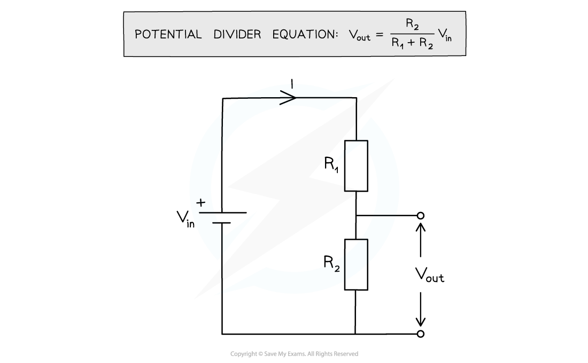

# Potential Dividers

## Potential Dividers

> **Spec point** — `spcpt_7wnmD9ZzwFrtgThr`

## Potential Dividers

- The electrical voltages rule is defined as: **The sum of the e.m.f.s in a closed circuit loop is equal to the sum of the potential differences around that loop**
- Therefore, when two resistors are connected in series,  the potential difference across the power source will be divided across the two resistors

- Potential dividers are circuits that produce an output voltage as a **fraction** of the input voltage
- This is done by using two resistors in series to split or divide the voltage of the supply in a chosen **ratio**
- Potential dividers have three main purposes:

  - To provide a variable potential difference
  - To enable a specific potential difference to be chosen
  - To split the potential difference of a power source between two or more components
- Potential dividers are used widely in volume controls and sensory circuits using LDRs and thermistors

- The link between the input voltage and the output voltage across each resistor is linked in an equation

***Potential divider diagram and equation***

- The input voltage Vin is applied across both resistors, which are in series
- The output voltage Vout is measured across one of the resistors, in this case resistor R2
- The potential difference *V* across each resistor depends upon its resistance *R*:

  - The resistor with the** largest resistance** will have the **greater **potential difference across it
  - This is shown as a greater Vout
  - This is from ***V***** = *****IR***
- If the resistance of one of the resistors is increased, it will get a greater share of the potential difference, whilst the other resistor will get a smaller share

- Since potential divider circuits are based on the ratio of voltage between components, and since V=IR, this is equal to the ratio of the resistances of the resistors
- Therefore, the ratios of the potential differences and resistances across each resistor can be linked

- Where:

  - V1 = potential difference of R1 (V)
  - V2 = potential difference or R2 (V)
- Using Ohm's Law, with a constant current, I, these can also be written as:

  - V1 = IR1
  - V2 = IR2

> **Worked Example**
> The circuit shown is designed to light up a lamp when the input voltage exceeds a preset value.
> 
> 
> 
> Vout is equal to 5.3 V when the lamp lights.
> 
> Calculate the input voltage Vin.
> 
> **Answer:**
> 
> 
