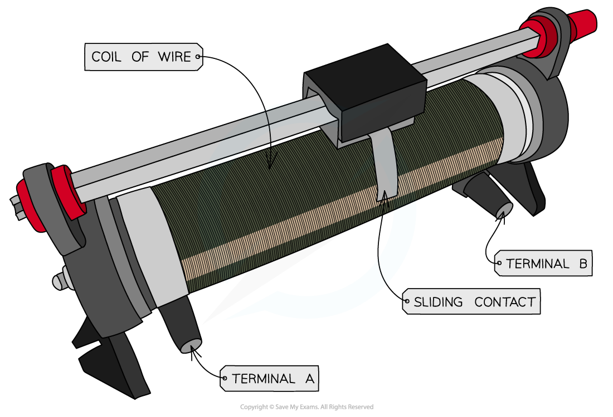
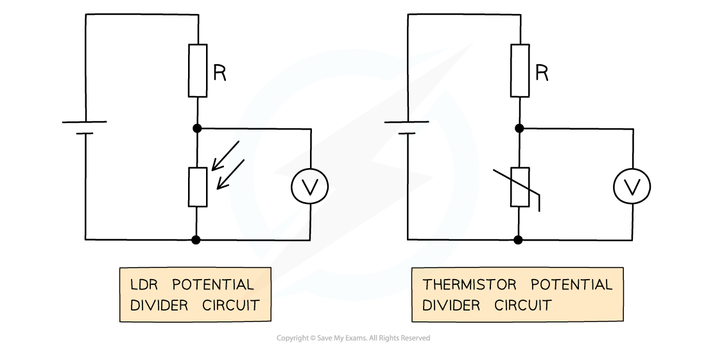

# Potential Dividers & Variable Resistance

## Potential Dividers & Variable Resistance

> **Spec point** — `spcpt_BFQtJ3dS97y3dnqp`

## Potential Dividers & Variable Resistance

#### The Potentiometer

- A potentiometer is a single component that can act as a potential divider

  - It consists of a coil of wire with a sliding contact
  - A variable output voltage can be varied by moving a slider along the component

***A potentiometer is a type of variable resistor***

- The circuit symbol is drawn as an arrow next to the resistor, to represent the sliding contact

- The sliding contact has the effect of separating the potentiometer into two parts

  - Each part will have different resistances
  - Therefore, the output voltage will change

***Moving the slider (the arrow in the diagram) changes the resistance (and hence potential difference) of the two parts of the potentiometer***

- If the slider in the above diagram is moved upwards, the resistance of the lower part will increase, and so the potential difference across it will also increase
- Therefore, the variable resistor obtains a maximum or minimum value for the output voltage
- If the resistance is 3 Ω:

  - Maximum voltage is when the resistance is 3 Ω
  - Minimum voltage is when the resistance is 0 Ω

#### Thermistors & Light Dependent Resistors (LDRs)

- Sensory resistors are used in potential dividers to vary the output voltage

  - This could cause an external component to switch on or off
  - For example, a heater switches off automatically when its surroundings are at room temperature

- Examples of the variable sensory resistors used are **thermistors **and **light-dependent resistors (LDRs)**

***LDR and thermistor in a potential divider circuit with a fixed resistor R***

- The voltmeter in both circuits is measuring Vout
- From Ohm’s law ***V = IR***, the potential difference Vout across a sensory resistor in a potential divider circuit **increases** as its resistance increases

  - If an LDR or thermistor's resistance **decreases**, the potential difference across it also **decreases**
  - If an LDR or thermistor's resistance **increases**, the potential difference across it also **increases**

- Since the total potential difference of the components must be equal to Vin:

  - If the potential difference across the sensory resistor **decreases**, then the potential difference across the other resistor in the circuit must **increase**
  - If the potential difference across the sensory resistor **increases**, then the potential difference across the other resistor in the circuit must **decrease**

**The resistance of an LDR...**

- Varies with **light intensity**

  - The higher the light intensity, the lower the resistance
  - The lower the light intensity, the higher the resistance

- Therefore:

  - If light intensity increases, Vout across the LDR will **decrease** because resistance has decreased
  - If light intensity decreases, Vout across the LDR will **increase** because resistance has increased

- An LDR circuit is often used for street and security lights

  - When light intensity falls, Vout increases and so this can provide the voltage required to turn on a lamp

**The resistance of a thermistor...**

- Varies with **temperature**

  - The hotter the thermistor, the lower the resistance
  - The cooler the thermistor, the higher the resistance

- Therefore:

  - If temperature increases, Vout across the thermistor will **decrease** because resistance has decreased
  - If temperature decreases, Vout across the thermistor will **increase** because resistance has increased

- A thermistor circuit is used in fire alarms, ovens and digital thermometers

  - When temperature falls, Vout increases and so this can provide the voltage required to turn on a heater

> **Worked Example**
> A potential divider consists of a fixed resistor R and a thermistor connected in series.
> 
> 
> 
> Which row of the table describes what happens to the potential difference across resistor R and the thermistor when the temperature of the thermistor decreases?
> 
> 
> 
> **Answer: D**
> 
> 
> 
> **Step 1: Consider Ohm's Law**
> 
> - Due to Ohm’s Law (V = IR), both the resistor and thermistor are connected in series and have the same current I
> 
>   - If the thermistor's resistance increases, the potential difference across it will **increase**
> 
> **Step 2: Consider the electrical voltages rule**
> 
> - In series, the input potential difference is shared between the components in proportion to their resistances
> - The two potential differences must always add up to the input potential difference
> 
>   - Therefore, since the potential difference across the thermistor **increases**, the potential difference across the resistance R must **decrease**
> 
> - This is described by row **D**

> **Exam Hint**
> A potentiometer can also be used as a variable resistor if only two of the three possible terminals are used.
