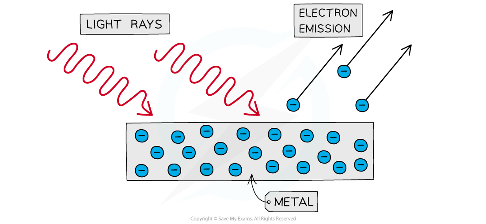
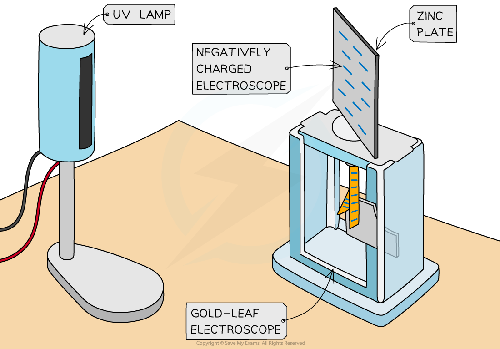
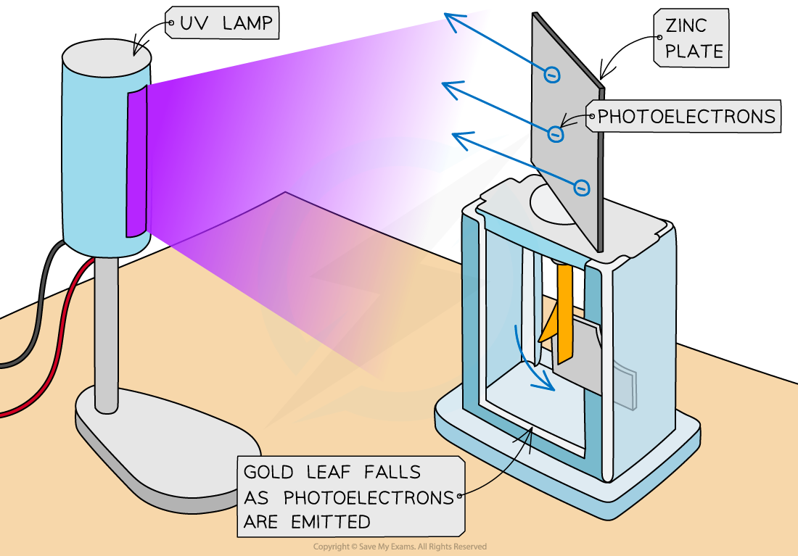

# The Photoelectric Effect

## The Photoelectric Effect

> **Spec point** — `spcpt_WHCGvc3n4FnzXyTD`

## The Photoelectric Effect

- The** photoelectric effect** is the phenomena in which electrons are emitted from the surface of a metal **upon the absorption of electromagnetic radiation**
- Electrons removed from a metal in this manner are known as **photoelectrons**
- The photoelectric effect provides important evidence that light is **quantised**, or carried in discrete packets

  - This is shown by the fact each electron can absorb only a single photon
  - This means only the frequencies of light above a **threshold frequency** will emit a photoelectron

***Photoelectrons are emitted from the surface of metal when light shines onto it***

- The photoelectric effect can be observed on a **gold leaf electroscope**
- A plate of metal, usually **zinc**, is attached to a gold leaf, which initially has a negative charge, causing it to be repelled by a central negatively charged rod

  - This causes negative charge, or electrons, to build up on the zinc plate
- **UV light **is shone onto the metal plate, leading to the **emission** of **photoelectrons**
- This causes the extra electrons on the central rod and gold leaf to be removed, so, the gold leaf begins to fall back towards the central rod

  - This is because they become less negatively charged, and hence repel less

***Typical set-up of the gold leaf electroscope experiment***
