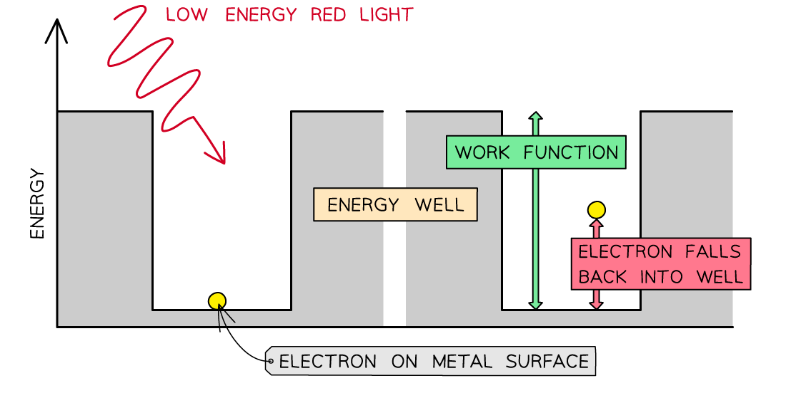
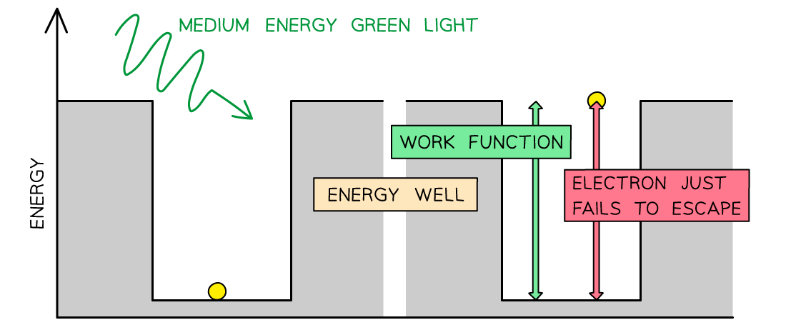
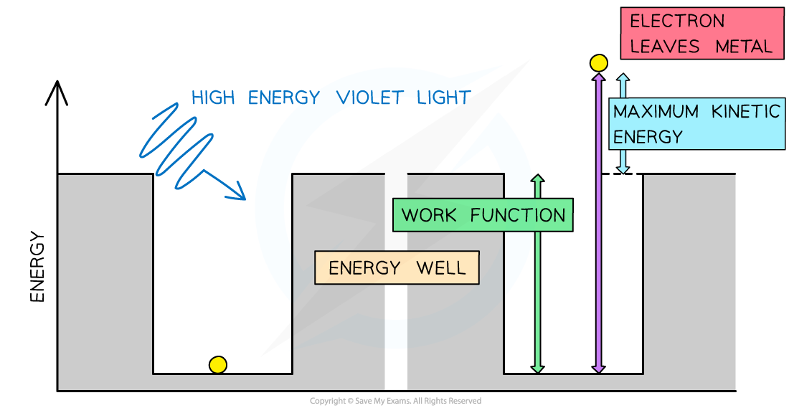

# The Photoelectric Equation

## The Photoelectric Equation

> **Spec point** — `spcpt_sjsX49WC3JGwTXjg`

## The Photoelectric Equation

- Since energy is always conserved, the energy of an incident photon is equal to:

***The work function *****+***** the maximum kinetic energy of the photoelectron***

- The energy within a photon is equal to ***hf***
- This energy is transferred to the electron to release it from a material (the work function) and the remaining amount is given as kinetic energy to the emitted photoelectron
- This equation is known as the **photoelectric equation**:

***E = hf = *****Φ***** + *****½***** mv******2******max***

- Where:

  - *h* = *Planck's constant* (J s)
  - *f* = the frequency of the incident radiation (Hz)
  - Φ = the work function of the material (J)
  - ½* mv**2**max*= *KE*max = the maximum kinetic energy of the photoelectrons (J)

- This equation demonstrates:

  - If the incident photons do not have a high enough frequency and energy to overcome the work function (Φ), then no electrons will be emitted
  - *hf**0* = Φ, where *f**0* = threshold frequency, photoelectric emission only just occurs
  - *KE**max* depends only on the frequency of the incident photon, and **not** the intensity of the radiation
  - The majority of photoelectrons will have kinetic energies **less than ***KE*max

#### Work Function

- The work function Φ, or threshold energy, of a material, is defined as: **The minimum energy required to release a photoelectron from the surface of a metal**
- Consider the electrons in a metal as trapped inside an ‘energy well’ where the energy between the surface and the top of the well is equal to the work function Φ
- A single electron absorbs one photon
- Therefore, an electron can only escape from the surface of the metal if it absorbs a photon which has an energy equal to Φ or higher

***In the photoelectric effect, a single photon may cause a surface electron to be released if it has sufficient energy***

#### Graphical Representation of Work Function

- The photoelectric equation can be rearranged into the straight line equation:

***y *****=***** mx + c***

- Comparing this to the photoelectric equation:

***KE******max***** =***** hf *****- Φ**

- * *A graph of maximum kinetic energy *KE**max* against frequency *f* can be obtained

- The key elements of the graph:

  - The work function Φ is the **y-intercept**
  - The threshold frequency *f**0* is the **x-intercept**
  - The **gradient** is equal to Planck's constant *h*
  - There are no electrons emitted below the threshold frequency *f**0*

#### Threshold Frequency

- The threshold frequency is defined as: **The minimum frequency of incident electromagnetic radiation required to remove a photoelectron from the surface of a metal**

> **Worked Example**
> The graph below shows how the maximum kinetic energy *E**k* of electrons emitted from the surface of sodium metal varies with the frequency *f* of the incident radiation.
> 
> 
> 
> Calculate the work function of sodium in eV.
> 
> **Answer:**
> 
> **Step 1: Write out the photoelectric equation and rearrange to fit the equation of a straight line**
> 
> *E = hf = *Φ + ½ *mv**2**max         *→    *KE**max** = hf *- Φ
> 
> *y *=* mx *+* c*
> 
> ** Step 2: Identify the threshold frequency from the x-axis of the graph**
> 
> When *E**k* = 0, *f* = *f**0*
> 
> Therefore, the threshold frequency is *f**0* = 4 × 1014 Hz
> 
> **Step 3: Calculate the work function**
> 
> From the graph at *f**0*, ½ *mv**max*2 = 0
> 
> Φ = *hf**0* = (6.63 × 10-34) × (4 × 1014) = 2.652 × 10-19 J
> 
> **Step 4: Convert the work function into eV**
> 
> 1 eV = 1.6 × 10-19 J                 J → eV: divide by 1.6 × 10-19
> 
> $E=\frac{2.652\times10^{^{-19}}}{1.6\times10^{-19}}=1.66eV$

> **Exam Hint**
> When using the photoelectric effect equation, *hf*, *Φ* and *KE*max must all have the **same** units, and that the S.I. unit of energy is Joules.
> 
> But the energy involved in these interactions is tiny, which is why we use a different unit for it, the electron volt. Make sure to convert any values given in eV into Joules before starting to calculate.
> 
> Remember that the eV is much smaller than the Joule, so your value of eV will be high in comparison. This is why we often use MeV when describing these energies.
