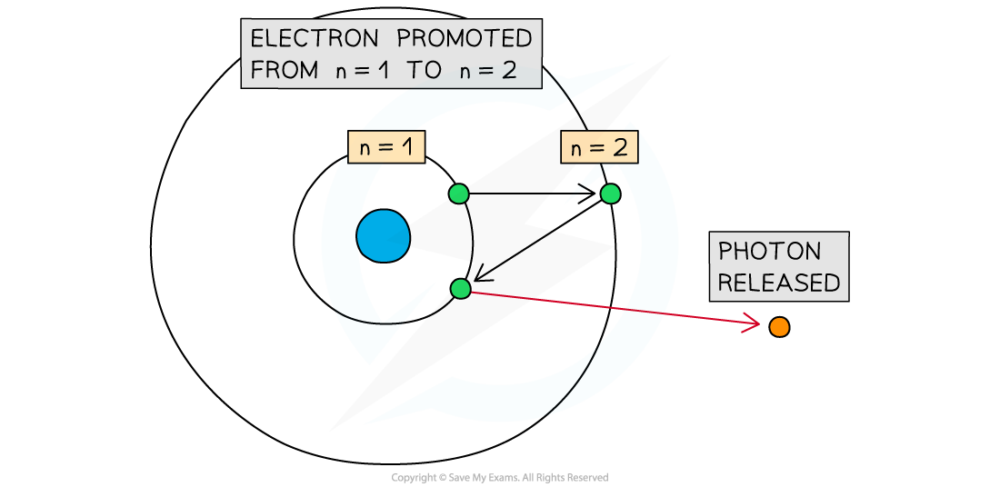
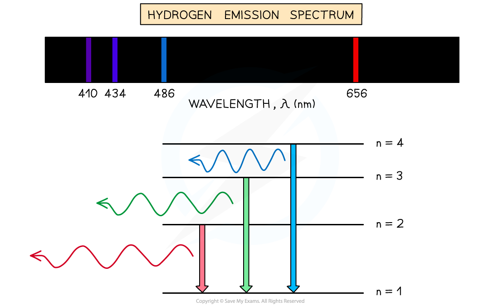
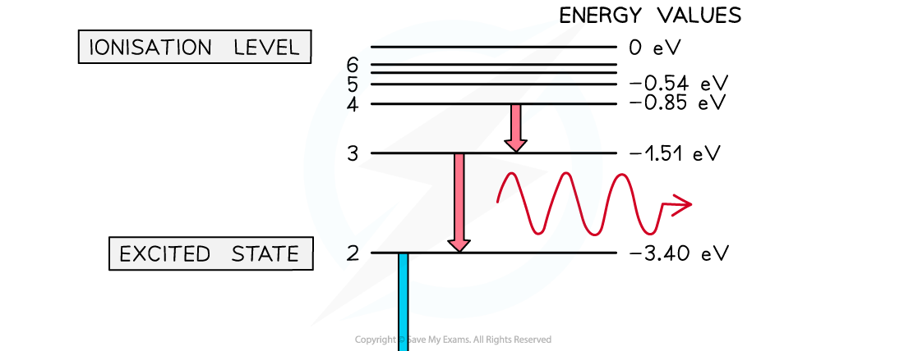
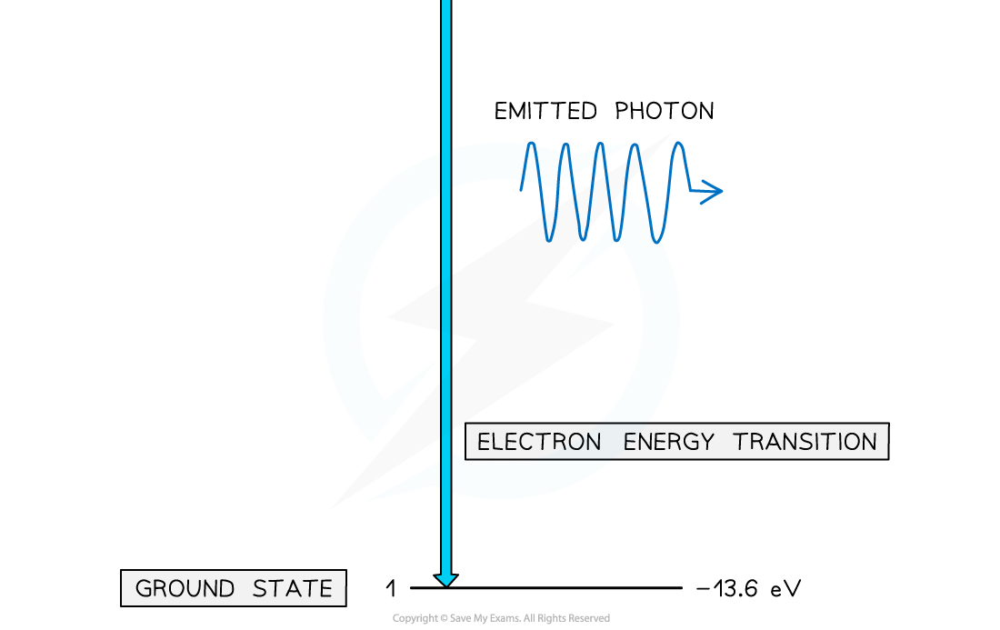

# Atomic Line Spectra

## Atomic Line Spectra

> **Spec point** — `spcpt_v9VCKzNV4zQVYWt6`

## Atomic Line Spectra

- An emission line spectrum is produced when: **An excited electron in an atom moves from a higher to a lower energy level and emits a photon with an energy corresponding to the difference between these energy levels**
- Each element produces a unique **emission line spectrum** due to its unique set of energy levels

  - Hot gases produce emission line spectra, such as stars
- When the atoms of a gas are **excited**, electrons gain energy and move to higher energy levels

***When an electron moves from a higher energy level to a lower energy level, a photon is released***

- Electrons cannot stay in a continuous state of excitation, so they will move back to lower energy levels through **de-excitation**

  - During de-excitation, energy must be conserved, so transitions result in an **emission of photons** with discrete frequencies (or wavelengths) specific to that element
  - Since there are many possible electron transitions for each atom, there are many different radiated wavelengths
  - This creates a** line spectrum** consisting of a series of bright lines against a dark background
  - An emission line spectrum acts as a **fingerprint of the element**

***An example of the emission line spectrum of hydrogen***

- Each line of the emission spectrum corresponds to a different **energy level** transition within the atom

  - Electrons can transition between energy levels absorbing or emitting a **discrete amount of energy**
  - An excited electron can transition down to the next energy level or move to a further level closer to the ground state
- For example, if an atom has six energy levels:

  - At low temperatures, most electrons will occupy the ground state n = 1
  - At high temperatures, electrons may be excited to the most excited state n = 6

***Energy and frequency of a photon are directly proportional***

- The energy of a photon is given by the equation:

*E = hf*

- Using energy can be written as:

*E = *$\frac{hc}{λ}$

- Where:

  - *E* = energy of the photon (J)
  - *h* = *Planck's constant*(J s)
  - *c* = speed of light (m s-1)
  - *f* = frequency (Hz)
  - *λ* = wavelength (m)

- The energy required to move from one energy level to another is given by the difference of energy between the two energy levels:

Δ*E* = *E**1* – *E**2*

- Where:

  - *E**1* = energy associated with the level that the electron has left (eV)
  - *E**2* = energy associated with the level that the electron moves to (eV)

- The difference of energy corresponds to the energy of the absorbed (or emitted) photon:

Δ*E* = *E**1* – *E**2* = *hf = *$\frac{hc}{λ}$

- For each transition, a photon will be emitted with a specific wavelength
- In the case of hydrogen, all wavelengths are in the visible range:

  - From n = 6 to n = 2 - violet
  - From n = 5 to n = 2 - blue
  - From n = 4 to n = 2 - light blue
  - From n = 3 to n = 2 - red

***If the emitted photons are in the visible range, wavelengths can be represented as lines of the respective colour against a black background***

- Emitted photons can have a range of wavelengths spanning the whole electromagnetic spectrum

  - The wavelength is inversely proportional to the energy level transition associated with the emitted photon

- For example, the transitions for hydrogen will be as follows:

  - To n = 1 (ground level) – ultraviolet, highest energy, high frequency, short wavelength
  - To n = 2 – visible light, violet is the highest energy, red is the lowest energy
  - To n = 3 – infrared light, lowest energy, low frequency, longest wavelength

***The larger the energy transition, the shorter the wavelength of the emitted photon***

> **Exam Hint**
> Although the difference in energy Δ*E* = *E**1* – *E**2* can be expressed in eV, you need to convert this value in Joules when you are asked to calculate either the frequency or wavelength of the emitted photon.
> 
> You are expected to be able to calculate the frequency or the wavelength of a photon, given a specific transition on an energy levels diagram or to identify a specific transition on a given diagram when provided with the value of frequency or wavelength.
> 
> You are not expected to know the Bohr formula as given in the worked example - this is just an example of an unfamiliar context you could be given that you have to apply your knowledge to.
