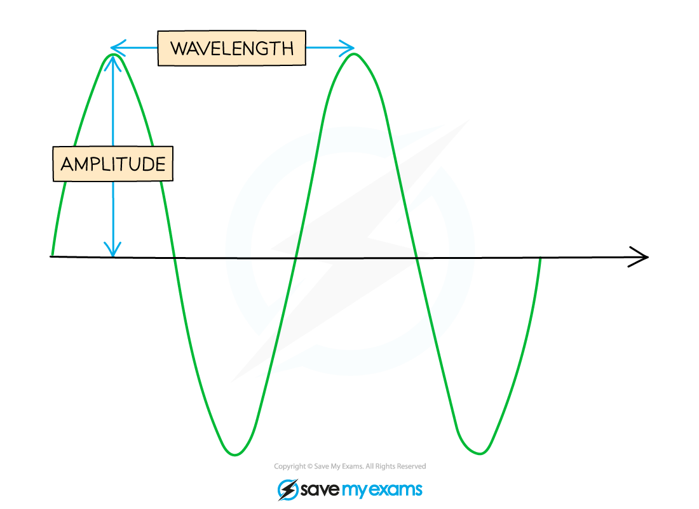

# Properties of Waves

## Properties of Waves

> **Spec point** — `spcpt_vrpX29X7vWmFMrcX`

## Properties of Waves

- Waves are generated by **oscillating sources **

  - These oscillations travel **away** from the source
- Oscillations can propagate through a **medium** (e.g. air, water) or in a **vacuum** (i.e. no particles), depending on the wave type

#### Wave Features

- In order to describe the properties of travelling waves, the following keywords need to be defined:

  - **Wavelength** ***λ*** (m) is the distance between a point on a wave and the same point on the next cycle of the wave, e.g. two crests, or two troughs
  - **Amplitude** ***A*** (m) is the magnitude of the maximum displacement reached by an oscillation in the wave
  - **Period** ***T*** (s) is the time taken for one complete oscillation at one point on the wave
  - **Frequency *****f*** (Hz) is the number of complete wave cycles per second
  - **Wave speed *****c*** (m s-1) is the rate of movement of the wave

***Diagram showing the amplitude and wavelength of a transverse wave***

- The frequency *f* and the period *T* of a travelling wave are related to each other by the equation

> **Worked Example**
> The graph below shows a travelling wave.
> 
> 
> 
> Determine:
> 
> (i) The amplitude *A* of the wave in metres (m)
> 
> (ii) The frequency *f* of the wave in hertz (Hz)
> 
> **Answer:**
> 
> **Part (i) **
> 
> Identify the amplitude *A* of the wave on the graph
> 
> - The amplitude is defined as the maximum displacement from the equilibrium position (*x* = 0) 
> - The amplitude must be converted from centimetres (cm) into metres (m)
> 
> *A* = 0.1 m
> 
> **Part (ii) **
> 
> Calculate the frequency of the wave
> 
> **Step 1: Identify the period *****T***** of the wave on the graph **
> 
> - The period is defined as the time taken for one complete oscillation to occur
> 
> 
> 
> - The period must be converted from milliseconds (ms) into seconds (s)
> 
> *T* = 1 × 10–3 s
> 
> **Step 2: Write down the relationship between the frequency *****f***** and the period *****T ***
> 
> *f = *$\frac{1}{T}$
> 
> **Step 3: Substitute the value of the period determined in Step 1**
> 
> *f = *$\frac{1}{1\times10^{-3}}$
> 
> *f* = 1000 Hz

> **Exam Hint**
> Every question about waves uses the vocabulary on this page. Many questions start by asking you to define one of them.
> 
> So your job is to learn the definitions to the point where you have them memorised.
