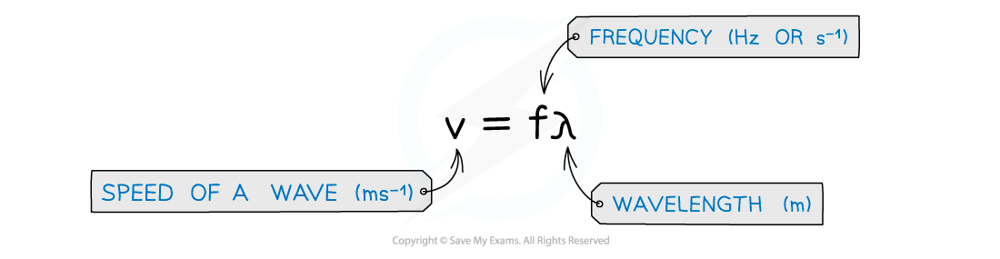
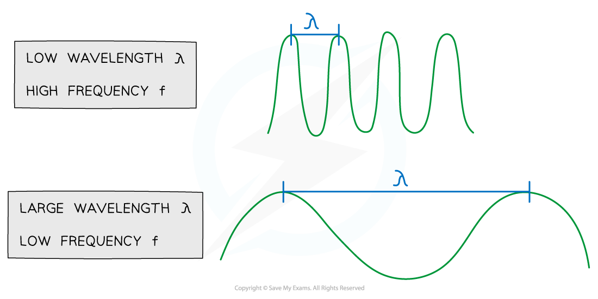

# The Wave Equation

## The Wave Equation

> **Spec point** — `spcpt_CtyyQS9MJmgPswrH`

## The Wave Equation

#### The Wave Equation

- This equation links wave speed, frequency and wavelength

- Where:

  - *v* = velocity of the wave (m s–1)
  - *f* = frequency of the wave (Hz)
  - *λ *= wavelength (m)

- The wave equation tells us that for a wave of constant speed:

  - As the wavelength **increases, **the frequency **decreases**
  - As the wavelength **decreases, **the frequency **increases**

** **

***The relationship between frequency and wavelength of a wave***

> **Worked Example**
> A travelling wave has a period of 1.0 μs and travels at a velocity of 100 cm s–1. Calculate the wavelength of the wave. Give your answer in metres (m).
> 
> **Answer:**
> 
> **Step 1: Write down the known quantities**
> 
> - Period, *T* = 1.0 μs = 1.0 × 10–6 s
> - Velocity, *c* = 100 cm s–1 = 1.0 m s–1
> 
> Note the conversions:
> 
> - The period must be converted from microseconds (μs) into seconds (s)
> - The velocity must be converted from cm s–1 into m s–1
> 
> **Step 2: Write down the relationship between the frequency *****f***** and the period *****T***** **
> 
> *f *= $\frac{1}{T}$
> 
> **Step 3: Substitute the value of the period into the above equation to calculate the frequency **
> 
> *f *= $\frac{1}{1\times10^{-6}}$
> 
> *f* = 1.0 × 106 Hz
> 
> **Step 4: Write down the wave equation**
> 
> *c = fλ*
> 
> **Step 5: Rearrange the wave equation to calculate the wavelength *****λ***
> 
> *λ *= $\frac{c}{f}$
> 
> **Step 6: Substitute the numbers into the above equation **
> 
> *λ *= $\frac{1.0}{1\times10^{6}}$
> 
> *λ* = 1 × 10–6 m

> **Exam Hint**
> This is an important equation that comes up in many other topics. Get really familiar with using it and rearranging it.
> 
> Be ready to use **prefixes **with values, for example, nanometres (nm = m × 10−9) or MHz (MHz = Hz × 106).
