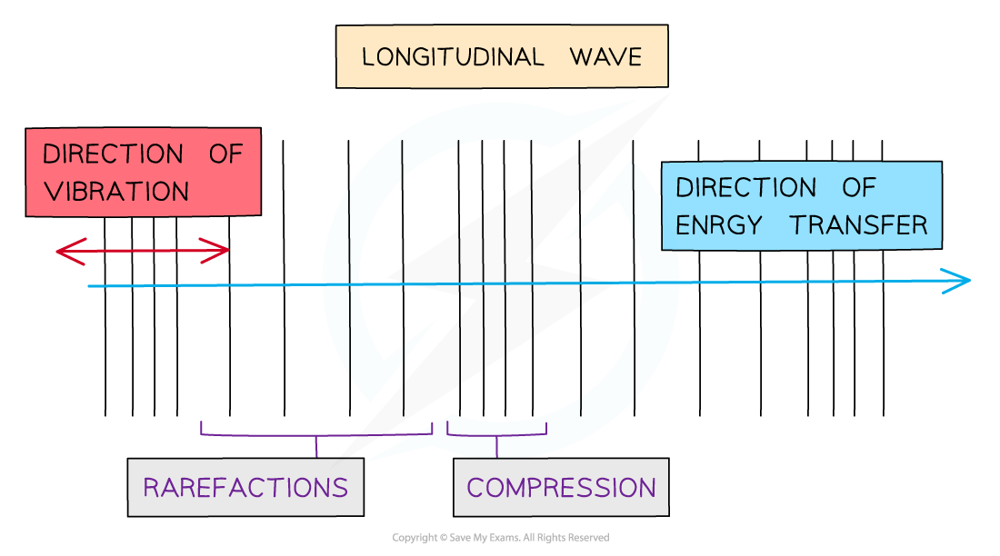
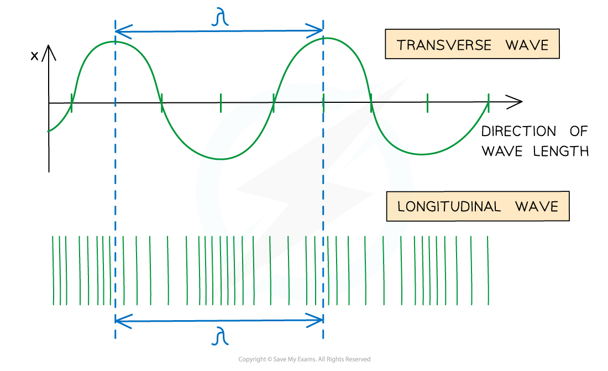

# Longitudinal Waves

## Longitudinal Waves

> **Spec point** — `spcpt_yWq8N5skr6TpyBSc`

## Longitudinal Waves

#### Longitudinal Waves

- A longitudinal wave is one where the particles oscillate **parallel** to the;

  - Propagation of the wave
  - Direction of energy transfer
- Longitudinal waves show areas of

  - **High pressure, **called **compressions**
  - **Low pressure**, called **rarefactions**

***Diagram of a longitudinal wave***

*** ***

- Examples of longitudinal waves are:

  - Sound waves
  - Ultrasound waves
  - P-waves caused by earthquakes

- Longitudinal waves **cannot** be *polarised*

#### Labelling Longitudinal Waves

- You learned how to describe the properties of a wave, such as amplitude and wavelength at the start of this topic

  - The diagram shows a wavelength on a longitudinal wave

***Wavelength is shown on a longitudinal wave***

> **Exam Hint**
> Questions about longitudinal waves typically start by asking for a definition, so be ready with a statement about areas of high and low pressure and the keywords compression and rarefaction.
> 
> Be careful with graphs of waves and don't assume a sinusoidal-shaped graph represents a transverse wave. Longitudinal waves can also look sinusoidal when plotted on a graph - make sure you read the question and look for whether the wave travels **parallel** (longitudinal) or **perpendicular **(transverse) to the direction of travel to confirm which type of wave it is.
