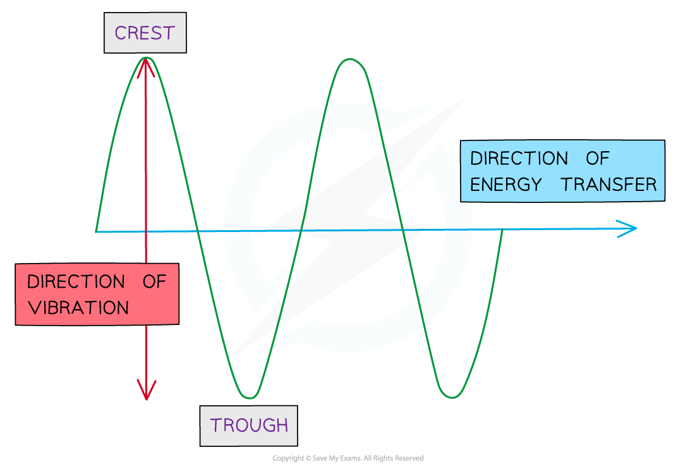

# Transverse Waves

## Transverse Waves

> **Spec point** — `spcpt_cZ5sY2HgrM7rjHGJ`

## Transverse Waves

#### Transverse Waves

- A transverse wave is one where the particles oscillate **perpendicular** to the direction of the

  - Propagation of the wave
  - Direction of energy transfer
- Transverse waves show areas of **crests **(peaks) and **troughs**

***Diagram of a transverse wave***

- Examples of transverse waves are:

  - Electromagnetic waves e.g. radio, visible light, UV
  - Vibrations on a guitar string
  - Waves on a rope or slinky

- Transverse waves can be *polarised*

> **Exam Hint**
> Questions about transverse waves typically start by asking for a definition, so be ready with a statement about **vibrations **or **oscillations **being perpendicular to the travel of the wave.
