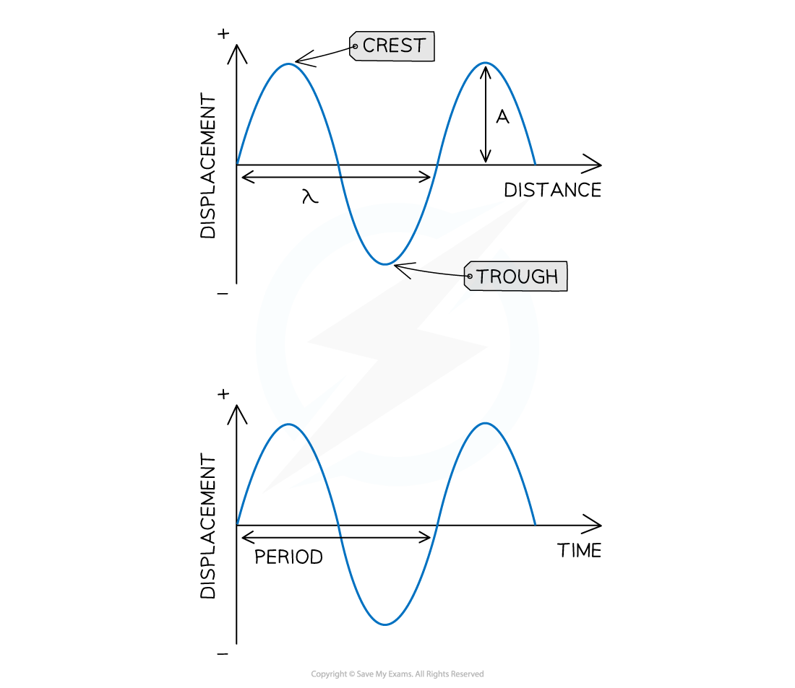
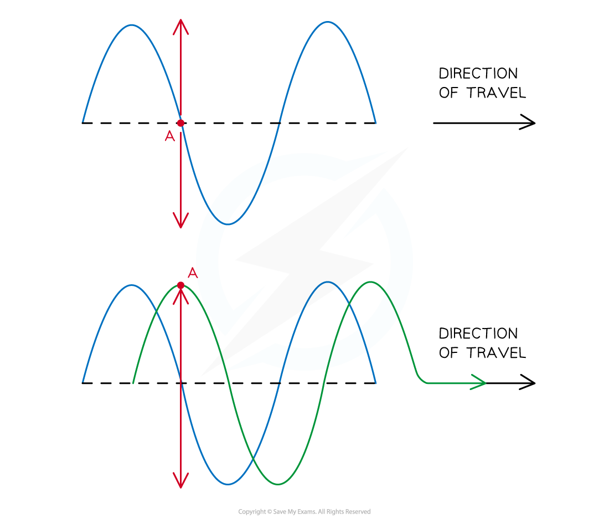
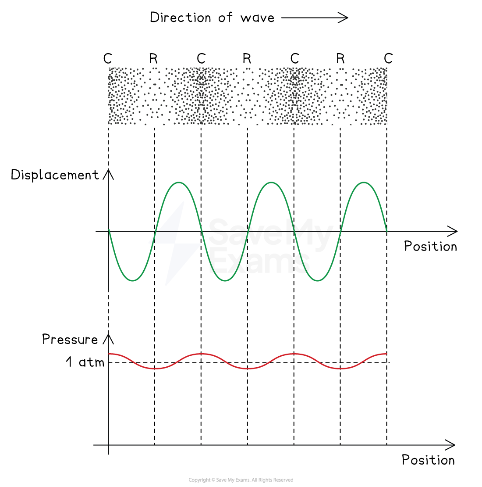
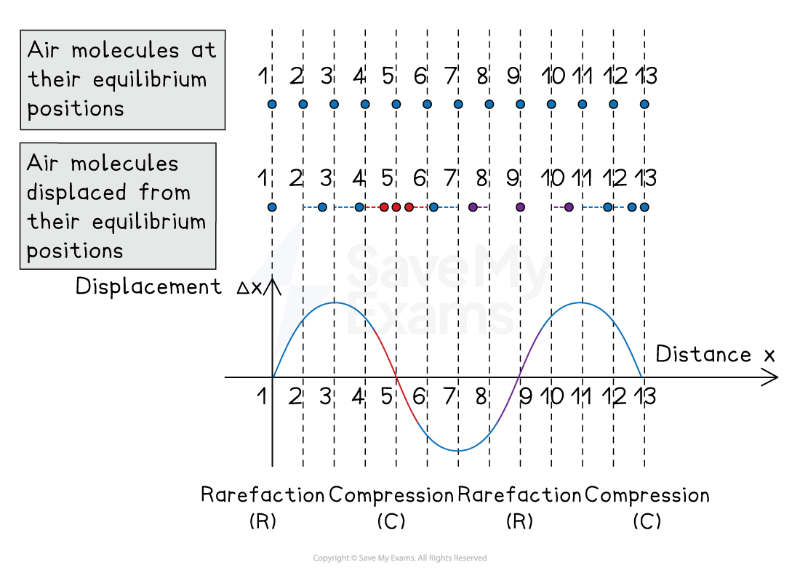

# Representing Waves on Graphs

## Graphs of Transverse & Longitudinal Waves

> **Spec point** — `spcpt_RWbvMHkDtdDCdKTX`

## Graphs of Transverse & Longitudinal Waves

### Representing transverse waves

- Transverse waves are commonly represented using:

  - displacement-distance graphs
  - displacement-time graphs

- On the** displacement-distance **graph:

  - amplitude $A$ is measured from the rest position to the point of maximum displacement
  - wavelength $λ$ is measured from one point on a wave to the same point on the next wave (e.g. two consecutive crests or troughs)
- On the **displacement-time **graph**:**

  - period $T$ is measured from one point on a wave to the same point on the next wave
  - frequency can be calculated using $f=\frac{1}{T}$

***Transverse waves can be graphed to visualise the perpendicular vibrations over distance or time***

- To determine the next position of a point on the wave

  - Sketch the full wave after time has passed by looking at the direction of travel
  - Each point oscillates perpendicular to the wave, so it remains on the normal line wherever the wave intersects, as shown in red below

### Representing longitudinal waves

- Longitudinal waves can be represented using:

  - displacement-distance graphs
  - pressure-distance graphs
- On the** displacement-distance **graph:

  - the amplitude and wavelength can be measured in the same way as the transverse wave
  - zero displacement occurs at compressions and rarefactions
  - maximum displacement occurs halfway between compressions and rarefactions

- The** pressure-distance **graph is:

  - highest at compressions and lowest at rarefactions
  - 90° out of phase with the displacement graph

***Longitudinal waves can be graphed to visualise the displacement of particles at different positions, as well as the pressure at each position***

- A sound wave is a longitudinal wave caused by oscillations of particles in the medium, e.g. air molecules
- At a **compression**:

  - air molecules have **zero **displacement (compared to their equilibrium positions)
  - air molecules on either side are displaced **towards **it
  - This creates an area of **high **pressure
- At a **rarefaction**:

  - air molecules have **zero **displacement (compared to their equilibrium positions)
  - air molecules on either side are displaced **away **from it
  - This creates an area of **low **pressure

***The positions of air molecules in a sound wave can be mapped onto a displacement-distance graph***

> **Worked Example**
> The graph shows how the displacement of a particle in a wave varies with time.
> 
> 
> 
> Which statement is correct?
> 
> **A.** The wave has an amplitude of 2 cm and could be either transverse or longitudinal.
> 
> **B.** The wave has an amplitude of 2 cm and has a time period of 6 s.
> 
> **C.** The wave has an amplitude of 4 cm and has a time period of 4 s.
> 
> **D.** The wave has an amplitude of 4 cm and must be transverse.
> 
> **Answer: A**
> 
> 

## Graphs of Stationary Waves

> **Spec point** — `spcpt_k8ngdCdjCNfGw4CM`

## Graphs of Stationary Waves

- Stationary waves occur when a wave is reflected with a 180o phase difference, creating a wave with a series of nodes and antinodes

  - Stationary waves can be transverse or longitudinal
  - They are represented graphically in the same way as progressive (travelling) waves

- Graphs of standing waves can also be used to determine the position of nodes and antinodes

*** ***

- *L* is the length of the string
- 1 wavelength *λ *is only a portion of the length of the string

> **Exam Hint**
> Both transverse and longitudinal waves can look like transverse waves when plotted on a graph - make sure you read the question and look for whether the wave travels **parallel** (longitudinal) or **perpendicular **(transverse) to the direction of travel to confirm which type of wave it is.
