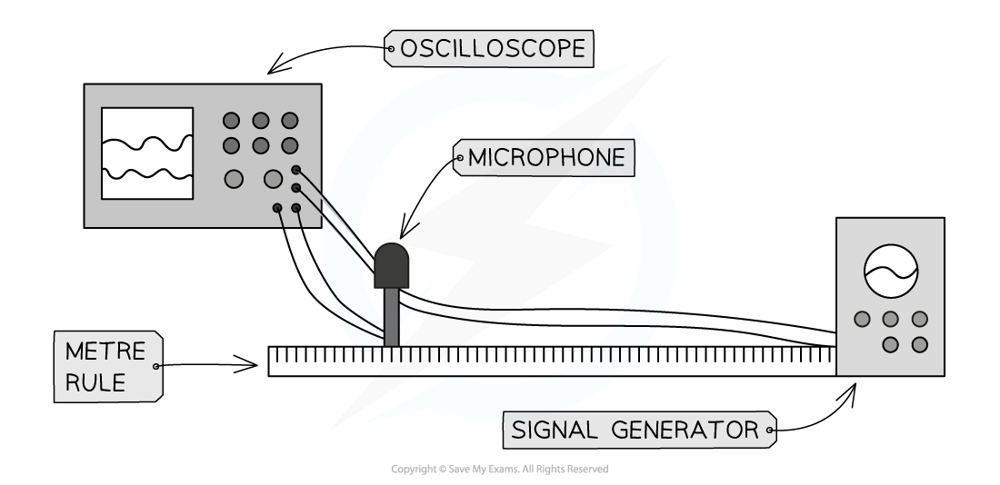

# Core Practical 4: Investigating the Speed of Sound

## Core Practical 4: Investigating the Speed of Sound

> **Spec point** — `spcpt_HW59GMVq63mD6pnq`

## Core Practical 4: Investigating the Speed of Sound

#### Aim of the Experiment

- The aim of this experiment is to measure the speed of sound in air between two points using an oscilloscope and a signal generator

**Variables**

- *Independent variable* = Distance
- *Dependent variable* = Phase of received signals
- Control variables:

  - Same location to carry out the experiment
  - Same set of microphones for each trial
  - For **each set of readings**, the same frequency of sound

#### Equipment

- Signal generator with loudspeaker
- Oscilloscope with 2-beam facility
- Microphone
- 2 metre rulers or 1 measuring tape of at least 2 m length
- Connecting leads

#### Method

1. Connect the microphone and signal generator to an oscilloscope, and set up the signal generator about 50 cm from the microphone
2. Set the signal to about 4 kHz
3. The oscilloscope should trigger when the microphone detects a sound, and adjust the time base so that the signal from the generator and the microphone can be on the screen with about three cycles visible
4. Adjust the separation so a trough on the upper trace coincides with a peak on the lower trace (this makes judging the point where the waves coincide easier)
5. Record the distance between the microphone and the signal generator
6. Move the microphone further away, watch the traces on the screen
7. When the next trough and peak coincide on the oscilloscope trace, record the new distance between the microphones and the signal generator
8. Repeat steps 6 and 7 as many times as possible in the available space
9. Calculate the mean wavelength of the sound
10. Using the oscilloscope trace find the frequency of the sound
11. Reduce the frequency to around 2 kHz (or half of the original value) and repeat steps 4-10.

#### Table of Results:

#### Analysis of Results

- The speed of sound can be calculated using the equation:

$v=fλ$

- Frequency is found from the time base of the oscilloscope by using

$f=\frac{1}{T}$

#### Evaluating the Experiment

*Systematic Errors*:

- Ensure the scale of the time base is accounted for correctly

  - The scale is likely to be small (e.g. milliseconds) so ensure this is taken into account when calculating frequency
- Use the oscilloscope signal trace to find frequency to avoid relying on the dial of the signal generator

*Random errors*:

- Random errors in taking measurements can be reduced by doing repeat readings and taking an average
- The time interval is small so make the distance between the microphone and signal generator as large as is practical

#### Safety Considerations

- The voltage and current are low so that normal care with electrical equipment is sufficient (including checking the leads for any signs of damage)
- Keep sound at a normal listening volume to avoid damage to hearing

> **Exam Hint**
> When you are answering questions about methods to measure waves, the question could ask you to comment on the accuracy of the measurements
> 
> In the case of measuring the speed of sound this experiment is very accurate because the timing is done automatically so reaction time is not a factor
