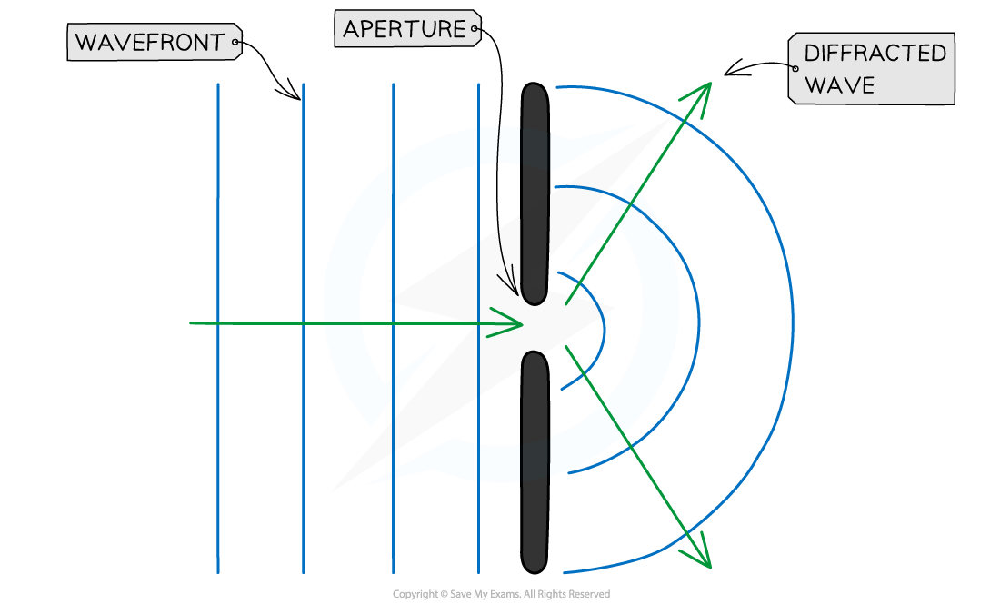
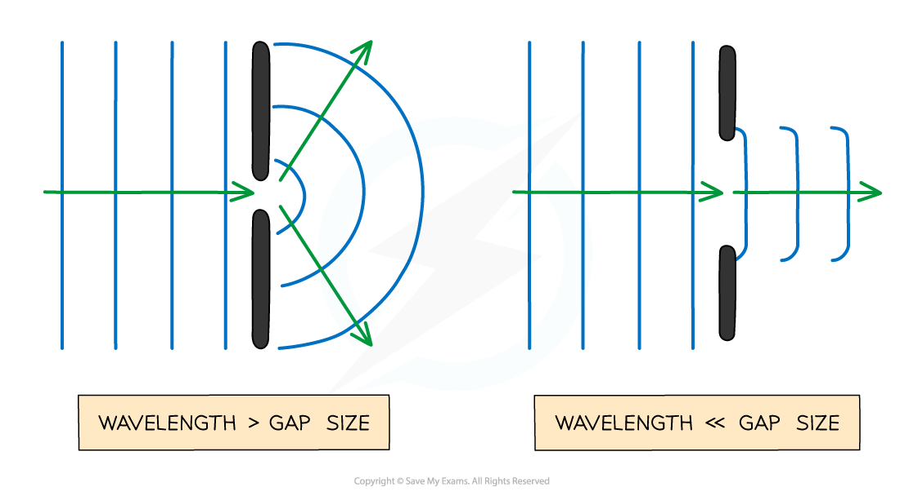
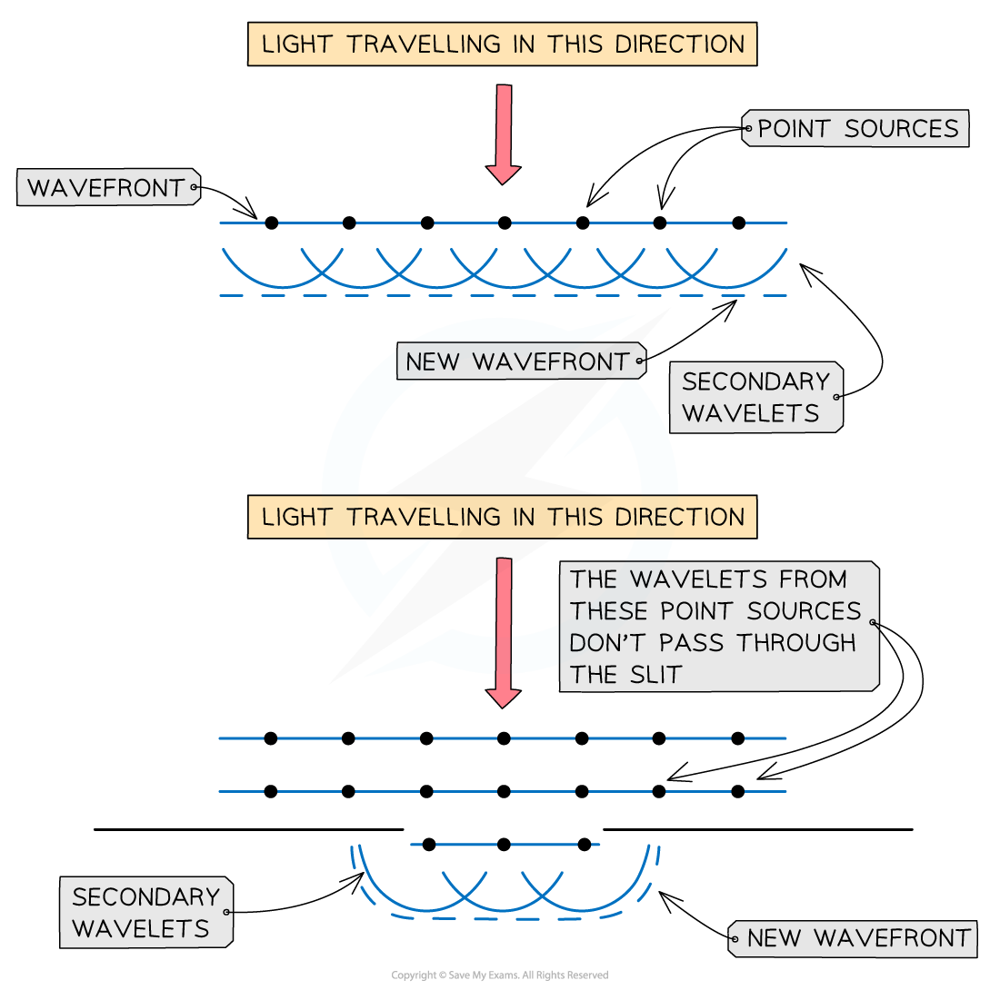
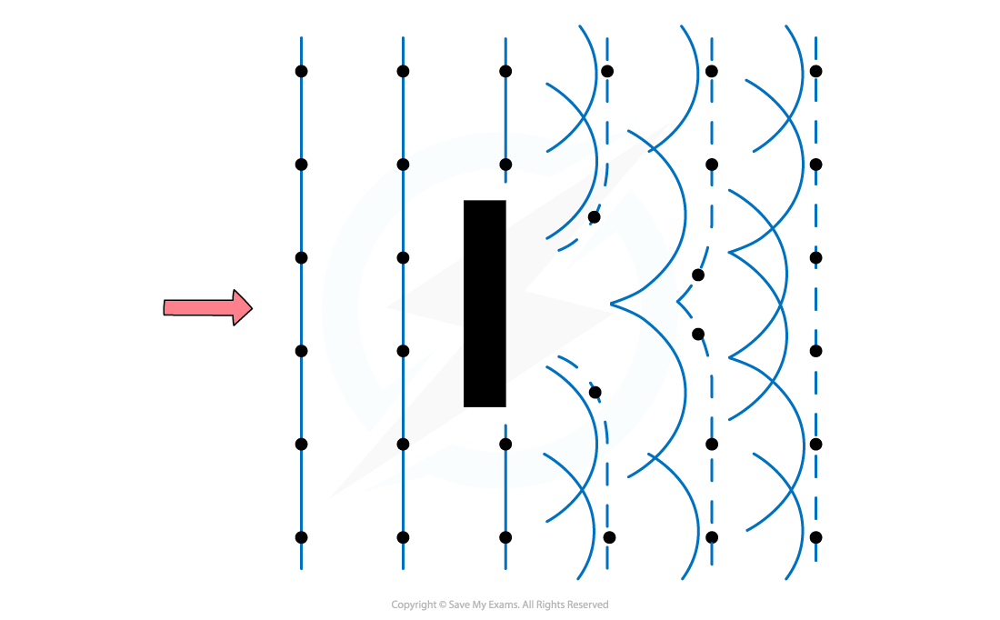

# Diffraction

## Diffraction

> **Spec point** — `spcpt_Kwt8qcZsGZJN9JVF`

## Diffraction

Diffraction is the **spreading out **of waves when they pass an obstruction

#### Diffraction through a gap

- This obstruction is typically a narrow gap (a slit, or aperture)

- Diffraction is usually represented by a wavefront as shown by the vertical lines in the diagrams above
- The only property of a wave that changes when its diffracted is its **amplitude**

  - This is because some energy is **dissipated** when a wave is diffracted through a gap

#### Diffraction around an obstacle

- The diffraction pattern for a large slit can be thought of as a wave passing two completely separate obstacles

  - This shows that when a wave meets an obstacle a diffraction pattern forms around the edges.
  - Behind the obstacle a ‘shadow’ forms where no part of the wave reaches

#### Factors that affect diffraction

- The effects of diffraction are most prominent when the gap size or obstacle is approximately the same or smaller than the wavelength of the wave

  - As the size of the gap or obstacle increases, the effect gradually gets less pronounced
  - When the gap is much larger than the wavelength, the waves are no longer spread out

***The size of the gap (compared to the wavelength) affects how much the waves spread out***

#### Explaining diffraction

- Huygens developed a model for wave propagation which suggested that every point on a *wavefront* can be considered to be a point source of secondary waves (which he called wavelets)

  - This leads to a diagram, called **Huygens’ construction**, which shows that new wavefronts are tangential to the secondary wavelets
  - The tangents create the curve of the new wavefront emerging either through the gap or around the obstacle

**When a wave meets an obstacle a diffraction pattern forms around the edges, with a ‘shadow’ created behind the obstacle where no part of the wave reaches**

#### Huygens' Construction for Diffraction Through a Gap

**Those point sources which pass through the gap create new wavelets on the other side, leading to the characteristic curved shape of the diffracted wave**

#### Huygens' Construction for Diffraction Around an Obstacle

**Those point sources which pass around the obstacle create new wavelets on the other side, leaving empty space where the 'shadow' is seen**

> **Worked Example**
> When a wave is travelling through air, which scenario best demonstrates diffraction?
> 
> **A.** UV radiation through a gate post
> 
> **B.** Sound waves passing a steel rod
> 
> **C.** Radio waves passing between human hair
> 
> **D.** X-rays passing through atoms in a crystalline solid
> 
> **Answer: D**
> 
> - Diffraction is most prominent when the wavelength is close to the aperture size
> - UV waves have a wavelength between 4 × 10-7 – 1 × 10-8 m so won’t be diffracted by a gate post
> - Sound waves have a wavelength of 1.72 × 10-2 – 17 m so would not be diffracted by the diffraction grating
> - Radio waves have a wavelength of 0.1 – 106 m so would not be diffracted by human hair
> - X-rays have a wavelength of 1 × 10-8 – 4 × 10-13 m which is roughly the gap between atoms in a crystalline solid
> 
>   - Therefore, the correct answer is **D**

> **Exam Hint**
> When drawing diffracted waves, take care to keep the wavelength constant. It is only the amplitude of the wave that changes when diffracted.
> 
> Huygen's diagrams can be tricky to draw, so are definitely worth practicing.
