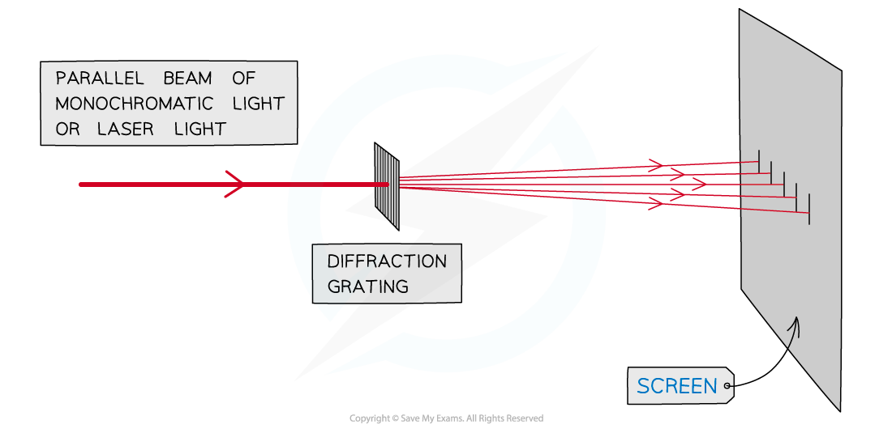
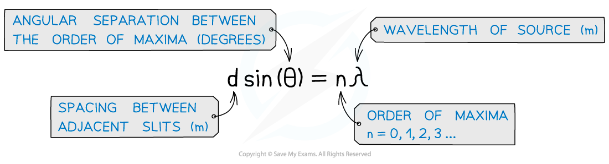
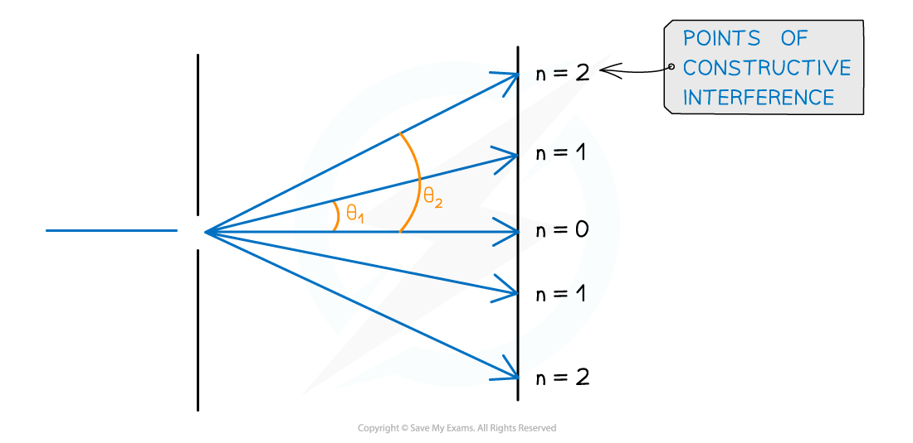

# The Diffraction Grating Equation

## The Diffraction Grating Equation

> **Spec point** — `spcpt_CV5bhyNsZBmc6MBP`

## The Diffraction Grating Equation

- A **diffraction grating **is a plate on which there is a very large number of parallel, identical, close-spaced slits
- When **monochromatic light** is incident on a grating, a pattern of narrow bright fringes is produced on a screen

***Diagram of diffraction grating used to obtain a fringe pattern***

***  ***

- The angles at which the maxima of intensity (constructive interference) are produced can be deduced by the diffraction grating equation

***Diffraction grating equation for the angle of bright fringes***

- Exam questions sometime state the **lines per m** (or per mm, per nm etc.) on the grating which is represented by the symbol *N*
- *d* can be calculated from *N* using the equation

#### Angular Separation

- The angular separation of each maxima is calculated by rearranging the grating equation to make θ the subject
- The angle θ is taken from the centre meaning the higher orders are at greater angles

***Angular separation***

*** ***

- The angular separation between two angles is found by subtracting the smaller angle from the larger one
- The angular separation between the first and second maxima n1 and n2 is **θ****2**** – θ****1**

#### Orders of Maxima

- The maximum angle to see orders of maxima is when the beam is at right angles to the diffraction grating

  - This means *θ* = 90o and sin *θ* = 1
- The highest order of maxima visible is therefore calculated by the equation:

- Note that since *n* must be an integer, if the value is a decimal it must be rounded **down**

  - E.g If *n* is calculated as 2.7 then *n* = 2 is the highest order visible

> **Worked Example**
> An experiment was set up to investigate light passing through a diffraction grating with a slit spacing of 1.7 µm. The fringe pattern was observed on a screen. The wavelength of the light is 550 nm.
> 
> 
> 
> Calculate the angle α between the two second-order lines.
> 
> **Answer:**
> 
> 

> **Exam Hint**
> Take care that the angle θ is the correct angle taken from the centre and not the angle taken between two orders of maxima.
