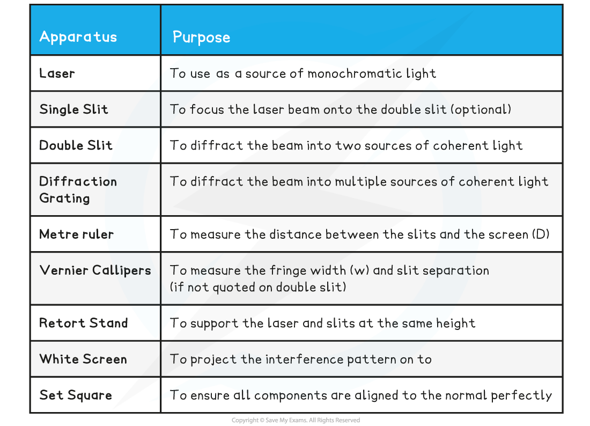
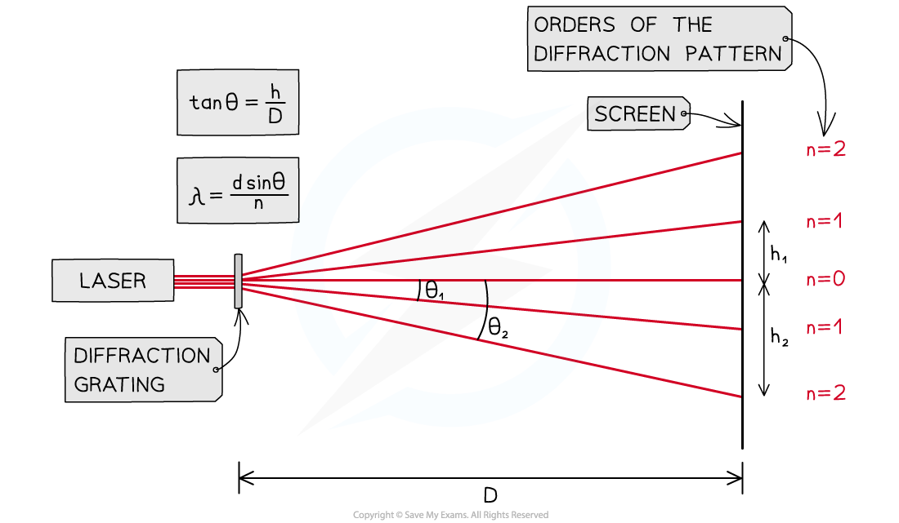
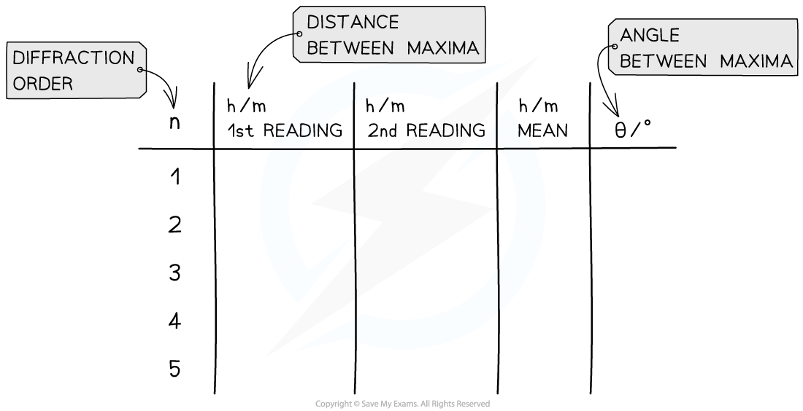

# Core Practical 6: Investigating Diffraction Gratings

## Core Practical 6: Investigating Diffraction Gratings

> **Spec point** — `spcpt_swg78RqWm3mBWPjF`

## Core Practical 6: Investigating Diffraction Gratings

#### Aim of the Experiment

- To find the **wavelength** of light using a **diffraction grating**

**Variables**

- *Independent variable* = Distance between maxima, *h*
- *Dependent variable* = The angle between the normal and each order, *θ**n** *(where n = 1, 2, 3 etc)
- Control variables

  - Distance between the slits and the screen, *D*
  - Laser wavelength, *λ*
  - Slit separation, *d*

#### Equipment List

- *Resolution* of measuring equipment:

  - Metre ruler = 1 mm
  - Vernier Callipers = 0.01 mm

#### Method

***The setup of apparatus required to measure the distance between maxima h at different angles θ***

1. Place the **laser** on a **retort stand** with the **diffraction grating** in front of it
2. Use a set square to ensure the beam passes through the grating at **normal incidence** and meets the screen perpendicularly
3. Set the **distance *****D*** between the grating and the screen to be 1.0 m using a metre ruler
4. **Darken** the **room** and turn on the laser
5. Identify the **zero-order maximum** (the central beam)
6. Measure the **distance *****h*** to the nearest two first-order maxima (i.e. n = 1, n = 2) using a vernier calliper
7. Calculate the **mean** of these two values
8. Measure **distance *****h*** for increasing orders
9. **Repeat** with a diffraction grating with a different number of slits per mm

- An example table might look like this:

#### Analysing the Results

The diffraction grating equation is given by:

***n*****λ = *****d***** sin θ**

- Where:

  - *n* = the order of the diffraction pattern
  - *λ* = the wavelength of the laser light (m)
  - *d* = the distance between the slits (m)
  - *θ* = the angle between the normal and the maxima (°)

- The distance between the slits is equal to:

- Where

  - *N* = the number of slits per metre (m–1)
- Since the angle is not small, it must be calculated using **trigonometry** with the measurements for the distance between maxima, *h*, and the distance between the slits and the screen, *D*

- Calculate a **mean *****θ*** value for each order
- Calculate a **mean** value for the **wavelength** of the laser light and compare the value with the accepted wavelength

  - This is usually 635 nm for a standard school red laser

#### Evaluating the Experiments

***Systematic errors:***

- Ensure the use of the set square to avoid **parallax error** in the measurement of the fringe width
- Using a grating with more **lines per mm** will result in greater values of *h.* This lowers its percentage uncertainty

***Random errors:***

- The** fringe spacing** can be subjective depending on its **intensity** on the screen, therefore, take multiple measurements of *w* and *h* (between 3-8) and find the average
- Use a **Vernier scale** to record distances *w* and *h* to reduce percentage uncertainty
- Reduce the uncertainty in *w* and *h* by **measuring across all visible fringes** and dividing by the number of fringes
- **Increase** the **grating to screen distance *****D***** **to increase the fringe separation (although this may decrease the intensity of light reaching the screen)
- Conduct the experiment in a darkened room, so the fringes are clear

#### Safety Considerations

- Lasers should be Class 2 and have a maximum output of no more than 1 mW
- Do not allow laser beams to shine into anyone’s eyes
- Remove reflective surfaces from the room to ensure no laser light is reflected into anyone’s eyes

> **Worked Example**
> A student investigates the interference patterns produced by two different diffraction gratings. One grating used was marked 100 slits / mm, and the other was marked 300 slits / mm. The distance between the grating and the screen is measured to be 3.75 m.
> 
> The student recorded the distance between adjacent maxima after passing a monochromatic laser source through each grating. These results are shown in the tables below.
> 
> 
> 
> 
> 
> Calculate the mean wavelength of the laser light and compare it with the accepted value of 635 nm. Assess the percentage uncertainty in this result.
> 
> **Answer:**
> 
> 
> 
> 
> 
> 
> 
> 

> **Exam Hint**
> Remember to read the question carefully and make sure dimensions such as the fringe separation are put into meters.
