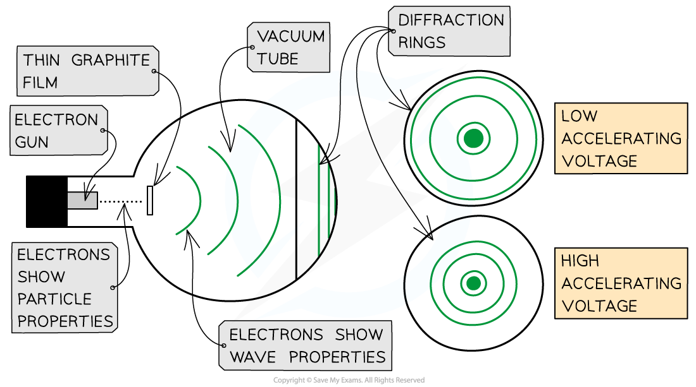

# The Wave Nature of Electrons

## The Wave Nature of Electrons

> **Spec point** — `spcpt_dnTRYdwsvGmQtc78`

## The Wave Nature of Electrons

- Electron diffraction was the first clear evidence that matter can behave like light and has wave properties

  - This is demonstrated using the electron diffraction tube
- The electrons are accelerated in an *electron gun* to a high potential, such as 5000 V, and are then directed through a thin film of graphite

  - The lattice structure of the graphite acts like the slits in a diffraction grating
- The electrons diffract from the gaps between carbon atoms and produce a circular pattern on a *fluorescent screen* made from phosphor

***Electrons accelerated through a high potential difference demonstrate wave-particle duality ***

- In order to observe the diffraction of electrons, they must be focused through a gap similar to their size, such as an atomic lattice
- Graphite film is ideal for this purpose because of its *crystalline* structure

  - The gaps between neighbouring planes of the atoms in the crystals act as slits, allowing the electron waves to spread out and create a diffraction pattern
- The diffraction pattern is observed on the screen as a series of *concentric rings*

  - This phenomenon is similar to the diffraction pattern produced when light passes through a diffraction grating
  - If the electrons acted as particles, a pattern would not be observed, instead, the particles would be distributed uniformly across the screen
- It is observed that a larger accelerating voltage reduces the diameter of a given ring, while a lower accelerating voltage increases the diameter of the rings
