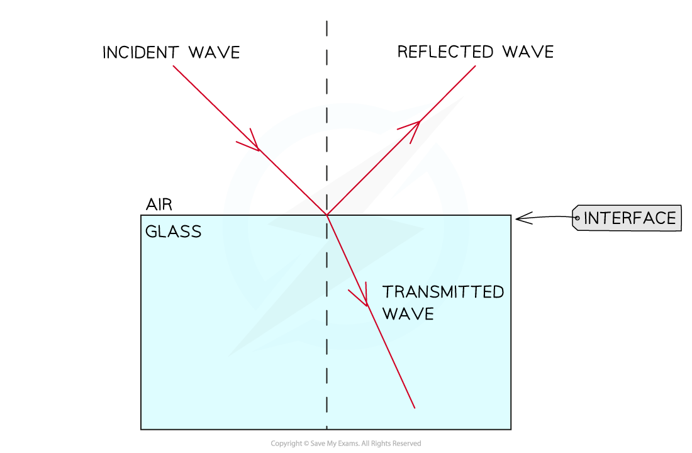
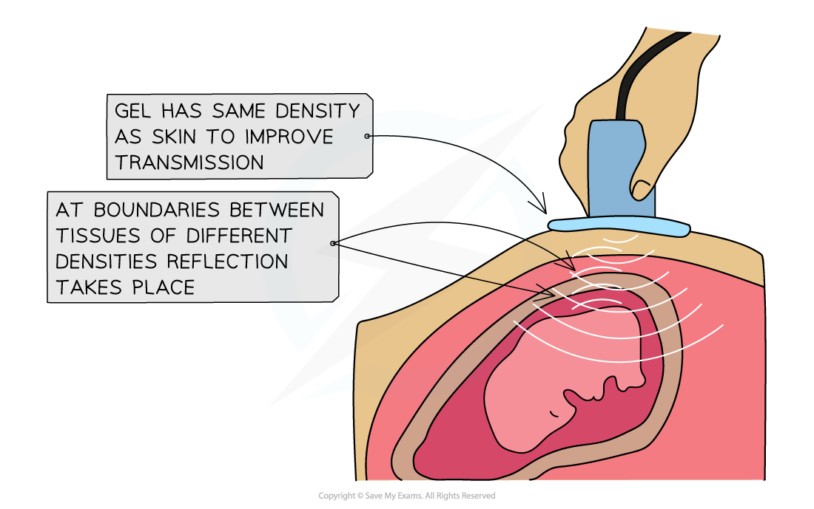

# Transmission & Reflection of Waves

## Transmission & Reflection of Waves

> **Spec point** — `spcpt_ysKzq5WB2t2VkbyT`

## Transmission & Reflection of Waves

- When waves are incident on the interface between two different media, they are either **transmitted **or **reflected**

  - 'Incident on' simply means 'to meet'
  - The interface is also called the **boundary **between media
  - Transmitted means to pass through

- When the media have **similar **densities the energy of the wave is mostly **transmitted**
- When the media have **different **densities most of the energy is **reflected**

#### Reflected waves in use

- Uses of reflected waves include:

  - Medical x-rays
  - Sonar
  - Ultrasound scans

#### Transmitted waves in use

- In the above examples the waves have to be transmitted through one medium first, before they are reflected

  - X-rays are transmitted through soft tissue
  - Sonar is transmitted through air or water
  - Ultrasound is transmitted through a gel of similar density to the skin so that it reaches the tissues inside the body

#### Reflection

- Reflection occurs when: **A wave hits a boundary between two media and does not pass through, but instead stays in the original medium**
- The law of reflection states:

**The angle of incidence = The angle of reflection**

***Reflection of a wave at a boundary***

- Some of the wave may also be absorbed or transmitted

  - Echos are examples of sound waves being reflected off a surface

- **Flat** surfaces are the **most** reflective

  - The smoother the surface, the stronger the reflected wave is
- **Rough** surfaces are the **least** reflective

  - This is because the light scatters in all directions
- **Opaque** surfaces will reflect light which is not absorbed by the material

  - The electrons will absorb the light energy, then reemit it as a reflected wave

#### Transmission

- Transmission occurs when: **A wave passes through a substance**
- For light waves, the more transparent the material, the more light will pass through

  - Transmission can involve **refraction** but it is not exactly the same
  - For the process to count as transmission, the wave must pass through the material and **emerge **from the other side

- When passing through a material, waves are usually partially absorbed

  - The transmitted wave may have a lower ***amplitude*** because of some absorption  ***When a wave passes through a boundary it may be absorbed and transmitted***
  
    - For example, sound waves are **quieter** after they pass through a wall
