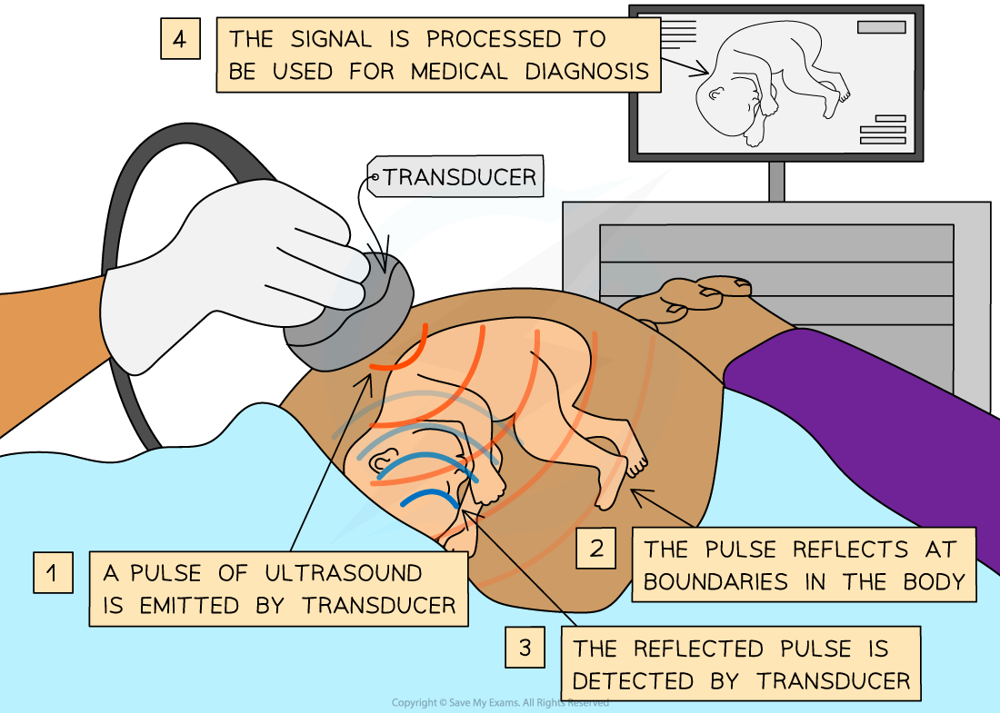
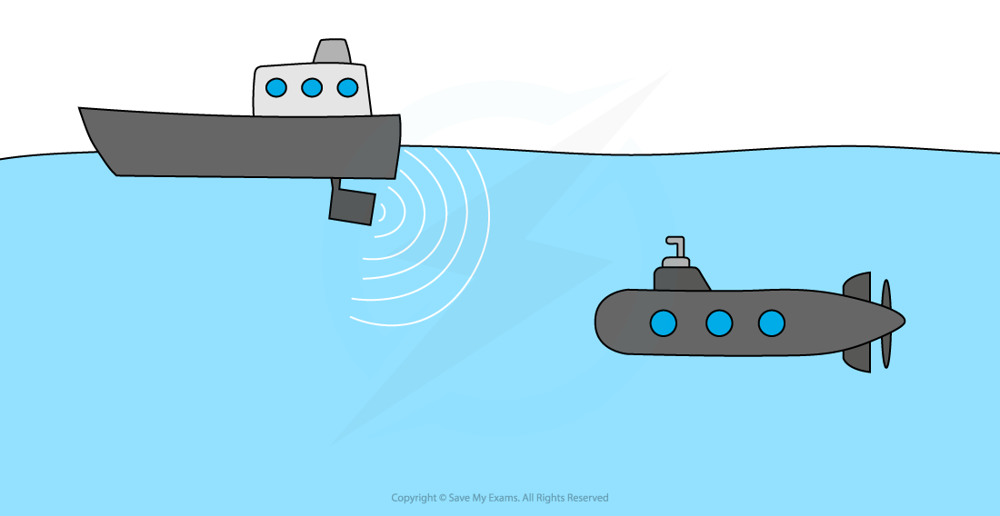
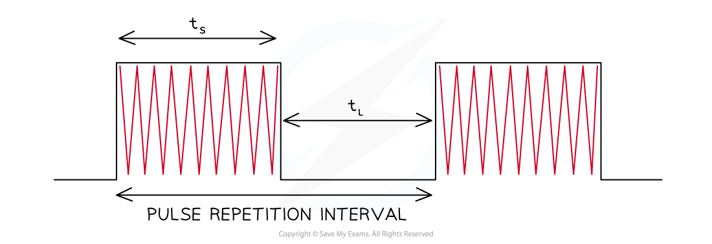

# Pulse-Echo Technique

## Pulse-Echo Technique

> **Spec point** — `spcpt_8nW82dbwdc6mhfH2`

## Pulse-Echo Technique

#### Foetal Scanning

- In medicine, ultrasound can be used to construct images of a **foetus** in the womb

  - An ultrasound detector is made up of a **transducer** that produces and detects a beam of ultrasound waves into the body
  - The ultrasound waves are reflected back to the transducer by different **boundaries** between tissues in the path of the beam
  - For example, the boundary between fluid and soft tissue or tissue and bone

- Using the speed of sound and the time of each echo’s return, the detector calculates the distance from the transducer to the tissue boundary
- Gel is put onto the scanner so that the boundary between the instrument and the skin is of the same density as the skin, this allows the signal to be easily **transmitted**
- By taking a series of ultrasound measurements, sweeping across an area, the time measurements may be used to build up an **image**

  - Unlike many other medical imaging techniques, ultrasound is **non-invasive** and **harmless**

***Ultrasound can be used to construct an image of a foetus in the womb***

#### Sonar

- **Sonar** uses **ultrasound** to detect objects underwater
- The sound wave is **reflected** off the object being tracked
- Examples include;

  - Finding fish by fishing fleets
  - Military uses looking for underwater vessels
  - Mapping the ocean bottom

- The **time** it takes for the sound wave to return is used to calculate the **depth** of the water
- The **distance** the wave travels is **twice the depth** of the ocean

  - This is the distance to the ocean floor plus the distance for the wave to return

#### Pulse Duration and Wavelength

- The amount of detail which can be captured (the **resolution**) of pulse-echo techniques depends on the wavelength

  - **Shorter **wavelengths have **smaller (better) **resolution
  - **More **detail can be seen since they diffract (spread out) less
  - More energy is needed as short wavelength waves have higher frequency
- Wavelength is chosen to be similar in size to the object that is being resolved

  - This makes best use of diffraction effects

- Pulse duration is a consideration because ultrasound transducers cannot transmit and receive pulses at the same time.

  - If incoming and outgoing pulses overlap the information is lost and image quality suffers
  - This affects the range since a longer wait time for pulses to return reduces the amount of information which can be collected

- Ultrasound pulses are very short, only a few microseconds, to reduce reflections from nearby interfaces
- The gap between pulses is relatively long, measured in milliseconds, to prevent overlapping signals

  - This combination of** short pulses** with relatively **large spaces** between them produces the **clearest **images

> **Worked Example**
> A sonar system uses ultrasound with frequency of 3.2 kHz to map the ocean floor. The speed of sound in water is 1 500 m s−1.
> 
> An echo is detected 3.6 s after the pulse is transmitted.
> 
> a) Determine the depth of the sea at this point.
> 
> b) Suggest a resolution for this ultrasound survey of the seafloor
> 
> **Part (a)**
> 
> **Step 1: Write the known values from the question**
> 
> - Frequency, *f *= 3.2 kHz = 3 200 Hz
> - Speed of sound, *v *= 1 500 m s−1
> - Time, *t *= 3.6 s
> 
> **Step 2: Write the correct equation and substitute the values**
> 
> - Distance;
> 
> *d *= *vt* = 1 500 × 3.6 = 5 400 m
> 
> **Step 3: Account for the received signal being an echo**
> 
> - Total distance travelled by the signal = 5 400 m
> - Depth of the sea floor = 1/2 × 5 400 = 2 700 m
> 
> **Part (b)**
> 
> **Step 1: Write the wave equation and rearrange to make wavelength the subject**
> 
> $v=fλ$
> 
> $\rightarrowλ=\frac{v}{f}$
> 
> **Step 2: Calculate to find wavelength**
> 
> $λ=\frac{1500}{3200}=0.47$
> 
> **Step 3: Write the final answer to correct significant figures and give units**
> 
> The resolution of the signal is similar to the wavelength, and λ = 0.47 m
