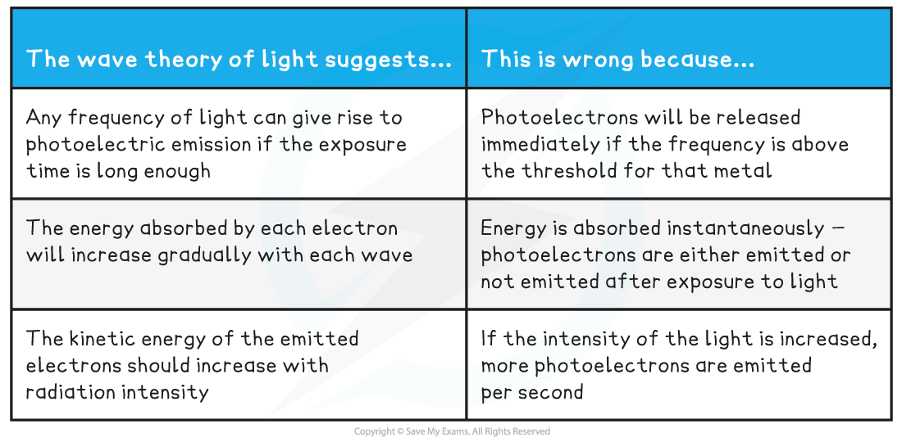
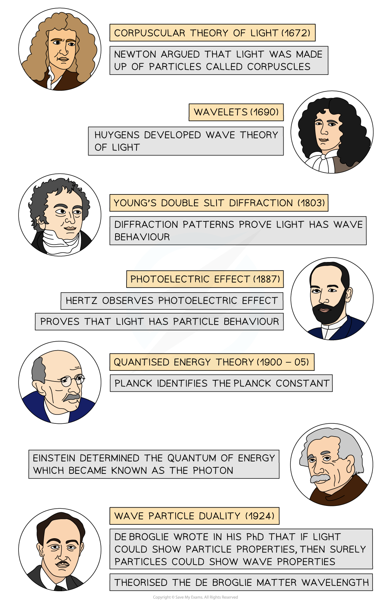

# Wave-Particle Duality

## Wave-Particle Duality

> **Spec point** — `spcpt_9FfrQW7qzKDSwpTr`

## Wave-Particle Duality

- Light can behave as a particle (i.e. photons) **and** a wave
- This phenomenon is called the wave-particle nature of light or **wave-particle duality**
- Light interacts with matter, such as electrons, **as a particle**

  - The evidence for this is provided by the *photoelectric effect*
- Light propagates through space **as a wave**

  - The evidence for this comes from the diffraction and interference of light in *Young’s Double Slit experiment*

#### Light as a Particle

- Einstein proposed that light can be described as a quanta of energy that behave as particles, called photons
- The photon model of light explains that:

  - Electromagnetic waves carry energy in *discrete* packets called photons
  - The energy of the photons are quantised according to the equation ***E***** = *****hf***
  - In the photoelectric effect, each electron can absorb only a single photon - this means only the frequencies of light above the *threshold frequency* will emit a photoelectron

- The wave theory of light does **not** support the idea of a threshold frequency

  - The wave theory suggests any frequency of light can give rise to photoelectric emission if the exposure time is long enough
  - This is because the wave theory suggests the energy absorbed by each electron will increase gradually with each wave
  - Furthermore, the kinetic energy of the emitted electrons should increase with radiation intensity
  - However, in the photoelectric effect, this is not what is observed
- If the frequency of the incident light is above the threshold and the intensity of the light is increased, **more photoelectrons are emitted per second**
- Although the wave theory provides good explanations for phenomena such as interference and diffraction, it fails to explain the photoelectric effect

**Compare wave theory and particulate nature of light**

#### Development of the Theory of Wave-Particle Duality

- Ideas about the nature of light were contested by modern science for around 300 years
- The evidence to prove both theories was available

  - Some prominent scientists argued light was a wave
  - Others contested that light was a particle
- It was not until the early 20th century that scientists settled on a theory of duality

