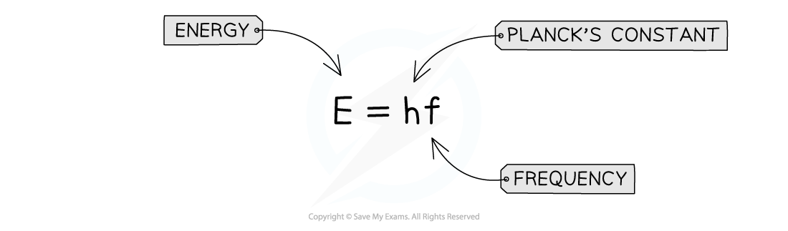
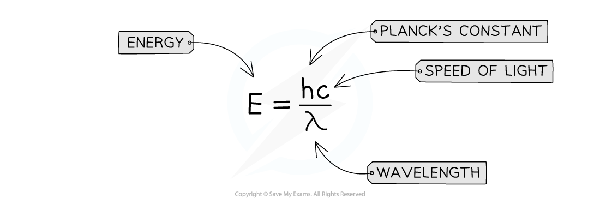

# Energy of a Photon

## Energy of a Photon

> **Spec point** — `spcpt_wV5H66rPK56zphBG`

## Energy of a Photon

- Photons are fundamental particles which make up all forms of electromagnetic radiation
- A photon is a massless “packet” or a “quantum” of electromagnetic energy
- What this means is that the energy is not transferred continuously, but as *discrete* packets of energy
- In other words, each photon carries a specific amount of energy, and transfers this energy all in one go, rather than supplying a consistent amount of energy

#### Calculating Photon Energy

- The energy of a photon can be calculated using the formula:

- Using the *wave equation*, energy can also be equal to:

- Where:

  - *E* = energy of the photon (J)
  - *h* = *Planck's constant* (J s)
  - *c* = *the speed of light* (m s-1)
  - *f* = frequency (Hz)
  - *λ* = wavelength (m)

- This equation tells us:

  - The higher the frequency of EM radiation, the higher the energy of the photon
  - The energy of a photon is inversely proportional to the wavelength
  - A long-wavelength photon of light has a lower energy than a shorter-wavelength photon

> **Worked Example**
> Light of wavelength 490 nm is incident normally on a surface, as shown in the diagram.
> 
> 
> 
> The power of the light is 3.6 mW. The light is completely absorbed by the surface. Calculate the number of photons incident on the surface in 2.0 s.
> 
> **Answer:**
> 
> 

> **Exam Hint**
> Make sure you learn the definition for a photon: *discrete quantity / packet / quantum of electromagnetic energy* are all acceptable definitions.
> 
> The values of Planck’s constant and the speed of light will always be available on the datasheet, however, it helps to memorise them to speed up calculation questions!
