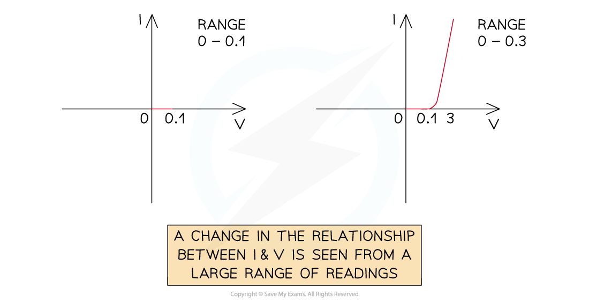

# Range of Measurements

## Range of Measurements

> **Spec point** — `spcpt_B4hY3GwYwygdvd9j`

## Range of Measurements

- When recording data from an experiment, it is important to take a good **range** of readings

  - This is between 5 – 10 values, with a step of 1, 2, 5 or a multiple of 10

***Example table of results with a good range***

- In the diagram, there is a good range of 8 values between 0.25 – 2.00 m
- A wide range of readings gives an idea of how well the average represents the data

- When considering the range of readings, think about the limitations of the instrument used to measure the *independent variable*
- An example of this is the range** **of the measuring device:

  - A maximum value of the range of 5 m when using a ruler wouldn't be ideal, because a ruler is normally 1 m long. This could become difficult to measure introducing many errors into the readings
  - The smallest division on a ruler is 1 mm, therefore, the smallest reading should be greater than this (e.g. not 0.1 mm)
- Another example is the **limitations** of the apparatus used:

  - When measuring the extension of a spring, a large load is avoided in order for the spring not to extend past its *elastic limit*
  - Too high voltages and currents could damage the circuit as it heats up, so the highest value in the range required must be well below the limit of any components in the circuit in order for them not to fuse or set on fire
- A range of readings is important to see whether the experiment holds true for all values, or, if there is a different pattern in results after a certain value
- Imagine investing the variation of current and potential difference for a semiconductor diode

  - If a reading of potential difference were only taken up to a value of 0. 5 V, the graph would look like a horizontal line
  - If they were taken up to 3 V, the steep increase in current can be seen by an almost vertical straight line
- Had a larger range not been taken, the full pattern of the current and potential difference in the diode wouldn't have been seen
- In general, the more readings the better, and the wider range the better

  - However, there is only so much time set out to complete the experiment

***A wider range of measurements shows a different pattern***

> **Exam Hint**
> It is important that the difference between each reading in a range is equal (e.g. 1, 2, 3, 4 and **not** 1, 2 , 5, 6 ) and that the difference between each value is 1, 2, 5 or a multiple of 10 (avoid something like 0.3, 0.6, 0.9)
